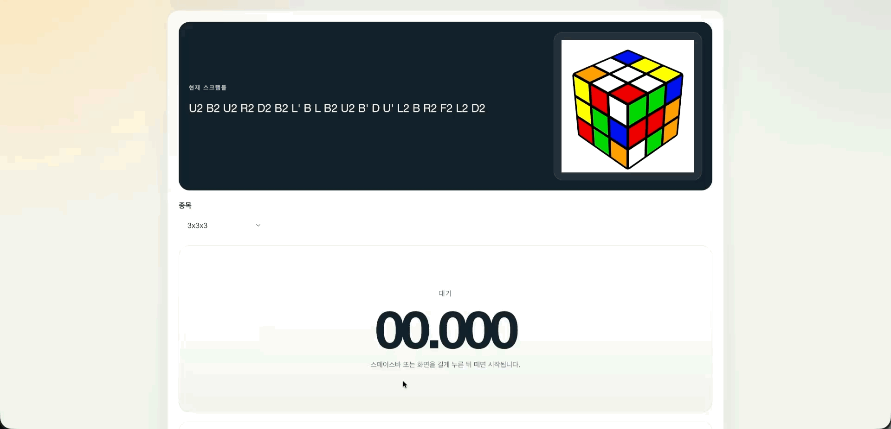
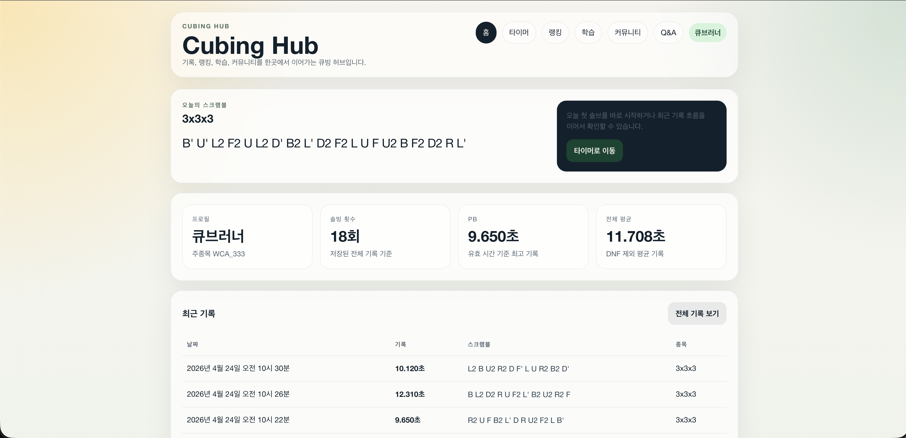
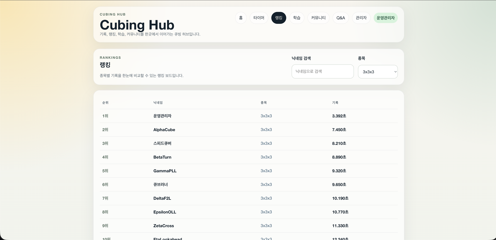
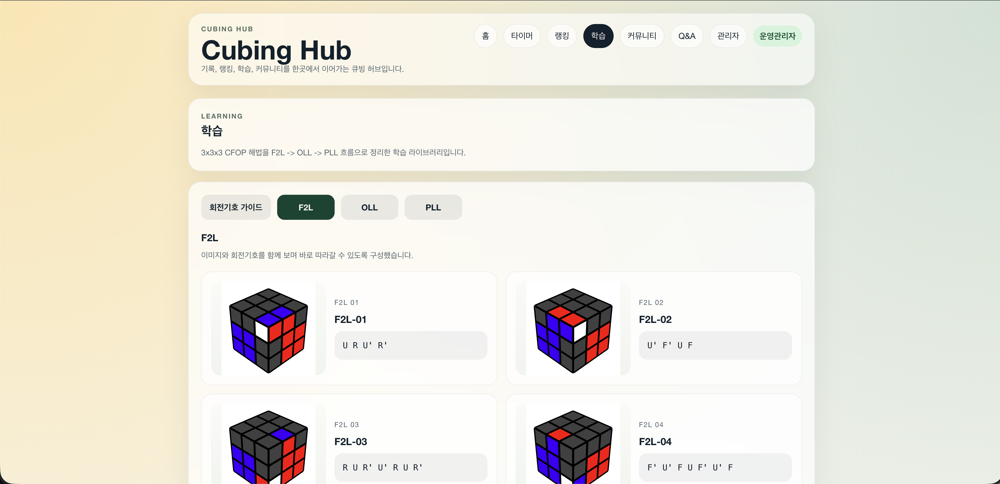
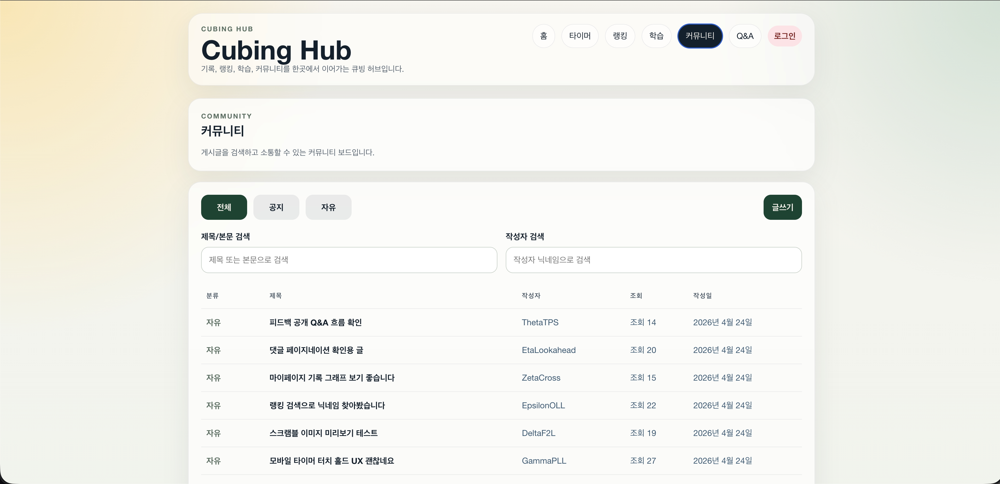
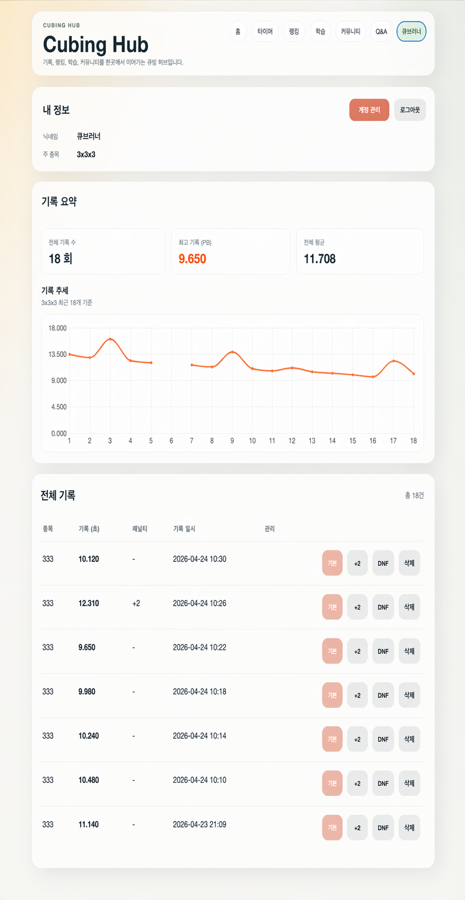
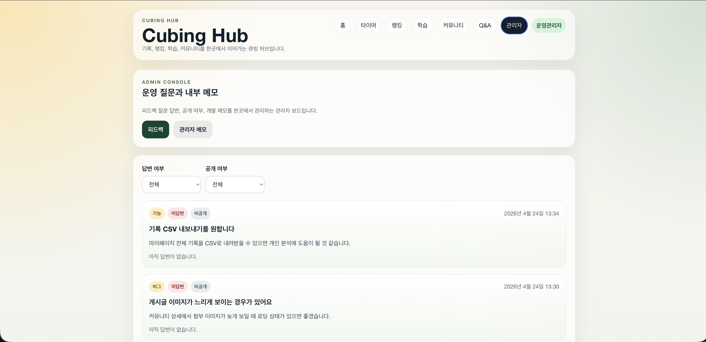

# Cubing Hub

큐빙 기록, 학습, 랭킹, 커뮤니티를 하나의 서비스 흐름으로 통합하는 1인 풀스택 웹 플랫폼입니다.
기능 구현에 그치지 않고 인증, 테스트, 문서화, 성능 비교, 배포, 운영 검증까지 서비스 단위로 정리하는 것을 목표로 했습니다.

| 항목 | 내용 |
| --- | --- |
| 프로젝트 성격 | 1인 풀스택 웹 플랫폼 |
| 현재 상태 | 핵심 기능 구현과 운영 배포 완료 |
| 운영 URL | `https://www.cubing-hub.com`, `https://api.cubing-hub.com` |
| 핵심 도메인 | 인증, 기록/타이머, 랭킹, 학습, 커뮤니티, 피드백 |
| 현재 지원 종목 | `WCA_333` |


## 1. 프로젝트 소개

큐빙허브는 큐빙 유저가 여러 서비스와 개인 도구에 흩어져 있던 기록, 학습 자료, 랭킹 비교, 커뮤니티 활동을 하나의 웹 서비스 흐름으로 통합한 1인 풀스택 웹 서비스입니다.

포트폴리오 관점에서는 화면 몇 개를 만드는 데서 끝내지 않고, 인증 전략, API 계약, DB 모델, 테스트 자동화, REST Docs, 모니터링, 배포 구조, 운영 검증까지 한 저장소에서 확인할 수 있게 정리했습니다.

## 2. 서비스 화면

아래 화면은 README용 시연 데이터 기준으로 촬영한 대표 화면입니다.

### 타이머 기록 저장 흐름



### 대표 화면

<table>
  <tr>
    <td width="50%">
      <strong>홈 대시보드</strong><br />
      
    </td>
    <td width="50%">
      <strong>랭킹</strong><br />
      
    </td>
  </tr>
  <tr>
    <td width="50%">
      <strong>학습</strong><br />
      
    </td>
    <td width="50%">
      <strong>커뮤니티</strong><br />
      
    </td>
  </tr>
  <tr>
    <td width="50%">
      <strong>마이페이지</strong><br />
      
    </td>
    <td width="50%">
      <strong>피드백 운영</strong><br />
      
    </td>
  </tr>
</table>

## 3. 현재 구현 상태

| 영역 | 현재 구현 |
| --- | --- |
| 인증 | 회원가입 이메일 인증, 비밀번호 재설정, `login`, `refresh`, `logout`, `GET /api/me`, malformed refresh cookie 복구 endpoint |
| 타이머 / 기록 | `GET /api/scramble`, `POST/PATCH/DELETE /api/records`, 최근 기록, `Ao5`, `Ao12`, 게스트 로컬 기록 캐시, 모바일 `touch`/`pen` 입력 상태 머신 |
| 홈 / 마이페이지 | `GET /api/home`, 프로필/요약 조회, 전체 기록 페이지 조회, 닉네임/주 종목 수정, 현재 비밀번호 확인 후 비밀번호 변경, 최근 기록 추세 그래프 |
| 랭킹 | `GET /api/rankings`, Redis ZSET 기반 기본 조회와 `nickname` 검색용 MySQL 대체 경로를 조합한 V2 구조 |
| 학습 | `CFOP` 기준 `F2L 41 + OLL 57 + PLL 21 = 119` 케이스, VisualCube 기반 회전기호 가이드 |
| 커뮤니티 | 게시글 CRUD, 검색, 댓글, 다중 이미지 첨부, 로그인 사용자 기준 고유 조회수, 수정 화면 사전 조회 분리 |
| 피드백 / 운영 | 로그인 사용자 피드백 제출, Discord 운영 알림 상태 내부 추적, 공개 Q&A, 관리자 답변/공개 전환, 관리자 메모 |
| 품질 | Testcontainers, REST Docs, JaCoCo instruction/branch 100%, Vitest 커버리지 100%, 분리된 GitHub Actions CI |
| 배포 | `S3 + CloudFront` 프런트, `EC2 + Nginx + Spring Boot + Redis + RDS` 백엔드, backend/frontend deploy workflow 운영 반영 확인 |

## 4. 주요 기술 결정

### JWT + Redis Refresh Token Rotation

- Access Token은 stateless JWT로 처리하고, Refresh Token은 Redis에 저장해 rotation과 재사용 감지를 관리합니다.
- 로그아웃 시 Refresh Token 삭제와 Access Token blacklist 등록을 함께 수행해 서버에서 세션을 무효화할 수 있도록 구성했습니다.

### 메모리 Access Token + HttpOnly Refresh Cookie

- React는 Access Token을 메모리에만 저장하고, Refresh Token은 `HttpOnly` cookie로만 전달받습니다.
- 앱 초기 진입/새로고침은 `refresh -> /api/me`, 보호 API 만료는 `401 -> refresh -> retry` 1회로 복구합니다.

### 랭킹 V1 기준선과 Redis V2 구조 분리

- MySQL `user_pbs` 기반 V1 기준선을 먼저 고정한 뒤, 기본 조회는 Redis ZSET으로 처리하고 `nickname` 검색은 MySQL 대체 경로를 유지하는 V2 구조로 전환했습니다.
- `300,000` PB 기준 같은 `k6` 시나리오에서 `avg 7,245.23 ms -> 21.10 ms`, `4.21 req/s -> 1,502.77 req/s`를 확인했습니다.

### Testcontainers + REST Docs + GitHub Actions 연결

- backend는 Testcontainers 기반 통합 테스트, JaCoCo 100%, REST Docs 빌드를 함께 검증합니다.
- frontend는 lint, Vitest, build를 별도 CI로 분리하고, 최종 로컬 검증에서 Vitest 커버리지 100%를 확인했습니다.

## 5. 운영 구조

### 현재 운영 기준

- Frontend: `AWS S3 + CloudFront`
- Backend: `AWS EC2 + Docker Compose + Nginx + Spring Boot + Redis`
- Data: `AWS RDS (MySQL)`
- Local observability baseline: `Prometheus + Grafana`

### CI/CD workflow

- `backend-ci.yml`
  - `./gradlew test jacocoTestReport --no-daemon`
  - `./gradlew build -x test --no-daemon`
  - `restdocs-site`, `jacoco-report`, 실패 시 `test-report` artifact 업로드
- `frontend-ci.yml`
  - `npm ci`, `npm run lint`, `npm test -- --run`, `npm run build`
  - 실패 시 `frontend-failure-reports` artifact 업로드
- `deploy-backend.yml`
  - `Backend CI` 성공 후 `workflow_run` 또는 수동 `workflow_dispatch`
  - Docker Hub push, EC2 배포, `https://localhost/actuator/health` health check
- `deploy-frontend.yml`
  - `Frontend CI` 성공 후 `workflow_run` 또는 수동 `workflow_dispatch`
  - production `VITE_API_BASE_URL` 검증, S3 sync, CloudFront invalidation
- `performance-benchmark.yml`
  - 수동 `workflow_dispatch`
  - seed + `k6` 기준선 실행, 비교 artifact 보관
- `rebuild-ranking-redis.yml`
  - 운영 Redis 읽기 모델 재구축용 수동 workflow

배포 환경에서 핵심 사용자 기능, 관리자 기능, 실제 SMTP 송수신, 실제 S3 업로드/삭제까지 수동으로 검증했습니다.

## 6. 기술 스택

### Frontend


### Backend


### Database / Cache


### Infra / DevOps


### Observability / Performance


## 7. 로컬 실행

### 1) 환경 변수 준비

```bash
cp .env.example .env
```

최소 필요 값:

- `LOCAL_DB_PASSWORD`
- `LOCAL_JWT_SECRET`
- `LOCAL_GRAFANA_ADMIN_PASSWORD`
- `LOCAL_FEEDBACK_DISCORD_WEBHOOK_URL`
- `SMTP_HOST`
- `SMTP_PORT`
- `SMTP_USERNAME`
- `SMTP_PASSWORD`
- `SMTP_AUTH`
- `SMTP_STARTTLS_ENABLE`
- `SMTP_FROM_ADDRESS`

### 2) 로컬 인프라 실행

```bash
docker compose up -d
```

실행 구성:

- `mysql`
- `redis`
- `prometheus`
- `grafana`

### 3) 백엔드 실행

```bash
cd backend
./gradlew bootRun
```

현재 Gradle 설정에서는 `bootRun`이 `asciidoctor`에 의존하고, `asciidoctor`는 `test`에 의존합니다.
즉 서버 기동 전에 테스트와 REST Docs 생성이 함께 수행됩니다.

### 4) 프런트엔드 실행

```bash
cd frontend
npm run dev
```

`VITE_API_BASE_URL`을 따로 주지 않으면 기본값은 `http://localhost:8080`입니다.

## 8. 검증 / 문서화

### 백엔드

```bash
cd backend
./gradlew test
./gradlew test jacocoTestReport --no-daemon
./gradlew build
```

- Testcontainers 기반 통합 테스트를 사용합니다.
- REST Docs 소스는 `backend/src/docs/asciidoc/index.adoc`입니다.
- generated HTML은 `backend/build/docs/asciidoc/`에 생성됩니다.
- JaCoCo HTML 리포트는 `backend/build/reports/jacoco/test/html/index.html`에서 확인할 수 있습니다.

### 프런트엔드

```bash
cd frontend
npm run lint
npm test -- --run
npx vitest run --coverage
npm run build
```

## 9. 문서 구조

### 핵심 설계 문서

- [Project Overview](docs/Project%20Overview.md)
- [Screen Specification](docs/Screen%20Specification.md)
- [API Specification](docs/API%20Specification.md)
- [Database Design](docs/Database%20Design.md)
- [Authentication & Authorization Design](docs/Authentication%20&%20Authorization%20Design.md)
- [System Architecture](docs/System%20Architecture.md)
- [Deployment & Infrastructure Design](docs/Deployment%20&%20Infrastructure%20Design.md)

### 일정 / 로그 / 설명 자산

- [Project Schedule](docs/Project%20Schedule.md)
- [Internal Schedule](docs/Internal%20Schedule.internal.md)
- [Dev Log Index](docs/dev-log.md)
- [Development Log](docs/Development%20Log/)
- [Portfolio](docs/portfolio.internal.md)
- [Trouble Shooting](docs/Trouble%20Shooting/)

## 10. 후속 확장 후보

- 랭킹 `nickname` 검색용 Redis secondary index 확장 여부 판단
- 운영 Redis rebuild trigger와 장애 복구 정책 고도화
- HTTPS 인증서 갱신 자동화
- 추가 benchmark(`/api/home`, 더 큰 사용자/기록 분포) 필요 여부 검토
