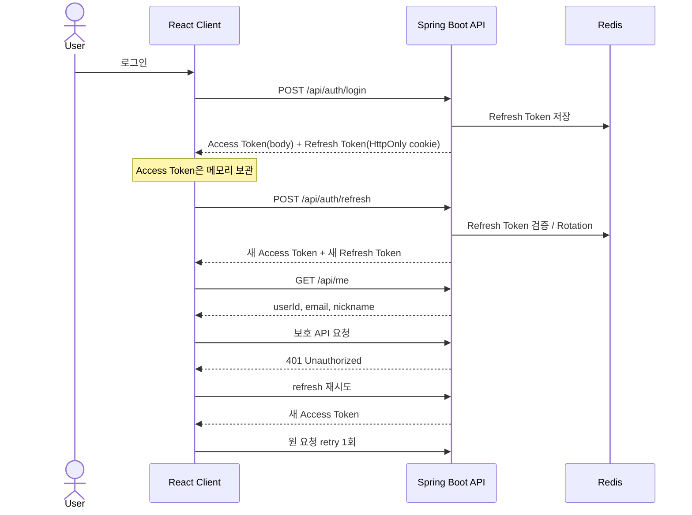
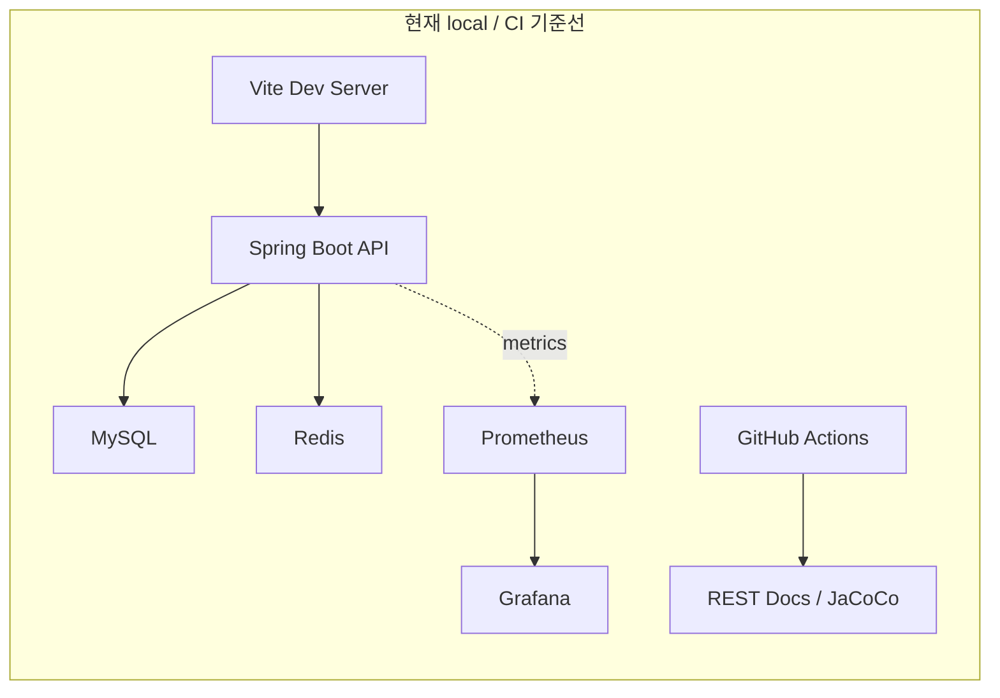
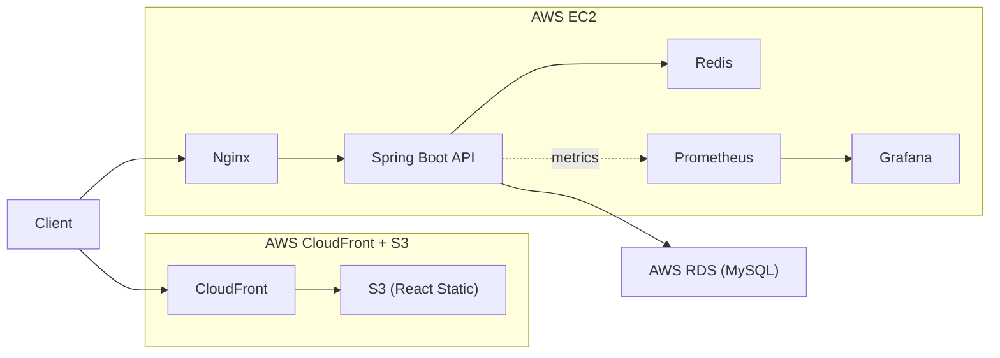

# Cubing Hub

큐빙 기록, 학습, 랭킹, 커뮤니티를 하나의 흐름으로 묶는 1인 풀스택 웹 플랫폼입니다.  
이 저장소는 단순 기능 구현보다 인증, 문서화, 테스트, 모니터링, 배포 구조까지 서비스 단위로 정리하는 데 초점을 둡니다.

| 항목 | 내용 |
| --- | --- |
| 프로젝트 성격 | 1인 풀스택 웹 플랫폼 |
| 핵심 도메인 | 큐빙 기록, 학습, 랭킹, 커뮤니티 통합 |
| 현재 구현 기준선 | 인증, 타이머/기록, 마이페이지, 랭킹 V1, 게시글 백엔드 CRUD, local infra/CI/REST Docs/모니터링 기준선 |
| 현재 실사용 종목 | `3x3x3` 중심 |
| 공식 데이터 | `CFOP` 기준 `F2L 41 + OLL 57 + PLL 21 = 119` 알고리즘 |

> 이 README는 `현재 구현 상태`와 `목표 구조`를 분리해서 설명합니다.  
> 아직 구현되지 않은 기능과 운영 구성을 완료된 것처럼 쓰지 않습니다.

## 1. 프로젝트 소개

Cubing Hub는 큐빙 유저가 여러 서비스와 개인 도구에 나눠서 관리하던 기록, 학습 자료, 랭킹 비교, 커뮤니티 활동을 하나의 웹 서비스 흐름으로 통합하려는 프로젝트입니다.

포트폴리오 관점에서는 화면 몇 개를 만드는 데서 끝내지 않고, 인증 전략, API 계약, DB 모델, 테스트 자동화, REST Docs, 모니터링, 배포 구조까지 한 저장소 안에서 설명 가능한 상태로 정리하는 것을 목표로 했습니다.

## 2. 문제 정의

큐빙 사용자는 보통 기록 측정, 알고리즘 학습, 랭킹 비교, 커뮤니티 활동을 서로 다른 서비스나 개인 메모 도구에 분산해서 사용합니다. 이 구조에서는 데이터가 이어지지 않고, 실제 서비스 운영 관점의 인증, 문서화, 검증, 관찰 가능성까지 함께 다루기 어렵습니다.

Cubing Hub는 이 파편화를 줄이기 위해 기록 저장과 조회, 공식 탐색, PB 기반 랭킹, 커뮤니티 기능을 하나의 제품 맥락으로 묶고, 그 위에 테스트와 운영 기준선을 함께 올리는 방향으로 설계됐습니다.

## 3. 현재 구현 상태 요약

### 구현됨

- 인증 API: `signup`, `login`, `refresh`, `logout`, `GET /api/me`
- React 인증 흐름: 로그인, 회원가입, 로그아웃, 보호 route, guest-only route
- 세션 복구: 앱 초기 `refresh -> /api/me`
- 보호 API 만료 대응: `401 -> refresh -> retry` 1회
- 타이머/기록: `GET /api/scramble`, `POST /api/records`, `PATCH /api/records/{recordId}`, `DELETE /api/records/{recordId}`
- 마이페이지: 프로필/요약 조회, 전체 기록 페이지 조회, 기록 penalty 수정/삭제, 로그아웃
- 랭킹 V1: `GET /api/rankings`, 서버 검색, 서버 페이지네이션, `user_pbs` 기반 PB 랭킹
- 게시글 백엔드 CRUD API: `POST`, `GET`, `PUT`, `DELETE /api/posts`
- local 개발 인프라: `mysql`, `redis`, `prometheus`, `grafana`
- 품질/운영 기준선: Testcontainers, Spring REST Docs, GitHub Actions, JaCoCo, Prometheus/Grafana

### 부분 구현 / 미구현

- 홈 대시보드는 아직 mock 데이터 기반입니다.
- 커뮤니티 프런트는 mock 기반이며 목록/상세/작성/삭제 submit도 실 API와 연결되지 않았습니다.
- 댓글 API와 댓글 실연동 UI는 미구현입니다.
- 피드백은 프런트 폼만 있고 백엔드 연동이 없습니다.
- 랭킹 V2는 Redis ZSET 목표 구조만 정의돼 있고 아직 구현되지 않았습니다.
- 프로덕션 배포 스크립트, 실제 도메인, HTTPS, `k6` 결과 문서화는 아직 없습니다.

## 4. 핵심 기능

| 영역 | 내용 | 현재 상태 |
| --- | --- | --- |
| 인증 | JWT 기반 로그인, `GET /api/me`, 로그아웃, 세션 복구 | 구현됨 |
| 타이머 / 기록 | 스크램블 조회, 기록 저장, penalty 수정, 기록 삭제 | 구현됨 |
| 마이페이지 | 프로필/요약 조회, 전체 기록 페이지네이션, 로그아웃 | 구현됨 |
| 랭킹 | PB 기준 글로벌 랭킹, 종목 필터, 닉네임 검색, 서버 페이지네이션 | 구현됨 (`V1`) |
| 공식 | `CFOP` 알고리즘 119개 탐색 | 구현됨 |
| 커뮤니티 | 게시글 백엔드 CRUD | 백엔드 구현 / 프런트 미연동 |
| 댓글 | 게시글 댓글 상호작용 | 미구현 |
| 피드백 | 버그 제보/기능 제안 폼 | 프런트 폼만 구현 |

현재 실사용 기준 종목은 `3x3x3`이며, 다른 WCA 종목은 확장 대상으로 남겨두고 있습니다.

## 5. 기술 스택

### 현재 구현 스택

**Frontend**  


**Backend**  


**Database & Cache**  


**Quality & Local Ops**  


### 목표 운영 스택


위의 `현재 구현 스택`은 지금 이 저장소에 실제로 도입해서 세팅을 마친 기술들입니다.  
`목표 운영 스택`은 앞으로 프로덕션 환경에 적용하기 위해 설계해 둔 내용으로, 아직 실제 클라우드 배포까지 완료된 상태는 아닙니다.

## 6. 주요 기술 결정

### JWT + Redis Refresh Token Rotation

Access Token은 stateless JWT로 처리하고, Refresh Token은 Redis에 저장해 rotation과 재사용 감지를 적용했습니다. 로그아웃 시에는 Refresh Token 삭제와 함께 Access Token blacklist 등록을 수행해 토큰 생명주기를 분리했습니다.

### Access Token 메모리 보관 + HttpOnly Refresh Cookie

프런트는 Access Token을 메모리에만 두고, Refresh Token은 `HttpOnly` cookie로만 전달받습니다. 이 구조 위에서 앱 초기 `refresh -> /api/me` 세션 복구와 보호 API `401 -> refresh -> retry`를 구현해 브라우저 저장소 의존을 줄였습니다.



### 랭킹 V1과 V2 분리

현재 랭킹은 MySQL `user_pbs` 기반 PB 조회를 사용하는 `V1`입니다. 읽기 부하가 커질 수 있는 hot path를 설명 가능하게 유지하기 위해, 최종 목표는 Redis ZSET 기반 실시간 랭킹 `V2`로 분리해 두었습니다.

### Testcontainers + REST Docs + GitHub Actions 연결

백엔드 테스트는 MySQL/Redis와 가까운 환경을 만들기 위해 Testcontainers를 사용합니다. 같은 테스트 흐름에서 Spring REST Docs 스니펫과 Asciidoctor HTML을 만들고, GitHub Actions는 테스트 리포트와 JaCoCo, REST Docs 산출물을 artifact로 회수합니다.

### Prometheus / Grafana 기반 운영 관찰 구조

로컬 `docker-compose.yml`에 Prometheus와 Grafana를 포함해 Spring Boot Actuator 메트릭을 바로 수집하고 시각화할 수 있게 했습니다. 이 구조는 production 목표 아키텍처에도 그대로 이어지는 운영 관찰 기준선입니다.

## 7. 시스템 아키텍처

### 현재 기준선

- Frontend는 로컬에서 Vite 개발 서버로 실행합니다.
- Backend는 Spring Boot 프로세스로 실행합니다.
- `docker-compose.yml`은 `mysql`, `redis`, `prometheus`, `grafana`를 제공합니다.
- CI는 GitHub Actions에서 backend 테스트, JaCoCo, REST Docs 빌드 검증을 수행합니다.



### 목표 production 구조



현재 저장소에는 위 목표 구조를 설명하는 문서와 local 기준선은 있지만, 프로덕션 배포 스크립트와 실제 도메인/HTTPS 적용은 아직 없습니다.

## 8. API / 도메인 개요

| 도메인 | 주요 범위 | 상태 |
| --- | --- | --- |
| Auth | `POST /api/auth/signup`, `login`, `refresh`, `logout`, `GET /api/me` | 구현됨 |
| Records | `GET /api/scramble`, `POST /api/records`, `PATCH`, `DELETE /api/records/{recordId}` | 구현됨 |
| My Page | `GET /api/users/me/profile`, `GET /api/users/me/records` | 구현됨 |
| Rankings | `GET /api/rankings` | 구현됨 (`V1`) |
| Posts | `POST`, `GET`, `PUT`, `DELETE /api/posts` | 백엔드 구현됨 |
| Comments | 댓글 조회/작성/삭제 | 미구현 |
| CFOP Algorithms | `F2L` / `OLL` / `PLL` 알고리즘 119개 정적 탐색 | 구현됨 |
| Feedback | 관리자 전달 및 저장 연동 | 미구현 |

자세한 계약은 아래 문서를 기준으로 관리합니다.

- [API Specification](docs/API%20Specification.md)
- [Authentication & Authorization Design](docs/Authentication%20%26%20Authorization%20Design.md)
- [Database Design](docs/Database%20Design.md)

## 9. 로컬 실행 방법

### 1) 환경 변수 준비

```bash
cp .env.example .env
```

`.env`에는 최소 아래 값이 필요합니다.

- `LOCAL_DB_PASSWORD`
- `LOCAL_JWT_SECRET`
- `LOCAL_GRAFANA_ADMIN_PASSWORD`

### 2) 로컬 인프라 실행

```bash
docker compose up -d
```

실행되는 구성요소:

- `mysql`
- `redis`
- `prometheus`
- `grafana`

### 3) 백엔드 실행

```bash
cd backend
./gradlew bootRun
```

현재 Gradle 설정에서는 `bootRun`이 `asciidoctor`에 의존하고, `asciidoctor`는 `test`에 의존합니다.  
즉 서버 기동 전에 테스트와 REST Docs 생성이 함께 수행됩니다.

### 4) 프런트엔드 실행

```bash
cd frontend
npm run dev
```

`VITE_API_BASE_URL`을 따로 주지 않으면 기본값은 `http://localhost:8080`입니다.

## 10. 테스트 / 문서화 / 운영

### 백엔드 검증

```bash
cd backend
./gradlew test
./gradlew build
```

- Testcontainers 기반 통합 테스트를 사용합니다.
- REST Docs 소스는 [backend/src/docs/asciidoc/index.adoc](backend/src/docs/asciidoc/index.adoc)입니다.
- generated HTML은 빌드 후 `backend/build/docs/asciidoc/`에서 확인할 수 있습니다.
- JaCoCo HTML 리포트는 `backend/build/reports/jacoco/test/html/index.html`에 생성됩니다.

### 프런트엔드 검증

```bash
cd frontend
npm run lint
npm run build
```

추가로 `npm run test -- --run`으로 Vitest 기반 컴포넌트/인증 회귀 테스트를 실행할 수 있습니다.

### CI / 운영 기준선

- GitHub Actions는 backend 테스트와 JaCoCo 리포트 생성, REST Docs 빌드 검증을 수행합니다.
- 성공 시 REST Docs HTML(`restdocs-site`)과 JaCoCo 리포트를 artifact로 업로드합니다.
- 로컬 운영 관찰 기준선으로 Prometheus + Grafana 구성이 포함되어 있습니다.

## 11. 문서 구조

### 핵심 문서

- [Project Overview](docs/Project%20Overview.md)
- [Screen Specification](docs/Screen%20Specification.md)
- [API Specification](docs/API%20Specification.md)
- [Database Design](docs/Database%20Design.md)
- [Authentication & Authorization Design](docs/Authentication%20%26%20Authorization%20Design.md)
- [System Architecture](docs/System%20Architecture.md)
- [Deployment & Infrastructure Design](docs/Deployment%20%26%20Infrastructure%20Design.md)
- [Project Schedule](docs/Project%20Schedule.md)

### 진행 기록

- [Dev Log Index](docs/dev-log.md)
- [Development Log](docs/Development%20Log/)
- [Trouble Shooting](docs/Trouble%20Shooting/)

### 저장소 구조

```text
.
├── backend/   # Spring Boot API, JPA, Security, REST Docs, tests
├── frontend/  # React + Vite UI
├── docs/      # 설계 문서, 일정, 개발 로그
├── docker-compose.yml
└── .env.example
```

## 12. 향후 개선 계획

- 커뮤니티 목록/상세/작성/삭제 프런트 실연동
- 댓글 API와 댓글 UI 구현
- 홈 대시보드 API 및 실데이터 연동
- 피드백 백엔드 연동
- Redis ZSET 기반 랭킹 V2 구현 및 V1 대비 검증
- 프로덕션 배포 스크립트, 실제 도메인, HTTPS 구성
- `k6` 기반 부하 테스트 결과와 운영 개선 문서화
