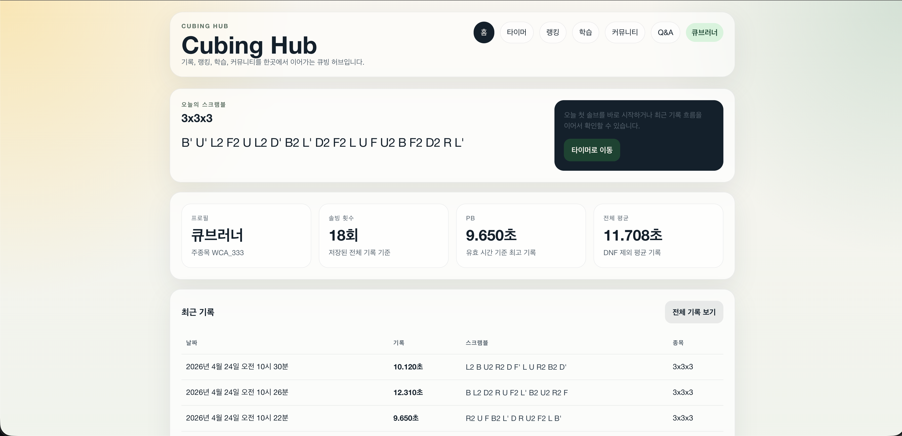

# Cubing Hub

Cubing Hub는 기록·랭킹·학습·커뮤니티와 서비스 운영 기능을 제공하는 full-stack cubing web service다. 현재 V1 기능은 유지·강화 대상이며, 최종 Vision과 향후 기능 우선순위는 아직 확정하지 않았다.

문서 체계와 Source of Truth는 [Documentation](docs/README.md)에서 시작한다.

## 현재 구현

- 이메일 인증, signup·login·refresh·logout, password reset
- keyboard·touch timer, scramble, solve 저장·penalty·삭제, Ao5·Ao12
- event별 PB ranking과 nickname search
- home summary, MyPage profile·history·trend
- 회전 기호, 초보자 과정, F2L·OLL·PLL 학습
- 게시글·댓글·다중 image community
- feedback, 공개 Q&A, ADMIN 답변·visibility·memo
- GitHub Actions, GHCR ARM64 artifact, Mac mini Docker Compose, backup·rollback runbook

Daily Challenge, Verified Record, Competition, Organizer는 후보 기능이며 일정·우선순위·상세 설계가 정해지지 않았다.

## 기술 기준선

| 영역 | 현재 기준 |
| --- | --- |
| Backend | Java 17, Spring Boot 3.5, Gradle, Spring Security, REST Docs |
| Frontend | React 19, Vite 8, React Router, Vitest |
| Data | MySQL 8 Source of Truth, Redis 7.2 auth state·ranking Read Model |
| Storage | MySQL attachment metadata + host post image binary |
| Delivery | GitHub Actions, exact SHA GHCR ARM64 image, runtime config digest |
| Production | Mac mini Docker Compose, Nginx, Cloudflare Tunnel |

구조 설명은 [System Context](docs/03-architecture/system-context.md), 데이터는 [ERD](docs/04-data/erd.md), 배포는 [Deployment Architecture](docs/03-architecture/deployment-architecture.md)를 따른다.

## API와 품질

endpoint method·request·response 계약은 test와 연결된 [Spring REST Docs source](backend/src/docs/asciidoc/index.adoc)가 기준이다. Markdown에는 endpoint 전체 표를 별도로 유지하지 않는다.

- [API policies](docs/05-api/README.md)
- [Test strategy](docs/06-quality/test-strategy.md)
- [Quality gates](docs/06-quality/quality-gates.md)
- [Performance evidence](docs/06-quality/performance/README.md)

## 개발과 운영

- [Local development](docs/07-operations/local-development.md)
- [CI/CD](docs/07-operations/ci-cd.md)
- [Deployment runbook gateway](docs/07-operations/deployment-runbook.md)
- [Backup and restore gateway](docs/07-operations/backup-restore.md)
- [Incident response](docs/07-operations/incident-response.md)

command-level Mac mini 절차는 homeserver/docs의 active runbook이 Source of Truth다. repository 문서 변경은 실제 운영 배포·restart 권한을 포함하지 않는다.

## V1 화면 Snapshot

아래 이미지는 현재 제품 계약이 아니라 V1 시점의 화면 기록이다. 최신 동작은 code와 test, 기능 요구사항을 기준으로 본다.

| Home | Timer |
| --- | --- |
|  |  |

| Ranking | Learning |
| --- | --- |
|  |  |

| Community | MyPage |
| --- | --- |
|  |  |

## 제품 방향 논의

공식 출처 기반 [reference service research](docs/00-product/research/)와 [Market Validation](docs/00-product/market-validation.md)을 먼저 사용한다. 그 다음 사용자와 별도 논의를 거쳐 [Vision](docs/00-product/vision.md), [PRD](docs/00-product/prd.md), [Roadmap](docs/00-product/roadmap.md)을 확정한다.

V1 문서와 개발 역사는 [V1 Archive](docs/99-archive/v1/README.md)에 보존한다.
