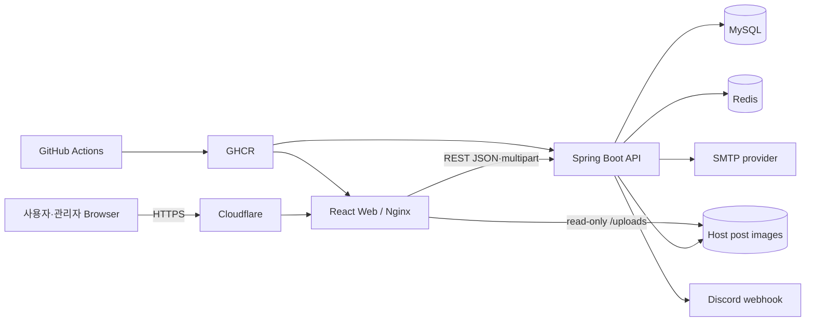

# System Context

Cubing Hub는 browser SPA와 Spring Boot API를 중심으로 MySQL, Redis, host image storage를 사용하는 서비스다.

## 신뢰 경계

- Browser는 access token을 memory에만 보유하고 refresh cookie를 직접 읽지 못한다.
- API가 인증·인가와 데이터 mutation의 최종 집행자다.
- MySQL은 영속 business data의 Source of Truth다.
- Redis는 auth temporary state와 ranking Read Model을 보유한다.
- post image binary는 DB metadata와 별도 host path에 있지만 같은 backup 단위로 다룬다.
- Cloudflare와 Nginx는 public ingress를 제공하며 direct database port는 공개하지 않는다.

## 외부 의존성

SMTP와 Discord는 outbound dependency다. 전송 실패는 계정·feedback 원본 데이터의 성공 여부와 분리해 처리해야 한다. GitHub Actions와 GHCR은 build·release artifact 공급 경계다.

현재 runtime health는 repository 구성만으로 확정할 수 없으며 [운영 문서](../07-operations/environments.md)에서 configuration fact와 observed fact를 구분한다.
