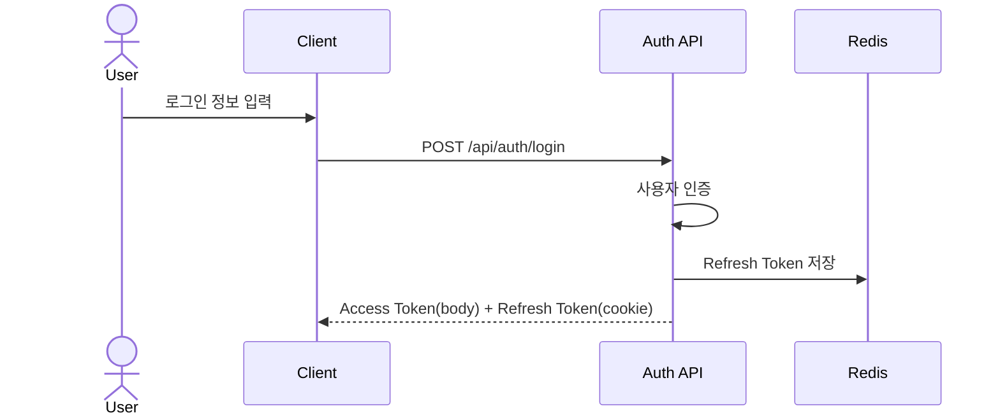
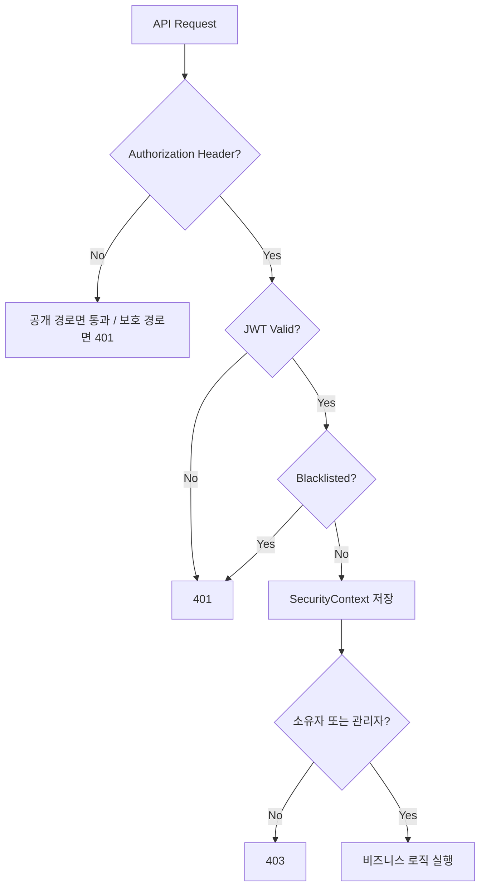

# Authentication & Authorization Design

## 1. 적용 범위

- 회원가입 / 로그인 / 토큰 재발급 / 로그아웃 API
- 보호 API 접근 제어
- 게시글 수정/삭제의 소유자 검증
- 프런트의 Access Token 보관 및 API 호출 규칙

## 2. 사용자 역할

| 역할 | 설명 |
| --- | --- |
| `ROLE_USER` | 일반 사용자 |
| `ROLE_ADMIN` | 관리자 권한 사용자 |

## 3. 권한 정책

### 공개 경로

- `/api/auth/**`
- `/api/rankings`
- `/api/scramble`
- `/actuator/**`
- `/docs/**`
- `/error`
- `GET /api/posts`
- `GET /api/posts/*`

### 인증 필요 경로

- 위 공개 경로를 제외한 나머지 API
- 예시
  - `GET /api/me`
  - `POST /api/records`
  - `POST /api/posts`
  - `PUT /api/posts/{postId}`
  - `DELETE /api/posts/{postId}`

### 추가 인가 정책

- 게시글 수정/삭제는 인증만으로 끝나지 않는다.
- 작성자 본인 또는 `ROLE_ADMIN`만 허용한다.

## 4. 인증 흐름

### 1. 회원가입

1. 사용자가 이메일, 비밀번호, 닉네임, 주 종목을 전달한다.
2. 이메일/닉네임 중복을 검사한다.
3. 비밀번호를 암호화해 `users`에 저장한다.
4. 기본 권한은 `ROLE_USER`, 기본 상태는 `ACTIVE`다.

### 2. 로그인

1. `AuthenticationManager`로 이메일/비밀번호를 검증한다.
2. Access Token과 Refresh Token을 생성한다.
3. Refresh Token을 Redis에 저장한다.
4. Access Token은 응답 body로, Refresh Token은 `HttpOnly` cookie로 반환한다.

### 3. 토큰 재발급

1. `refresh_token` cookie를 전달한다. cookie가 없으면 `400 Bad Request`를 반환한다.
2. Refresh Token 자체 유효성을 검증한다.
3. 토큰에서 `email`, `jti`를 추출한다.
4. Redis 저장 값과 비교해 일치 여부를 확인한다.
5. 불일치 시 해당 사용자의 모든 Refresh Token을 제거하고 `401 Unauthorized`를 반환해 재로그인을 강제한다.
6. 일치하면 기존 Refresh Token을 삭제하고 새 Access/Refresh Token을 발급한다.

### 4. 로그아웃

1. Refresh Token이 전달되면 Redis에서 제거한다.
2. Access Token이 전달되면 남은 만료 시간 기준으로 블랙리스트에 등록한다.
3. `refresh_token` cookie를 즉시 만료 처리한다.

## 5. 인가 흐름

### JWT 필터 동작

1. `Authorization` 헤더에서 Bearer 토큰을 추출한다.
2. 토큰 유효성을 검증한다.
3. 블랙리스트 등록 여부를 확인한다.
4. 토큰의 이메일과 권한 정보를 사용해 인증 객체를 구성한다.
5. `SecurityContext`에 인증 정보를 저장한다.

### 서비스 계층 소유권 검증

1. 보호 API 진입 후 현재 사용자 정보를 조회한다.
2. 대상 리소스 작성자와 현재 사용자 ID를 비교한다.
3. `ROLE_ADMIN`이면 통과시킨다.
4. 작성자 본인이 아니면 `403 Forbidden`을 반환한다.

## 6. 토큰 / 세션 / 보안 정책

### 목표 인증 방식

- JWT Access Token 기반 인증
- Redis Refresh Token 생명주기 관리
- Spring Security Stateless 세션 정책
- 역할 기반 인가

### 현재 구현 상태

- 백엔드 인증 API는 구현되어 있다.
  - `POST /api/auth/signup`
  - `POST /api/auth/login`
  - `POST /api/auth/refresh`
  - `POST /api/auth/logout`
- 현재 로그인 사용자 컨텍스트 조회용 `GET /api/me`가 구현되어 있다.
  - 응답 최소 필드: `userId`, `email`, `nickname`
  - 이 API는 헤더/전역 사용자 컨텍스트용이며 상세 프로필 API와 분리한다.
- 현재 백엔드는 Access Token을 응답 body로, Refresh Token을 `HttpOnly` cookie로 전달한다.
- 현재 React 구현은 `AuthContext` + `authStorage.js` 기반 메모리 보관 구조다.
- 현재 React는 앱 초기 `refresh -> /api/me` 순서로 사용자 컨텍스트를 동기화한다.
- 현재 `apiClient`는 `withCredentials: true`와 `401 -> refresh -> retry`를 사용한다.
- React 로그인/회원가입/로그아웃, 보호 라우트, guest-only 라우트, `/api/me` 기반 헤더 연동이 구현되어 있다.

### 현재 React 구조

- `Access Token = 메모리`, `Refresh Token = HttpOnly cookie`를 단일 기준으로 맞춘다.
- 앱 초기 진입/새로고침 시 `refresh -> /api/me` 순서로 세션을 복구한다.
- refresh 또는 `/api/me`가 실패하면 access token과 사용자 컨텍스트를 함께 정리한다.
- React `apiClient`는 `withCredentials: true`로 설정되어 있다.

### 토큰 세부 정책

#### Access Token

- 저장/전달
  - 응답 body의 `data.accessToken`
  - 현재 구현 상태: React 메모리 저장
- 주요 정보
  - `subject`: 사용자 이메일
  - `role`: 권한 claim
  - `jti`: 토큰 식별자
- 사용 목적
  - API 인증 헤더 `Authorization: Bearer <token>`
  - `GET /api/me` 같은 현재 사용자 컨텍스트 조회
- 세션 복구
  - 현재 구현: 앱 초기 cold start에서 `refresh_token` cookie로 Access Token을 재발급받은 뒤 메모리에 다시 적재하고 `/api/me`를 조회한다.
  - 현재 구현: refresh 또는 `/api/me`가 실패하면 메모리 token과 사용자 컨텍스트를 함께 정리한다.
- 만료 시간
  - 로컬 설정: `86400000` (1일)
  - 테스트 설정: `10000`
  - 프로덕션 설정: `jwt.expiration` 정의됨

#### Refresh Token

- 저장/전달
  - 응답 cookie `refresh_token`
  - `HttpOnly`, `SameSite=Strict`, `Path=/api/auth`
  - `Secure` 속성은 환경 설정으로 분기한다.
    - local: `false`
    - prod: `true`
- 주요 정보
  - `subject`: 사용자 이메일
  - `jti`: 토큰 식별자
- 저장 위치
  - Redis
  - Key 전략: `refresh:{email}:{jti}`
- 만료 시간
  - 로컬 설정: `604800000` (7일)
  - 테스트 설정: `60000`
  - 프로덕션 설정: `application-prod.yaml`의 `JWT_REFRESH_EXPIRATION`으로 관리하며 기본값은 `604800000`이다.

#### Access Token Blacklist

- 로그아웃된 Access Token은 Redis 블랙리스트에 저장된다.
- Key 전략: `blacklist:{accessToken}`
- TTL: 토큰의 남은 유효 시간

## 7. 핵심 설계 판단

### 설계 선택 1

- 선택한 방식:
  - JWT Access Token + Redis Refresh Token Rotation 조합을 사용한다.
- 선택 이유:
  - API 서버를 stateless하게 유지하면서도 Refresh Token 재사용 감지와 로그아웃 처리가 필요하다.
  - Redis를 사용하면 토큰 생명주기를 명시적으로 관리할 수 있다.
- 검토한 대안:
  - 세션 기반 인증
  - JWT 단독 운용
- 대안을 배제한 이유:
  - 세션 기반은 stateless API 구조와 운영 설명력이 약하다.
  - JWT 단독은 장기 인증과 강제 무효화 제어가 어렵다.
- 트레이드오프:
  - 토큰 관리 로직과 Redis 의존성이 늘어난다.
  - Rotation, blacklist, cookie 정책까지 함께 관리해야 한다.
- 보안상 영향:
  - Refresh Token 재사용 탐지와 로그아웃 토큰 차단이 가능해진다.

### 설계 선택 2

- 선택한 방식:
  - 현재 구현: Access Token은 응답 body로 받고 React 메모리에 저장한다.
  - 현재 구현: Refresh Token은 `HttpOnly` cookie로 유지하고, 보호 API `401` 시 `refresh -> retry`를 수행한다.
  - 현재 구현: Refresh Token은 `HttpOnly` cookie로 유지하고, 앱 초기 진입/새로고침 시 `refresh -> /api/me` 순서로 세션을 복구한다.
- 선택 이유:
  - Access Token은 API 호출 시 직접 헤더에 넣어야 하므로 React가 읽을 수 있어야 한다.
  - 다만 영속 JS 저장소에 남기지 않으면 XSS 시 장기 노출면을 줄일 수 있다.
  - Refresh Token은 재발급 전용이므로 브라우저 스크립트 접근을 막는 편이 안전하다.
- 검토한 대안:
  - Access Token `localStorage` + Refresh Token `HttpOnly` cookie
  - 두 토큰 모두 `localStorage`
  - 두 토큰 모두 cookie
- 대안을 배제한 이유:
  - 첫 번째 대안은 Access Token이 XSS에 더 오래 노출된다.
  - 두 번째 대안은 Refresh Token까지 JS 저장소에 노출된다.
  - 세 번째 대안은 이 프로젝트의 SPA 구조에서 CSRF, 브라우저 제어, 프런트 요청 흐름이 더 복잡해질 수 있다.
- 트레이드오프:
  - 현재 구현에서는 새로고침/새 탭이 refresh 성공 여부에 따라 세션을 복구한다.
  - `withCredentials`, `SameSite`, `Secure`, CORS, 필요 시 `CSRF` 방어까지 함께 관리해야 한다.
  - 쿠키와 헤더를 함께 다뤄야 하므로 React 구현이 조금 복잡해진다.
- 보안상 영향:
  - 현재 구현에서도 Refresh Token은 JS에서 직접 접근할 수 없다.
  - 현재 구현에서도 Access Token은 영속 JS 저장소에 남지 않는다.

### 설계 선택 3

- 선택한 방식:
  - JWT 필터에서 DB 재조회 없이 토큰 정보만으로 인증 객체를 구성한다.
- 선택 이유:
  - 매 요청마다 DB를 다시 조회하면 인증 경로가 불필요하게 무거워진다.
  - role과 subject만으로 보호 API 진입을 빠르게 처리할 수 있다.
- 검토한 대안:
  - 요청마다 사용자 정보를 DB에서 재조회
- 대안을 배제한 이유:
  - stateless 인증의 장점이 줄고, 읽기 부하가 불필요하게 늘어난다.
- 트레이드오프:
  - 사용자 상태 변경이 즉시 반영되지 않는 시나리오를 별도로 고려해야 한다.
  - 토큰 내용과 서버 정책이 어긋나지 않도록 토큰 만료와 블랙리스트가 중요해진다.
- 보안상 영향:
  - 블랙리스트와 짧은 Access Token 만료 정책이 함께 있어야 안전성이 유지된다.

## 8. 예외 처리 정책

| 상황 | HTTP Status | 백엔드 처리 | 프런트 처리 |
| --- | --- | --- | --- |
| `refresh_token` cookie 누락 | `400` | `GlobalExceptionHandler`의 `MissingRequestCookieException` 처리 | 세션 확인 또는 재로그인 유도 |
| 잘못된 refresh token | `400` | `AuthService`의 `IllegalArgumentException` 처리 | refresh 재시도 중단, 세션 정리 판단 |
| Refresh Token 재사용 감지 | `401` | `AuthService`가 Redis 불일치 감지 후 해당 사용자의 Refresh Token을 전체 삭제 | 세션 전체 정리 후 재로그인 유도 |
| 인증 정보 없음 | `401` | `SecurityConfig`의 `authenticationEntryPoint`에서 JSON 응답 | 로그인 화면 유도 |
| 로그인 실패 | `401` | `AuthService`에서 `CustomApiException` 반환 | 에러 메시지 표시 |
| 만료/무효 토큰 | `401` | JWT 검증 실패 또는 블랙리스트 검사 실패 | 재로그인 또는 재발급 유도 |
| 권한 부족 | `403` | `accessDeniedHandler` 또는 서비스 계층 인가 예외 | 권한 없음 메시지 표시 |
| 소유자 조건 불일치 | `403` | 게시글 수정/삭제 거부 | 상세 또는 목록 화면 복귀 |
| 중복 회원가입 | `409` | `DataIntegrityViolationException` 처리 | 입력값 수정 유도 |

## 9. 프런트 처리 규칙

- 보호 라우트 처리:
  - 현재 `mypage`, `community/write`에 명시적 보호 라우트가 적용되어 있다.
  - `login`, `signup`에는 guest-only route가 적용되어 있다.
- 현재 사용자 컨텍스트 처리:
  - 현재 헤더와 전역 auth-aware UI는 `GET /api/me`를 사용해 최소 사용자 컨텍스트를 조회한다.
  - `GET /api/me`는 `userId`, `email`, `nickname`만 반환하고, 상세 프로필은 후속 `/api/users/me/profile` 또는 별도 마이페이지 API로 분리한다.
  - 보안상 `userId`를 파라미터로 받지 않고 인증 주체 기준으로만 조회한다.
  - 현재 구현에서는 앱 초기 진입/새로고침 시 먼저 refresh로 Access Token을 복구한 뒤 `/api/me`를 조회한다.
  - refresh 또는 `/api/me` 조회가 실패하면 세션을 유효하지 않은 상태로 보고 access token과 사용자 컨텍스트를 정리한다.
  - 이때 현재 경로가 보호 라우트면 `/login`으로 이동하고, public route면 guest 상태로 남긴다.
- bootstrapping 처리:
  - 현재 구현에서는 앱 시작 시 인증 상태가 즉시 확정되지 않으므로 `AuthContext`가 초기 복구가 끝날 때까지 `bootstrapping/loading` 상태를 가진다.
- 401 처리:
  - 현재 `apiClient`가 `401 -> refresh -> retry`를 1회 수행한다.
  - 동시에 여러 요청이 `401`을 받을 수 있으므로 refresh 요청은 단일 in-flight 요청으로 공유해야 한다.
  - refresh 실패 시 대기 중 요청을 모두 실패 처리하고 access token과 사용자 컨텍스트를 함께 정리한다.
  - `POST /api/auth/refresh` 자체가 `401`이면 토큰 재사용 감지로 보고 재시도 없이 세션 전체를 정리한 뒤 로그인으로 보낸다.
- 403 처리:
  - 작성자/관리자 권한이 없는 경우 작업 버튼 비활성화 또는 오류 메시지 처리가 필요하다.
- 로그인 성공 후 이동:
  - 현재는 보호 경로에서 로그인 화면으로 이동한 경우 원래 경로로 복귀한다.
  - 기본 진입은 홈(`/`)으로 복귀한다.
- 재로그인/재발급 UX:
  - 현재는 refresh 실패 시 세션을 정리하고 보호 경로 기준으로 로그인 이동을 수행한다.
- 로그아웃 처리:
  - `/api/auth/logout` 호출 성공 여부와 무관하게 클라이언트는 `finally`에서 인증 상태를 정리해야 한다.
  - 현재 구현에서는 메모리 access token과 사용자 컨텍스트를 함께 비운다.
  - 서버 실패는 사용자에게 알릴 수 있지만, 사용자를 로그인 상태에 가둬서는 안 된다.

## 10. 인증 / 인가 다이어그램

### 로그인 시퀀스

### 인가 분기

## 11. 면접 / 포트폴리오 포인트

- 백엔드 인증 API와 프런트 auth UX를 Day 14에서 실제 연결했다는 점을 설명할 수 있다.
- Refresh Token Rotation, blacklist, stateless filter를 조합한 이유를 구조적으로 설명할 수 있다.
- `메모리 Access Token + HttpOnly Refresh Cookie`를 선택한 이유와 트레이드오프를 설명할 수 있다.

## 12. 미확정 사항

- `SameSite`, `Secure`, CORS, 필요 시 `CSRF` 대응의 최종 운영 정책
- `/api/users/me/profile`의 최종 계약 범위
- 프로덕션 설정의 `jwt.refresh-expiration` 정리 방식
