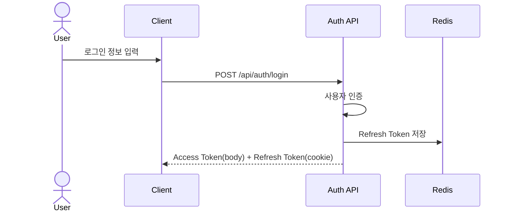
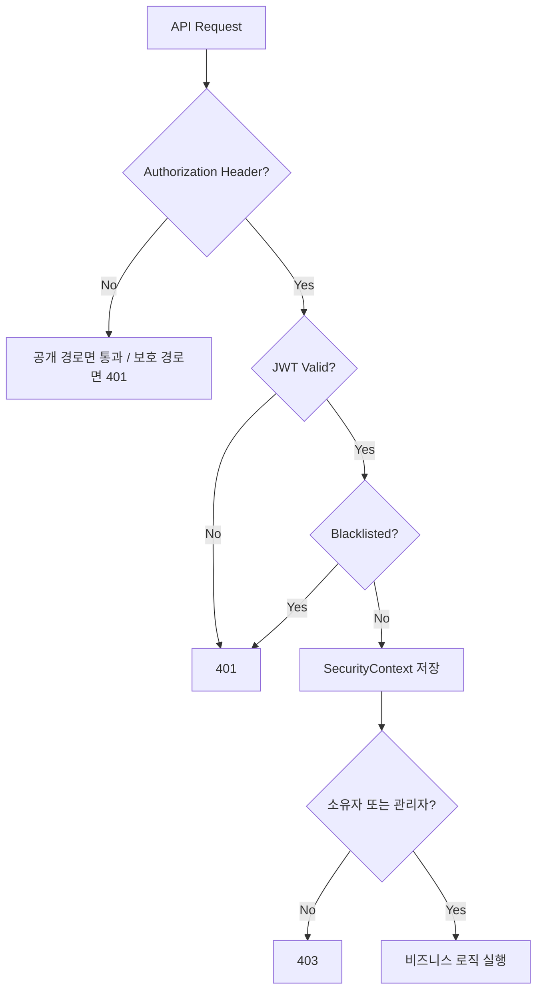

# Authentication & Authorization Design

## 1. 적용 범위

- 회원가입용 이메일 인증 / 비밀번호 재설정 / 회원가입 / 로그인 / 토큰 재발급 / 로그아웃 API
- 보호 API 접근 제어
- 로그인 사용자의 계정 정보/비밀번호 변경
- 게시글과 댓글 삭제의 소유자 검증
- 프런트의 Access Token 보관 및 API 호출 규칙

## 2. 사용자 역할

| 역할 | 설명 |
| --- | --- |
| `ROLE_USER` | 일반 사용자 |
| `ROLE_ADMIN` | 관리자 권한 사용자 |

## 3. 권한 정책

### 공개 경로

- `/api/auth/**`
- `/api/session/clear-refresh-cookie`
- `/api/home`
- `/api/rankings`
- `/api/scramble`
- `/actuator/health`
- local profile에서 `monitoring.prometheus.permit-all=true`일 때만 `/actuator/prometheus`
- `/docs/**`
- `/error`
- `GET /api/posts`
- `GET /api/posts/*`
- `GET /api/posts/*/comments`
- `GET /api/qna`
- `GET /api/qna/*`

### 인증 필요 경로

- 위 공개 경로를 제외한 나머지 API
- 예시
  - `GET /api/me`
  - `GET /api/users/me/profile`
  - `GET /api/users/me/records`
  - `PATCH /api/users/me/profile`
  - `PATCH /api/users/me/password`
  - `POST /api/records`
  - `PATCH /api/records/{recordId}`
  - `DELETE /api/records/{recordId}`
  - `POST /api/posts`
  - `GET /api/posts/{postId}/edit`
  - `PUT /api/posts/{postId}`
  - `DELETE /api/posts/{postId}`
  - `POST /api/posts/{postId}/comments`
  - `DELETE /api/posts/{postId}/comments/{commentId}`
  - `POST /api/feedbacks`
- `POST /api/feedbacks`는 인증 사용자 기준으로 `user_id`와 제출 시점의 회신 이메일을 함께 저장한다.

### 관리자 전용 경로

- `/api/admin/**`
- 예시
  - `GET /api/admin/feedbacks`
  - `GET /api/admin/feedbacks/{feedbackId}`
  - `PATCH /api/admin/feedbacks/{feedbackId}/answer`
  - `PATCH /api/admin/feedbacks/{feedbackId}/visibility`
  - `GET /api/admin/memos`
  - `POST /api/admin/memos`
  - `GET /api/admin/memos/{memoId}`
  - `PATCH /api/admin/memos/{memoId}`
  - `DELETE /api/admin/memos/{memoId}`

### 추가 인가 정책

- 게시글 수정/삭제는 인증만으로 끝나지 않는다.
- 작성자 본인 또는 `ROLE_ADMIN`만 허용한다.
- 게시글 상세 조회는 로그인 사용자 기준 계정당 1회만 조회수를 증가시키고, 비로그인 사용자는 조회수에 반영하지 않는다.
- 댓글 삭제는 인증만으로 끝나지 않는다.
- 댓글 작성자 본인 또는 `ROLE_ADMIN`만 허용한다.
- 기록 penalty 수정/삭제는 인증만으로 끝나지 않는다.
- 기록 소유자 본인만 허용한다.
- 관리자 피드백/메모 API는 `ROLE_ADMIN`만 허용한다.
- 공개 Q&A는 `PUBLIC` 상태이면서 답변이 있는 피드백만 노출한다.

## 4. 인증 흐름

### 1. 이메일 인증번호 요청

1. 사용자가 회원가입용 이메일을 전달한다.
2. 이미 가입된 이메일인지 확인한다.
3. 같은 이메일의 재요청 제한 시간을 확인한다.
4. 6자리 인증번호를 생성한다.
5. Redis에 인증번호와 재요청 제한 상태를 TTL과 함께 저장한다.
6. SMTP로 인증번호 메일을 발송한다.
7. SMTP 또는 메일 설정 문제로 발송에 실패하면 사용자에게는 `503 Service Unavailable`과 일반화된 재시도 문구만 반환한다.

### 2. 이메일 인증번호 확인

1. 사용자가 이메일과 6자리 인증번호를 전달한다.
2. Redis에 저장된 인증번호와 비교한다.
3. 일치하면 인증번호 key를 삭제하고 인증 완료 상태를 TTL과 함께 저장한다.

### 3. 회원가입

1. 사용자가 이메일, 비밀번호, 닉네임, 주 종목을 전달한다.
2. Redis 인증 완료 상태가 있는지 확인한다.
3. 이메일/닉네임 중복을 검사한다.
4. 비밀번호를 암호화해 `users`에 저장한다.
5. 회원가입 성공 후 인증 완료 상태를 삭제한다.
6. 기본 권한은 `ROLE_USER`, 기본 상태는 `ACTIVE`다.

### 4. 비밀번호 재설정 인증번호 요청

1. 사용자가 비밀번호를 재설정할 이메일을 전달한다.
2. 같은 이메일의 재요청 제한 시간을 확인한다.
3. 6자리 인증번호를 생성한다.
4. Redis에 비밀번호 재설정 인증번호와 재요청 제한 상태를 TTL과 함께 저장한다.
5. 계정 존재 여부는 외부에 노출하지 않고, 가입된 이메일인 경우에만 SMTP로 인증번호 메일을 발송한다.
6. SMTP 또는 메일 설정 문제로 발송에 실패하면 사용자에게는 `503 Service Unavailable`과 일반화된 재시도 문구만 반환한다.

### 5. 비밀번호 재설정 확인

1. 사용자가 이메일, 6자리 인증번호, 새 비밀번호를 전달한다.
2. Redis에 저장된 비밀번호 재설정 인증번호와 비교한다.
3. 일치하면 사용자의 비밀번호를 암호화해 갱신한다.
4. 관련 비밀번호 재설정 key를 삭제한다.
5. 해당 사용자의 Refresh Token을 모두 제거해 재로그인을 강제한다.

### 6. 로그인

1. `AuthenticationManager`로 이메일/비밀번호를 검증한다.
2. Access Token과 Refresh Token을 생성한다.
3. Refresh Token을 Redis에 저장한다.
4. Access Token은 응답 body로, Refresh Token은 `HttpOnly` cookie로 반환한다.

### 7. 토큰 재발급

1. `refresh_token` cookie를 전달한다. cookie가 없으면 `400 Bad Request`를 반환한다.
2. Refresh Token 자체 유효성을 검증한다.
3. 토큰에서 `email`, `jti`를 추출한다.
4. Redis 저장 값과 비교해 일치 여부를 확인한다.
5. 불일치 시 해당 사용자의 모든 Refresh Token을 제거하고 `401 Unauthorized`를 반환해 재로그인을 강제한다.
6. 일치하면 기존 Refresh Token을 삭제하고 새 Access/Refresh Token을 발급한다.

### 8. 로그아웃

1. Refresh Token이 전달되면 Redis에서 제거한다.
2. Access Token이 전달되면 남은 만료 시간 기준으로 블랙리스트에 등록한다.
3. `refresh_token` cookie를 즉시 만료 처리한다.

### 9. 로그인 사용자 비밀번호 변경

1. 로그인 사용자가 현재 비밀번호와 새 비밀번호를 전달한다.
2. 현재 비밀번호 일치 여부를 확인한다.
3. 새 비밀번호가 현재 비밀번호와 다른지 확인한다.
4. 새 비밀번호를 암호화해 저장한다.
5. 해당 사용자의 Refresh Token을 모두 제거해 재로그인을 강제한다.

## 5. 인가 흐름

### JWT 필터 동작

1. `Authorization` 헤더에서 Bearer 토큰을 추출한다.
2. 토큰 유효성을 검증한다.
3. 블랙리스트 등록 여부를 확인한다.
4. 토큰의 이메일과 권한 정보를 사용해 인증 객체를 구성한다.
5. `SecurityContext`에 인증 정보를 저장한다.

### 서비스 계층 소유권 검증

1. 보호 API 진입 후 로그인 사용자 정보를 조회한다.
2. 대상 리소스 작성자와 로그인 사용자 ID를 비교한다.
3. `ROLE_ADMIN`이면 통과시킨다.
4. 작성자 본인이 아니면 `403 Forbidden`을 반환한다.

## 6. 토큰 / 세션 / 보안 정책

### 목표 인증 방식

- JWT Access Token 기반 인증
- Redis Refresh Token 생명주기 관리
- Spring Security Stateless 세션 정책
- 역할 기반 인가

### 구현 상태

- 백엔드 인증 API를 제공한다.
  - `POST /api/auth/email-verification/request`
  - `POST /api/auth/email-verification/confirm`
  - `POST /api/auth/password-reset/request`
  - `POST /api/auth/password-reset/confirm`
  - `POST /api/auth/signup`
  - `POST /api/auth/login`
  - `POST /api/auth/refresh`
  - `POST /api/auth/logout`
  - `POST /api/session/clear-refresh-cookie`
- 로그인 사용자 컨텍스트 조회용 `GET /api/me`를 제공한다.
- `GET /api/home`는 공개 경로지만, Access Token이 있으면 개인화 데이터를 함께 반환한다.
  - 응답 최소 필드: `userId`, `email`, `nickname`, `role`
  - 이 API는 헤더/전역 사용자 컨텍스트용이며 상세 프로필 API와 분리한다.
- 마이페이지 상세 조회 API를 제공한다.
  - `GET /api/users/me/profile`
  - `GET /api/users/me/records`
- 로그인 사용자 계정 관리 API를 제공한다.
  - `PATCH /api/users/me/profile`
  - `PATCH /api/users/me/password`
- 기록 관리 API를 제공한다.
  - `PATCH /api/records/{recordId}`
  - `DELETE /api/records/{recordId}`
- 백엔드는 Access Token을 응답 body로, Refresh Token을 `HttpOnly` cookie로 전달한다.
- React는 `AuthContext` + `authStorage.js` 기반 메모리 보관 구조를 사용한다.
- React는 앱 초기 `refresh -> /api/me` 순서로 사용자 컨텍스트를 동기화한다.
- `apiClient`는 `withCredentials: true`와 `401 -> refresh -> retry`를 사용한다.
- React 로그인/회원가입/로그아웃, 비밀번호 재설정, 회원가입 이메일 인증 단계, 보호 라우트, 비로그인 전용 라우트, `/api/me` 기반 헤더 연동을 제공한다.
- React는 malformed refresh token, token reuse, 브라우저 레벨 request rejection처럼 `refresh_token`이 비정상 상태로 판단되면 세션 복구용 cookie clear endpoint를 가능한 범위에서 호출한다.

### React 구조

- `Access Token = 메모리`, `Refresh Token = HttpOnly cookie`를 단일 기준으로 맞춘다.
- 앱 초기 진입/새로고침 시 `refresh -> /api/me` 순서로 세션을 복구한다.
- refresh 또는 `/api/me`가 실패하면 access token과 사용자 컨텍스트를 함께 정리한다.
- refresh 실패 원인이 `refresh_token` 자체 문제로 판단되면 React는 `POST /api/session/clear-refresh-cookie`를 추가 호출해 `/api/auth` 경로 cookie를 정리한다.
- React `apiClient`는 `withCredentials: true`로 설정되어 있다.

### 토큰 세부 정책

#### Access Token

- 저장/전달
  - 응답 body의 `data.accessToken`
  - 구현 상태: React 메모리 저장
- 주요 정보
  - `subject`: 사용자 이메일
  - `role`: 권한 claim
  - `jti`: 토큰 식별자
- 사용 목적
  - API 인증 헤더 `Authorization: Bearer <token>`
  - `GET /api/me` 같은 로그인 사용자 컨텍스트 조회
- 세션 복구
  - 구현 상태: 앱 초기 진입에서 `refresh_token` cookie로 Access Token을 재발급받은 뒤 메모리에 다시 적재하고 `/api/me`를 조회한다.
  - 구현 상태: refresh 또는 `/api/me`가 실패하면 메모리 token과 사용자 컨텍스트를 함께 정리한다.
- 만료 시간
  - 로컬 설정: `86400000` (1일)
  - 테스트 설정: `10000`
  - 프로덕션 설정: `jwt.expiration` 정의됨

#### Refresh Token

- 저장/전달
  - 응답 cookie `refresh_token`
  - `HttpOnly`, `SameSite=Strict`, `Path=/api/auth`
  - `Secure` 속성은 환경 설정으로 분기한다.
    - local: `false`
    - prod: `true`
- 주요 정보
  - `subject`: 사용자 이메일
  - `jti`: 토큰 식별자
- 저장 위치
  - Redis
  - Key 전략: `refresh:{email}:{jti}`
- 만료 시간
  - 로컬 설정: `604800000` (7일)
  - 테스트 설정: `60000`
  - 프로덕션 설정: `application-prod.yaml`의 `JWT_REFRESH_EXPIRATION`으로 관리하며 기본값은 `604800000`이다.

#### Access Token Blacklist

- 로그아웃된 Access Token은 Redis 블랙리스트에 저장된다.
- Key 전략: `blacklist:{accessToken}`
- TTL: 토큰의 남은 유효 시간

#### 회원가입 이메일 인증 상태

- 인증번호와 인증 완료 상태는 Redis에 저장된다.
- Key 전략
  - `auth:email-verification:code:{email}`
  - `auth:email-verification:cooldown:{email}`
  - `auth:email-verification:verified:{email}`
- TTL 정책
  - 인증번호: `10분`
  - 재요청 제한: `1분`
  - 인증 완료 상태: `30분`
- 메일 발송은 SMTP 기반이다.
- 재요청 제한 안내 문구는 Redis 남은 TTL을 별도 조회하지 않고 `인증번호 재요청은 약 1분 뒤에 가능합니다.`처럼 근사값으로 안내한다.

#### 비밀번호 재설정 인증 상태

- 인증번호와 재요청 제한 상태는 Redis에 저장된다.
- Key 전략
  - `auth:password-reset:code:{email}`
  - `auth:password-reset:cooldown:{email}`
- TTL 정책
  - 인증번호: `10분`
  - 재요청 제한: `1분`
- 가입되지 않은 이메일은 인증번호를 저장하지 않고 동일 성공 응답만 반환한다.
- 재요청 제한 안내 문구는 Redis 남은 TTL을 별도 조회하지 않고 `인증번호 재요청은 약 1분 뒤에 가능합니다.`처럼 근사값으로 안내한다.

## 7. 예외 처리 정책

| 상황 | HTTP Status | 백엔드 처리 | 프런트 처리 |
| --- | --- | --- | --- |
| 이메일 인증번호 재요청 제한 | `400` | `AuthService`의 `IllegalArgumentException` 처리 | 안내 메시지 노출 후 잠시 뒤 재시도 |
| 잘못되거나 만료된 이메일 인증번호 | `400` | `AuthService`의 `IllegalArgumentException` 처리 | 인증번호 재입력 또는 재요청 유도 |
| 비밀번호 재설정 인증번호 재요청 제한 | `400` | `AuthService`의 `IllegalArgumentException` 처리 | 안내 메시지 노출 후 잠시 뒤 재시도 |
| 잘못되거나 만료된 비밀번호 재설정 인증번호 | `400` | `AuthService`의 `IllegalArgumentException` 처리 | 인증번호 재입력 또는 재요청 유도 |
| 이메일 인증 미완료 회원가입 | `400` | `AuthService`의 `IllegalArgumentException` 처리 | 이메일 인증 단계 재진행 유도 |
| 현재 비밀번호 불일치 또는 동일 비밀번호 변경 시도 | `400` | `UserProfileService`의 `IllegalArgumentException` 처리 | 비밀번호 입력 재확인 유도 |
| `refresh_token` cookie 누락 | `400` | `GlobalExceptionHandler`의 `MissingRequestCookieException` 처리 | 세션 확인 또는 재로그인 유도 |
| 잘못된 refresh token | `400` | `AuthService`의 `IllegalArgumentException` 처리 | refresh 재시도 중단, 세션 정리 판단 |
| Refresh Token 재사용 감지 | `401` | `AuthService`가 Redis 불일치 감지 후 해당 사용자의 Refresh Token을 전체 삭제 | 세션 전체 정리 후 재로그인 유도 |
| 인증 정보 없음 | `401` | `SecurityConfig`의 `authenticationEntryPoint`에서 JSON 응답 | 로그인 화면 유도 |
| 로그인 실패 | `401` | `AuthService`에서 `CustomApiException` 반환 | 에러 메시지 표시 |
| 만료/무효 토큰 | `401` | JWT 검증 실패 또는 블랙리스트 검사 실패 | 재로그인 또는 재발급 유도 |
| 권한 부족 | `403` | `accessDeniedHandler` 또는 서비스 계층 인가 예외 | 권한 없음 메시지 표시 |
| 소유자 조건 불일치 | `403` | 게시글/댓글 수정·삭제 또는 기록 수정/삭제 거부 | 상세 또는 목록 화면 복귀 |
| 중복 회원가입 | `409` | `DataIntegrityViolationException` 처리 | 입력값 수정 유도 |
| SMTP/S3 같은 외부 연동 일시 장애 | `503` | `CustomApiException(HttpStatus.SERVICE_UNAVAILABLE)`로 일반화된 재시도 문구 반환 | 잠시 후 재시도 유도 |

## 8. 프런트 처리 규칙

- 보호 라우트 처리:
  - `mypage`, `community/write`, `community/:id/edit`에 명시적 보호 라우트가 적용되어 있다.
  - `login`, `signup`에는 비로그인 전용 라우트가 적용되어 있다.
- 비밀번호 재설정 처리:
  - `/reset-password`는 이메일 입력 -> 인증번호 요청 -> 새 비밀번호 입력 -> 로그인 화면 복귀 순서로 동작한다.
  - 비밀번호 재설정 성공 시 로그인 화면으로 이동하고 안내 메시지와 이메일 prefill 상태를 전달한다.
- 회원가입 처리:
  - `/signup`은 이메일 입력 -> 인증번호 요청 -> 인증번호 확인 -> 가입 제출 순서로 동작한다.
  - 이메일이 바뀌면 프런트는 인증 완료 상태와 인증번호 입력값을 즉시 초기화한다.
  - 이메일 인증이 완료되기 전까지 최종 가입 버튼은 비활성화한다.
- 로그인 사용자 계정 관리 처리:
  - 마이페이지는 `/api/users/me/profile`, `/api/users/me/records` 조회와 함께 프로필 수정, 비밀번호 변경을 처리한다.
  - 비밀번호 변경 성공 시 프런트는 세션을 정리하고 로그인 화면으로 이동한다.
- 로그인 사용자 컨텍스트 처리:
  - 헤더와 전역 auth-aware UI는 `GET /api/me`를 사용해 최소 사용자 컨텍스트를 조회한다.
  - `GET /api/me`는 `userId`, `email`, `nickname`, `role`을 반환하고, 상세 프로필/기록은 `/api/users/me/profile`, `/api/users/me/records`로 분리한다.
  - `role`은 커뮤니티 작성 화면의 `NOTICE` 노출과 게시글 상세 삭제 버튼 노출 기준으로 사용한다.
  - 보안상 `userId`를 파라미터로 받지 않고 인증 주체 기준으로만 조회한다.
  - 앱 초기 진입/새로고침 시 먼저 refresh로 Access Token을 복구한 뒤 `/api/me`를 조회한다.
  - refresh 또는 `/api/me` 조회가 실패하면 세션을 유효하지 않은 상태로 보고 access token과 사용자 컨텍스트를 정리한다.
  - 이때 진입 경로가 보호 라우트면 `/login`으로 이동하고, public route면 guest 상태로 남긴다.
- bootstrapping 처리:
  - 앱 시작 시 인증 상태가 즉시 확정되지 않으므로 `AuthContext`가 초기 복구가 끝날 때까지 `bootstrapping/loading` 상태를 가진다.
- 401 처리:
  - `apiClient`가 `401 -> refresh -> retry`를 1회 수행한다.
  - 동시에 여러 요청이 `401`을 받을 수 있으므로 refresh 요청은 단일 in-flight 요청으로 공유해야 한다.
  - refresh 실패 시 대기 중 요청을 모두 실패 처리하고 access token과 사용자 컨텍스트를 함께 정리한다.
  - `POST /api/auth/refresh` 자체가 `401`이면 토큰 재사용 감지로 보고 재시도 없이 세션 전체를 정리한 뒤 로그인으로 보낸다.
- 403 처리:
  - 작성자/관리자 권한이 없는 경우 작업 버튼 비활성화 또는 오류 메시지 처리가 필요하다.
- 로그인 성공 후 이동:
  - 보호 경로에서 로그인 화면으로 이동한 경우 원래 경로로 복귀한다.
  - 기본 진입은 홈(`/`)으로 복귀한다.
- 재로그인/재발급 UX:
  - refresh 실패 시 세션을 정리하고 보호 경로 기준으로 로그인 이동을 수행한다.
- 로그아웃 처리:
  - `/api/auth/logout` 호출 성공 여부와 무관하게 클라이언트는 `finally`에서 인증 상태를 정리해야 한다.
  - 구현 상태에서는 메모리 access token과 사용자 컨텍스트를 함께 비운다.
  - 서버 실패는 사용자에게 알릴 수 있지만, 사용자를 로그인 상태에 가둬서는 안 된다.

## 9. 인증 / 인가 다이어그램

### 로그인 시퀀스

### 인가 분기

## 10. 미확정 사항

- `SameSite`, `Secure`, CORS, 필요 시 `CSRF` 대응의 최종 운영 정책
- 홈 대시보드 API의 최종 계약 범위
- 프로덕션 설정의 `jwt.refresh-expiration` 정리 방식
