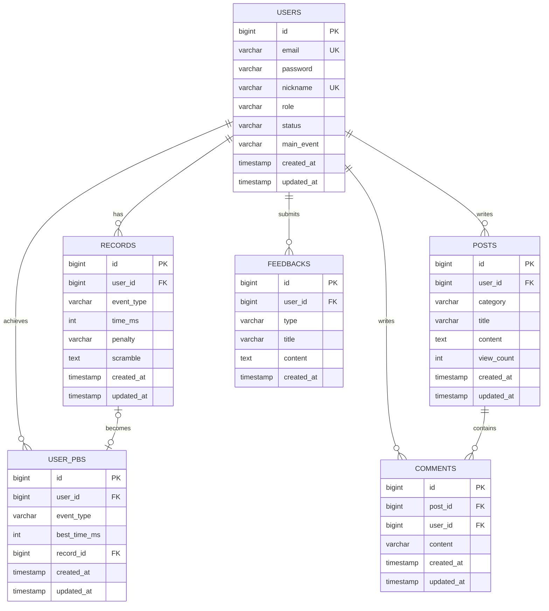

# Database Design

## 1. 설계 개요

- 영속 데이터 저장소는 MySQL을 기준으로 한다.
- 기록 도메인은 원본 solve 로그(`records`)와 사용자 대표 기록(`user_pbs`)을 분리해 관리한다.
- 게시판은 `posts`, `comments` 중심 구조로 설계하고, 피드백은 선택 저장 모델로 둔다.
- 최종 랭킹 최적화는 Redis ZSET을 목표로 하지만, 영속 기준은 여전히 MySQL의 `records` / `user_pbs` 조합이다.

## 2. 엔티티 / 테이블 목록

| 테이블 | 역할 | 현재 상태 |
| --- | --- | --- |
| `users` | 사용자 계정 및 프로필 저장 | JPA 엔티티 구현됨 |
| `records` | 원본 solve 로그 저장 | JPA 엔티티 구현됨 |
| `user_pbs` | 사용자별 대표 PB 저장 | JPA 엔티티 구현됨 |
| `posts` | 게시글 저장 | JPA 엔티티 구현됨 |
| `comments` | 댓글 저장 | JPA 엔티티 구현됨 / API 구현 예정 |
| `feedbacks` | 피드백 저장 또는 아카이브 | 설계 유지 / 구현 예정 |

## 3. 관계 요약

```text
Users 1:N Records
Users 1:N User_PBs
Users 1:N Posts
Users 1:N Comments
Users 1:N Feedbacks
Posts 1:N Comments
Records 1:1 (또는 1:0) User_PBs
```

## 4. 핵심 설계 판단

### 설계 선택 1

- 선택한 구조:
  - `records`와 `user_pbs`를 분리한다.
- 선택 이유:
  - `records`는 모든 solve 원본 로그를 보존해야 한다.
  - 랭킹이나 PB 조회는 사용자별 대표 기록만 빠르게 찾는 별도 모델이 있으면 단순해진다.
- 검토한 대안:
  - `records` 하나만 두고 매번 최소 기록을 조회
  - 사용자 테이블에 PB 컬럼을 직접 보관
- 대안을 배제한 이유:
  - 전자는 원본 로그가 누적될수록 조회 비용이 커질 수 있다.
  - 후자는 종목별 PB 확장성과 원본 기록 연결성이 약하다.
- 트레이드오프:
  - 기록 저장 시 PB 갱신 로직이 추가된다.
  - V1 랭킹이 아직 `records`를 조회하므로 문서에서 구조가 두 개처럼 보일 수 있다.
- 성능/유지보수 영향:
  - 원본 로그와 대표 기록의 책임이 분리되어 후속 랭킹 최적화와 통계 확장에 유리하다.

### 설계 선택 2

- 선택한 구조:
  - 홈/마이페이지 통계용 집계 컬럼을 별도 컬럼으로 저장하지 않는다.
- 선택 이유:
  - 집계값은 원본 로그 기준으로 계산되는 파생 데이터다.
  - 조기 최적화로 컬럼을 늘리면 쓰기 경로와 정합성 관리가 복잡해진다.
- 검토한 대안:
  - `users` 또는 별도 통계 테이블에 총 횟수, 평균, PB를 중복 저장
- 대안을 배제한 이유:
  - 기록 수정/삭제나 향후 집계 기준 변경 시 동기화 비용이 커진다.
- 트레이드오프:
  - 조회 시 집계 비용이 늘 수 있다.
  - 읽기 부하가 커질 경우 별도 집계 모델 또는 캐시가 필요해질 수 있다.
- 성능/유지보수 영향:
  - 현재는 데이터 정합성과 설계 단순성을 우선하고, 성능 이슈는 후속 캐시/집계 구조로 대응할 수 있다.

### 설계 선택 3

- 선택한 구조:
  - 인덱스를 조회 패턴 중심으로 최소 구성한다.
- 선택 이유:
  - 랭킹 조회는 `event_type`, `time_ms` 정렬이 핵심이고, 게시판/댓글은 작성자와 부모 자원 기준 조회가 많다.
- 검토한 대안:
  - 초기부터 다수의 복합 인덱스를 광범위하게 추가
- 대안을 배제한 이유:
  - 실제 조회 패턴이 확정되기 전 과도한 인덱스는 쓰기 비용과 운영 복잡도만 늘릴 수 있다.
- 트레이드오프:
  - 후속 검색 조건이 늘어나면 인덱스 재조정이 필요할 수 있다.
- 성능/유지보수 영향:
  - 현재 구현 범위에서 필요한 경로를 우선 보장하고, 부하 테스트 이후 추가 최적화를 검토할 수 있다.

## 5. 테이블 구조

### `users`

- 목적:
  - 로그인과 권한 관리, 프로필 표시의 기준 사용자 정보를 저장한다.
- 설명:
  - 인증 주체와 작성자/기록 주체를 모두 담당하는 핵심 테이블이다.

| Field | Type | Description |
| --- | --- | --- |
| `id` | `bigint` | 사용자 ID (PK, Auto Increment) |
| `email` | `varchar(255)` | 로그인 이메일 (Unique) |
| `password` | `varchar(255)` | 암호화된 비밀번호 |
| `nickname` | `varchar(50)` | 사용자 닉네임 (Unique) |
| `role` | `varchar(20)` | 시스템 권한 (`ROLE_USER`, `ROLE_ADMIN`) |
| `status` | `varchar(20)` | 계정 상태 (`ACTIVE`, `DELETED`) |
| `main_event` | `varchar(50)` | 프로필 주력 종목 |
| `created_at` | `timestamp` | 생성일 |
| `updated_at` | `timestamp` | 수정일 |

#### 제약 / 비즈니스 규칙

- `email`, `nickname`은 중복을 허용하지 않는다.
- 권한과 상태는 enum 문자열로 저장한다.

### `records`

- 목적:
  - 모든 solve 원본 로그를 저장한다.
- 설명:
  - 타이머 결과의 사실 기록이며, 통계와 PB 갱신의 기준 데이터다.

| Field | Type | Description |
| --- | --- | --- |
| `id` | `bigint` | 기록 ID (PK, Auto Increment) |
| `user_id` | `bigint` | 측정자 ID (FK -> `users.id`) |
| `event_type` | `varchar(20)` | 종목 (`WCA_333`, `WCA_222` 등) |
| `time_ms` | `int` | 해결 시간(밀리초) |
| `penalty` | `varchar(10)` | 페널티 (`NONE`, `PLUS_TWO`, `DNF`) |
| `scramble` | `text` | 사용된 스크램블 문자열 |
| `created_at` | `timestamp` | 측정 시각 |
| `updated_at` | `timestamp` | 수정 시각 |

#### 인덱스

| 인덱스명 | 컬럼 | 목적 |
| --- | --- | --- |
| `idx_record_event_time` | `event_type, time_ms` | 종목별 랭킹 정렬 기준 |
| `idx_record_user_id` | `user_id` | 사용자 기준 기록 조회 |

#### 제약 / 비즈니스 규칙

- `DNF`는 저장하되 PB 갱신 대상에서는 제외한다.
- 기록은 원본 로그이므로 삭제/수정 정책은 별도 합의가 필요하다.

### `user_pbs`

- 목적:
  - 사용자별·종목별 대표 PB를 저장한다.
- 설명:
  - 원본 solve 전체를 매번 스캔하지 않고 대표 기록을 참조하기 위한 모델이다.

| Field | Type | Description |
| --- | --- | --- |
| `id` | `bigint` | 최고 기록 ID (PK, Auto Increment) |
| `user_id` | `bigint` | 측정자 ID (FK -> `users.id`) |
| `event_type` | `varchar(20)` | 종목 |
| `best_time_ms` | `int` | 최고 기록(밀리초) |
| `record_id` | `bigint` | 원본 측정 기록 ID (FK -> `records.id`) |
| `created_at` | `timestamp` | 생성 시각 |
| `updated_at` | `timestamp` | 최고 기록 갱신 시각 |

#### 인덱스

| 인덱스명 | 컬럼 | 목적 |
| --- | --- | --- |
| `uk_user_event` | `user_id, event_type` | 사용자별 종목당 대표 PB 1건 보장 |
| `idx_event_best_time` | `event_type, best_time_ms` | 종목별 PB 정렬 기준 |
| `idx_user_pb_record_id` | `record_id` | 원본 기록 연결 |

#### 제약 / 비즈니스 규칙

- 사용자당 종목별 PB는 1건만 허용한다.
- 반드시 원본 `records` 한 건을 참조한다.

### `posts`

- 목적:
  - 커뮤니티 게시글을 저장한다.
- 설명:
  - 공지/자유 게시판의 본문과 메타 정보를 관리한다.

| Field | Type | Description |
| --- | --- | --- |
| `id` | `bigint` | 게시글 ID (PK, Auto Increment) |
| `user_id` | `bigint` | 작성자 ID (FK -> `users.id`) |
| `category` | `varchar(50)` | 게시판 분류 (`NOTICE`, `FREE`) |
| `title` | `varchar(100)` | 게시글 제목 |
| `content` | `text` | 게시글 본문 |
| `view_count` | `int` | 조회수 (기본값 0) |
| `created_at` | `timestamp` | 작성일 |
| `updated_at` | `timestamp` | 수정일 |

#### 인덱스

| 인덱스명 | 컬럼 | 목적 |
| --- | --- | --- |
| `idx_post_category` | `category` | 카테고리 필터 |
| `idx_post_user_id` | `user_id` | 작성자 기준 조회 |

#### 제약 / 비즈니스 규칙

- 게시글 수정/삭제는 작성자 본인 또는 `ROLE_ADMIN`만 허용한다.
- 상세 조회는 `view_count`를 증가시킨다.

### `comments`

- 목적:
  - 게시글 댓글을 저장한다.
- 설명:
  - 커뮤니티 상세 화면의 댓글 상호작용을 담당한다.

| Field | Type | Description |
| --- | --- | --- |
| `id` | `bigint` | 댓글 ID (PK, Auto Increment) |
| `post_id` | `bigint` | 게시글 ID (FK -> `posts.id`) |
| `user_id` | `bigint` | 작성자 ID (FK -> `users.id`) |
| `content` | `varchar(500)` | 댓글 본문 |
| `created_at` | `timestamp` | 작성일 |
| `updated_at` | `timestamp` | 수정일 |

#### 인덱스

| 인덱스명 | 컬럼 | 목적 |
| --- | --- | --- |
| `idx_comment_post_id` | `post_id` | 게시글 기준 댓글 조회 |
| `idx_comment_user_id` | `user_id` | 작성자 기준 조회 |

#### 제약 / 비즈니스 규칙

- 댓글 API는 아직 구현 예정이지만, 테이블 구조와 관계는 미리 정의되어 있다.

### `feedbacks`

- 목적:
  - 피드백을 저장하거나 아카이브하는 선택 저장 모델이다.
- 설명:
  - 제품 기준 1차 전달 경로는 관리자 메일이며, 필요 시 DB 저장을 확장한다.

| Field | Type | Description |
| --- | --- | --- |
| `id` | `bigint` | 피드백 ID (PK, Auto Increment) |
| `user_id` | `bigint` | 제보자 ID (FK -> `users.id`, 익명 시 null 가능) |
| `type` | `varchar(20)` | 피드백 종류 (`BUG`, `FEATURE`, `UX`, `OTHER`) |
| `title` | `varchar(100)` | 피드백 제목 |
| `content` | `text` | 피드백 상세 내용 |
| `created_at` | `timestamp` | 제출일 |

#### 비고

- 메일 전달만 사용할 경우 필수 테이블은 아닐 수 있다.
- 회신 이메일, 발송 상태, 처리 이력까지 관리하려면 스키마 보강이 필요하다.

## 6. 제약조건 정책

- FK 유지 전략:
  - 사용자, 기록, 게시글, 댓글의 관계는 FK로 유지한다.
- Unique 대상:
  - `users.email`
  - `users.nickname`
  - `user_pbs(user_id, event_type)`
- 길이 제한 기준:
  - 닉네임 최대 50자
  - 게시글 제목 최대 100자
  - 댓글 최대 500자
- 값 검증 기준:
  - enum 값은 코드 레벨(`EventType`, `Penalty`, `PostCategory`, `UserRole`, `UserStatus`)에서 검증한다.

## 7. 삭제 / 보관 정책

- 현재 명시된 soft delete 적용 테이블은 없다.
- 게시글은 현재 물리 삭제 기준이다.
- 기록 데이터는 원본 로그 성격이 강하므로 삭제 정책을 신중히 다뤄야 한다.
- 피드백은 메일 전송만 사용할 경우 DB 저장 없이 처리할 수도 있다.

## 8. 성능 고려

- 자주 조회되는 컬럼
  - `records.event_type`, `records.time_ms`
  - `records.user_id`
  - `user_pbs.event_type`, `user_pbs.best_time_ms`
  - `posts.category`, `posts.user_id`
  - `comments.post_id`
- 페이징/정렬 기준
  - 랭킹: 시간 오름차순
  - 게시글: 생성일/ID 내림차순
- 현재 구조의 한계
  - V1 랭킹은 `records` 원본 조회라 읽기 부하가 커질 수 있다.
- 후속 최적화 방향
  - Redis ZSET 기반 랭킹 V2
  - 필요 시 통계성 조회를 위한 별도 집계/캐시 구조

## 9. ERD



## 10. 미확정 사항

- 댓글 API 구현 시 수정/삭제 정책과 soft delete 도입 여부
- 피드백을 메일 전송만 사용할지, `feedbacks` 테이블을 함께 운영할지
- 랭킹 V2 전환 시 `user_pbs`와 Redis ZSET 동기화 방식
