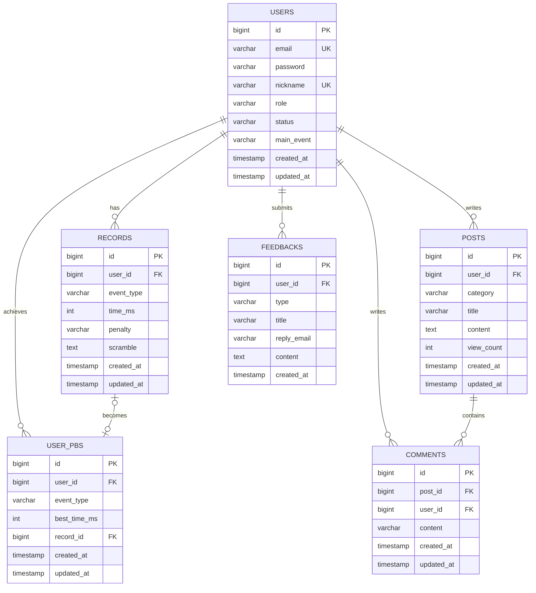

# Database Design

## 1. 설계 개요

- 영속 데이터 저장소는 MySQL을 기준으로 한다.
- 기록 도메인은 원본 solve 로그(`records`)와 사용자 대표 기록(`user_pbs`)을 분리해 관리한다.
- 홈/마이페이지 통계는 원본 로그 기준 조회를 사용하며 별도 집계 테이블이나 집계 컬럼은 두지 않는다.
- 게시판은 `posts`, `comments`, `post_attachments`, `post_views` 중심 구조로 설계하고, 피드백과 관리자 메모를 운영 데이터로 함께 둔다.
- 랭킹 최적화는 Redis ZSET 읽기 모델을 사용하지만, 기준 데이터는 여전히 MySQL의 `records` / `user_pbs` 조합이다.
- 인덱스는 조회 패턴 기준의 최소 구성을 유지한다.

## 2. 엔티티 / 테이블 목록

| 테이블 | 역할 | 구현 상태 |
| --- | --- | --- |
| `users` | 사용자 계정 및 프로필 저장 | JPA 엔티티 구현됨 |
| `records` | 원본 solve 로그 저장 | JPA 엔티티 구현됨 |
| `user_pbs` | 사용자별 대표 PB 저장 | JPA 엔티티 구현됨 |
| `posts` | 게시글 저장 | JPA 엔티티 구현됨 |
| `comments` | 댓글 저장 | JPA 엔티티 구현됨 / API 구현됨 |
| `post_attachments` | 게시글 첨부 이미지 메타데이터 저장 | JPA 엔티티 구현됨 / API 구현됨 |
| `post_views` | 로그인 사용자 기준 고유 조회 이력 저장 | JPA 엔티티 구현됨 / API 구현됨 |
| `feedbacks` | 피드백 저장 또는 아카이브 | JPA 엔티티 구현됨 / API 구현됨 |
| `admin_memos` | 관리자 내부 질문/답변 메모 저장 | JPA 엔티티 구현됨 / API 구현됨 |

## 3. 관계 요약

```text
Users 1:N Records
Users 1:N User_PBs
Users 1:N Posts
Users 1:N Comments
Users 1:N Feedbacks
Users 1:N Post_Views
Posts 1:N Comments
Posts 1:N Post_Attachments
Posts 1:N Post_Views
Records 1:1 (또는 1:0) User_PBs
```

## 4. 테이블 구조

### `users`

- 목적:
  - 로그인과 권한 관리, 프로필 표시의 기준 사용자 정보를 저장한다.
- 설명:
  - 인증 주체와 작성자/기록 주체를 모두 담당하는 핵심 테이블이다.

| Field | Type | Description |
| --- | --- | --- |
| `id` | `bigint` | 사용자 ID (PK, Auto Increment) |
| `email` | `varchar(255)` | 로그인 이메일 (Unique) |
| `password` | `varchar(255)` | 암호화된 비밀번호 |
| `nickname` | `varchar(50)` | 사용자 닉네임 (Unique) |
| `role` | `varchar(20)` | 시스템 권한 (`ROLE_USER`, `ROLE_ADMIN`) |
| `status` | `varchar(20)` | 계정 상태 (`ACTIVE`, `DELETED`) |
| `main_event` | `varchar(50)` | 프로필 주력 종목 |
| `created_at` | `timestamp` | 생성일 |
| `updated_at` | `timestamp` | 수정일 |

#### 제약 / 비즈니스 규칙

- `email`, `nickname`은 중복을 허용하지 않는다.
- 권한과 상태는 enum 문자열로 저장한다.

### `records`

- 목적:
  - 모든 solve 원본 로그를 저장한다.
- 설명:
  - 타이머 결과의 사실 기록이며, 통계와 PB 갱신의 기준 데이터다.

| Field | Type | Description |
| --- | --- | --- |
| `id` | `bigint` | 기록 ID (PK, Auto Increment) |
| `user_id` | `bigint` | 측정자 ID (FK -> `users.id`) |
| `event_type` | `varchar(20)` | 종목 (`WCA_333`, `WCA_222` 등) |
| `time_ms` | `int` | 원본 해결 시간(밀리초) |
| `penalty` | `varchar(10)` | 페널티 (`NONE`, `PLUS_TWO`, `DNF`) |
| `scramble` | `text` | 사용된 스크램블 문자열 |
| `created_at` | `timestamp` | 측정 시각 |
| `updated_at` | `timestamp` | 수정 시각 |

#### 인덱스

| 인덱스명 | 컬럼 | 목적 |
| --- | --- | --- |
| `idx_record_event_time` | `event_type, time_ms` | 종목별 원본 기록 탐색과 정렬 보조 |
| `idx_record_user_created_at` | `user_id, created_at` | 사용자 최근 기록 조회와 페이지 정렬 |

#### 제약 / 비즈니스 규칙

- `DNF`는 저장하되 PB 갱신 대상에서는 제외한다.
- `PLUS_TWO`는 `time_ms`를 덮어쓰지 않고, 비즈니스 로직에서 `time_ms + 2000`의 유효 시간으로 계산한다.
- 기록 소유자는 본인 기록의 penalty를 수정하거나 기록을 삭제할 수 있다.
- PB를 참조하던 기록이 수정/삭제되면 `user_pbs`를 다시 계산한다.

### `user_pbs`

- 목적:
  - 사용자별·종목별 대표 PB를 저장한다.
- 설명:
  - 원본 solve 전체를 매번 스캔하지 않고 대표 기록을 참조하기 위한 모델이다.

| Field | Type | Description |
| --- | --- | --- |
| `id` | `bigint` | 최고 기록 ID (PK, Auto Increment) |
| `user_id` | `bigint` | 측정자 ID (FK -> `users.id`) |
| `event_type` | `varchar(20)` | 종목 |
| `best_time_ms` | `int` | penalty 반영 유효 시간 기준 최고 기록(밀리초) |
| `record_id` | `bigint` | 원본 측정 기록 ID (FK -> `records.id`) |
| `created_at` | `timestamp` | 생성 시각 |
| `updated_at` | `timestamp` | 최고 기록 갱신 시각 |

#### 인덱스

| 인덱스명 | 컬럼 | 목적 |
| --- | --- | --- |
| `uk_user_event` | `user_id, event_type` | 사용자별 종목당 대표 PB 1건 보장 |
| `idx_event_best_time` | `event_type, best_time_ms` | 종목별 PB 정렬 기준 |
| `idx_user_pb_record_id` | `record_id` | 원본 기록 연결 |

#### 제약 / 비즈니스 규칙

- 사용자당 종목별 PB는 1건만 허용한다.
- 반드시 원본 `records` 한 건을 참조한다.
- `best_time_ms`는 `records.time_ms` 원값이 아니라 penalty를 반영한 유효 시간이다.

### Redis ranking 읽기 모델

- 목적:
  - 기본 랭킹 조회의 읽기 병목 구간을 MySQL에서 Redis로 분리한다.
- 설명:
  - 비영속 읽기 모델이며, MySQL `user_pbs`를 기준으로 재구축하거나 PB 변경 시 증분 동기화한다.

| Key | 타입 | 설명 |
| --- | --- | --- |
| `ranking:v2:{eventType}:zset` | ZSET | score=`best_time_ms`, member=`createdAtMillis:recordId:userId` |
| `ranking:v2:{eventType}:nicknames` | HASH | `userId -> nickname` 조회용 |
| `ranking:v2:{eventType}:members` | HASH | `userId -> member` update/delete 동기화용 |
| `ranking:v2:{eventType}:ready` | String | 재구축 완료 후 Redis 조회 가능 여부 표시 |

#### 비즈니스 규칙

- score는 `best_time_ms`를 사용한다.
- 동률 tie-break는 member 문자열의 사전순 정렬로 `created_at asc -> record.id asc`를 유지한다.
- `nickname` 부분 검색은 현재 Redis에 secondary index가 없어서 MySQL 대체 경로를 사용한다.
- Redis가 비어 있거나 준비 상태 키가 없으면 기본 조회도 MySQL 대체 경로를 사용한다.

### Redis auth email verification state

- 목적:
  - 회원가입 전 이메일 인증 상태를 임시 저장한다.
- 설명:
  - 영속 기준 데이터는 아니고, 이메일 인증번호·재요청 제한 상태·회원가입 가능 상태를 TTL로 관리하는 임시 모델이다.

| Key | 타입 | 설명 |
| --- | --- | --- |
| `auth:email-verification:code:{email}` | String | 6자리 인증번호 |
| `auth:email-verification:cooldown:{email}` | String | 재요청 제한 상태 |
| `auth:email-verification:verified:{email}` | String | 회원가입 가능 상태 |

#### 비즈니스 규칙

- 인증번호 TTL은 `10분`이다.
- 재요청 제한 TTL은 `1분`이다.
- 인증 완료 상태 TTL은 `30분`이다.
- 회원가입 성공 시 인증 완료 상태는 즉시 삭제한다.

### Redis auth password reset state

- 목적:
  - 로그인 전 비밀번호 재설정 인증 상태를 임시 저장한다.
- 설명:
  - 별도 영속 테이블 없이 비밀번호 재설정 인증번호와 재요청 제한 상태만 TTL로 관리하는 임시 모델이다.

| Key | 타입 | 설명 |
| --- | --- | --- |
| `auth:password-reset:code:{email}` | String | 6자리 인증번호 |
| `auth:password-reset:cooldown:{email}` | String | 재요청 제한 상태 |

#### 비즈니스 규칙

- 인증번호 TTL은 회원가입 이메일 인증과 같은 `10분` 설정을 재사용한다.
- 재요청 제한 TTL은 회원가입 이메일 인증과 같은 `1분` 설정을 재사용한다.
- 비밀번호 재설정 성공 시 인증번호와 재요청 제한 key를 즉시 삭제한다.

### `posts`

- 목적:
  - 커뮤니티 게시글을 저장한다.
- 설명:
  - 공지/자유 게시판의 본문과 메타 정보를 관리한다.

| Field | Type | Description |
| --- | --- | --- |
| `id` | `bigint` | 게시글 ID (PK, Auto Increment) |
| `user_id` | `bigint` | 작성자 ID (FK -> `users.id`) |
| `category` | `varchar(50)` | 게시판 분류 (`NOTICE`, `FREE`) |
| `title` | `varchar(100)` | 게시글 제목 |
| `content` | `text` | 게시글 본문 |
| `view_count` | `int` | 조회수 (기본값 0) |
| `created_at` | `timestamp` | 작성일 |
| `updated_at` | `timestamp` | 수정일 |

#### 인덱스

| 인덱스명 | 컬럼 | 목적 |
| --- | --- | --- |
| `idx_post_category_created_at_id` | `category, created_at, id` | 카테고리별 게시글 목록 정렬 |
| `idx_post_created_at_id` | `created_at, id` | 최근글 조회와 전체 목록 정렬 |
| `idx_post_user_id` | `user_id` | 작성자 기준 조회 |

#### 제약 / 비즈니스 규칙

- 게시글 수정/삭제는 작성자 본인 또는 `ROLE_ADMIN`만 허용한다.
- 첨부 이미지는 S3 object storage를 원본 저장소로 두고 DB에는 메타데이터만 저장한다.
- 상세 조회는 로그인 사용자 기준 `post_views(post_id, user_id)` 고유 행이 처음 생성될 때만 `view_count`를 증가시킨다.
- 비로그인 사용자는 조회수에 반영하지 않는다.

### `post_attachments`

- 목적:
  - 게시글에 연결된 다중 이미지 메타데이터를 저장한다.
- 설명:
  - 실제 바이너리는 S3에 저장하고, DB에는 URL/파일명/순서 정보만 둔다.

| Field | Type | Description |
| --- | --- | --- |
| `id` | `bigint` | 첨부 이미지 ID (PK, Auto Increment) |
| `post_id` | `bigint` | 게시글 ID (FK -> `posts.id`) |
| `object_key` | `varchar(512)` | S3 object key |
| `image_url` | `varchar(1000)` | 공개 이미지 URL |
| `original_file_name` | `varchar(255)` | 원본 파일명 |
| `content_type` | `varchar(100)` | MIME type |
| `file_size_bytes` | `bigint` | 파일 크기 |
| `display_order` | `int` | 화면 표시 순서 |
| `created_at` | `timestamp` | 생성 시각 |
| `updated_at` | `timestamp` | 수정 시각 |

#### 인덱스

| 인덱스명 | 컬럼 | 목적 |
| --- | --- | --- |
| `idx_post_attachment_post_id` | `post_id` | 게시글 기준 첨부 조회 |

#### 제약 / 비즈니스 규칙

- 게시글당 최대 5장까지 첨부할 수 있다.
- 허용 형식은 `jpg`, `jpeg`, `png`, `webp`다.

### `post_views`

- 목적:
  - 로그인 사용자 기준 게시글 고유 조회 이력을 저장한다.

| Field | Type | Description |
| --- | --- | --- |
| `id` | `bigint` | 조회 이력 ID (PK, Auto Increment) |
| `post_id` | `bigint` | 게시글 ID (FK -> `posts.id`) |
| `user_id` | `bigint` | 조회 사용자 ID (FK -> `users.id`) |
| `created_at` | `timestamp` | 첫 조회 시각 |
| `updated_at` | `timestamp` | 갱신 시각 |

#### 제약 / 비즈니스 규칙

- `post_id + user_id`는 unique다.
- 같은 사용자가 같은 게시글을 다시 조회해도 `view_count`는 추가 증가하지 않는다.

### `comments`

- 목적:
  - 게시글 댓글을 저장한다.
- 설명:
  - 커뮤니티 상세 화면의 댓글 상호작용을 담당한다.

| Field | Type | Description |
| --- | --- | --- |
| `id` | `bigint` | 댓글 ID (PK, Auto Increment) |
| `post_id` | `bigint` | 게시글 ID (FK -> `posts.id`) |
| `user_id` | `bigint` | 작성자 ID (FK -> `users.id`) |
| `content` | `varchar(500)` | 댓글 본문 |
| `created_at` | `timestamp` | 작성일 |
| `updated_at` | `timestamp` | 수정일 |

#### 인덱스

| 인덱스명 | 컬럼 | 목적 |
| --- | --- | --- |
| `idx_comment_post_id` | `post_id` | 게시글 기준 댓글 조회 |
| `idx_comment_user_id` | `user_id` | 작성자 기준 조회 |

#### 제약 / 비즈니스 규칙

- 댓글 목록/생성/삭제 API가 구현되어 있고, 삭제 권한은 작성자 본인 또는 관리자 기준을 따른다.

### `feedbacks`

- 목적:
  - 피드백을 저장하거나 아카이브하는 선택 저장 모델이다.
- 설명:
  - 로그인 사용자 기준 DB 저장을 기준 데이터로 사용하고, Discord 운영 알림 상태와 재시도 이력을 함께 관리한다.
  - 제출 시점의 회신용 이메일 주소를 `reply_email`에 함께 보관한다.

| Field | Type | Description |
| --- | --- | --- |
| `id` | `bigint` | 피드백 ID (PK, Auto Increment) |
| `user_id` | `bigint` | 제보자 ID (FK -> `users.id`) |
| `type` | `varchar(20)` | 피드백 종류 (`BUG`, `FEATURE`, `UX`, `OTHER`) |
| `title` | `varchar(100)` | 피드백 제목 |
| `reply_email` | `varchar(255)` | 제출 시점 회신용 이메일 |
| `content` | `text` | 피드백 상세 내용 |
| `answer` | `text` | 관리자 답변 |
| `answered_by_user_id` | `bigint` | 답변 관리자 ID (FK -> `users.id`) |
| `answered_at` | `timestamp` | 답변 시각 |
| `notification_status` | `varchar(20)` | Discord 운영 알림 상태 (`PENDING`, `SUCCESS`, `FAILED`) |
| `notification_attempt_count` | `int` | Discord 운영 알림 누적 시도 횟수 |
| `notification_last_attempt_at` | `timestamp` | 마지막 Discord 운영 알림 시도 시각 |
| `notification_last_error` | `varchar(500)` | 마지막 Discord 운영 알림 실패 요약 |
| `visibility` | `varchar(20)` | 공개 여부 (`PRIVATE`, `PUBLIC`) |
| `published_at` | `timestamp` | 공개 시각 |
| `created_at` | `timestamp` | 제출일 |

#### 비고

- 피드백은 로그인 사용자만 제출할 수 있다.
- `user_id`와 `reply_email`을 함께 저장해 작성자 계정과 회신 주소를 분리 보관한다.
- Discord 운영 알림 상태 컬럼은 내부 운영 추적과 관리자 화면 확인 용도로 유지한다.
- 긴 본문은 Discord 채널에는 일부만 표시하고, `feedbackId`를 기준으로 전체 내용은 DB에서 확인할 수 있게 한다.
- 답변은 현재 질문당 1개만 저장한다.
- 질문과 답변은 기본 `PRIVATE` 상태이고, 답변이 있는 경우에만 `PUBLIC` 전환할 수 있다.

### `admin_memos`

- 목적:
  - 관리자 내부 질문/답변 메모를 list/detail 형태로 저장한다.

| Field | Type | Description |
| --- | --- | --- |
| `id` | `bigint` | 메모 ID (PK, Auto Increment) |
| `question` | `text` | 내부 질문 |
| `answer` | `text` | 내부 답변 |
| `answer_status` | `varchar(20)` | 답변 상태 (`UNANSWERED`, `ANSWERED`) |
| `answered_at` | `timestamp` | 답변 시각 |
| `created_at` | `timestamp` | 생성 시각 |
| `updated_at` | `timestamp` | 수정 시각 |

## 5. 제약조건 정책

- FK 유지 전략:
  - 사용자, 기록, 게시글, 댓글의 관계는 FK로 유지한다.
- Unique 대상:
  - `users.email`
  - `users.nickname`
  - `user_pbs(user_id, event_type)`
- 길이 제한 기준:
  - 닉네임 최대 50자
  - 게시글 제목 최대 100자
  - 댓글 최대 500자
- 값 검증 기준:
  - enum 값은 코드 레벨(`EventType`, `Penalty`, `PostCategory`, `UserRole`, `UserStatus`)에서 검증한다.

## 6. 삭제 / 보관 정책

- 명시된 soft delete 적용 테이블은 없다.
- 게시글은 물리 삭제 기준이다.
- 기록 데이터는 원본 로그지만 현재는 기록 소유자 기준 물리 삭제를 허용한다.
- 기록 삭제 시 해당 기록이 PB를 대표하던 경우 `user_pbs`를 다시 계산하거나 제거한다.
- 피드백은 현재 DB 저장을 기준으로 운영하고, 메일 전달이 필요하면 추가 확장을 검토한다.

## 7. 성능 고려

- 자주 조회되는 컬럼
  - `records.event_type`, `records.time_ms`
  - `records.user_id`
  - `user_pbs.event_type`, `user_pbs.best_time_ms`
  - `posts.category`, `posts.user_id`
  - `post_attachments.post_id`
  - `post_views(post_id, user_id)`
  - `comments.post_id`
- 페이징/정렬 기준
  - 랭킹: `user_pbs.best_time_ms asc`, 동률 시 `records.created_at asc -> records.id asc`
  - 마이페이지 전체 기록: `records.created_at desc`
  - 게시글: 생성일/ID 내림차순
- 구조 현황
  - 기본 랭킹 조회는 Redis ZSET 읽기 모델을 사용한다.
  - `nickname` 부분 검색은 `containsIgnoreCase` 계약을 유지하기 위해 MySQL 대체 경로를 사용한다.
  - MySQL `user_pbs`는 기준 데이터이고 Redis는 보조 읽기 모델이다.
- 운영 리스크
  - 로컬 `300,000` PB 기준 시작 시 재구축에 약 9분이 걸렸다.
  - 운영에서 시작 시 재구축을 항상 켜면 부팅 시간 증가와 Redis 메모리 사용량을 고려해야 한다.
- 후속 최적화 방향
  - `nickname` 검색용 Redis secondary index
  - 운영 재구축 트리거/수동 명령 정리
  - 필요 시 통계성 조회를 위한 별도 집계/캐시 구조

## 8. ERD



## 9. 미확정 사항

- 댓글 API 구현 시 수정/삭제 정책과 soft delete 도입 여부
- 피드백 메일 전달을 추가할 경우 전송 실패 처리와 보관 정책
- 운영 환경에서 Redis 재구축을 언제 어떤 방식으로 실행할지
- 랭킹 `nickname` 검색을 Redis secondary index로 확장할지 여부
