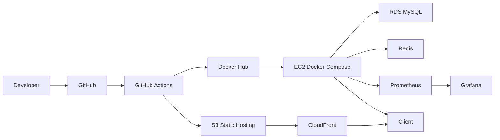

# Deployment & Infrastructure Design

## 1. 배포 개요

- 목표는 Frontend와 Backend를 역할에 맞게 분리 배포하는 것이다.
- Frontend는 `S3 + CloudFront`, Backend는 `EC2 + Docker Compose`, 영속 데이터는 `RDS`를 기준으로 둔다.
- Local, Test, Production을 같은 구조로 복제하지 않고, 목적에 맞는 격리 수준으로 나눈다.

## 2. 인프라 구성

| 영역 | 구성 | 목적 |
| --- | --- | --- |
| Frontend | AWS S3, AWS CloudFront | 정적 자산 호스팅 및 CDN 배포 |
| Backend | AWS EC2, Docker Compose, Spring Boot, Redis, Prometheus, Grafana | API 실행, 토큰/캐시 처리, 운영 메트릭 관찰 |
| Data | AWS RDS (MySQL) | 영속 데이터 저장 |
| Delivery | GitHub Actions, Docker Hub | CI/CD 자동화 |

## 3. 서버 구성

### Local

- `docker-compose.yml`
  - `mysql`
  - `redis`
  - `prometheus`
  - `grafana`
- Spring Boot와 Vite는 로컬 프로세스로 실행한다.
- 목적
  - 기능 개발
  - API 연동 확인
  - 모니터링 환경 로컬 재현

### Test

- GitHub Actions workflow는 변경 경로 기준으로 backend/frontend를 분리해 실행한다.
- Backend CI
  - Testcontainers 기반 MySQL / Redis
  - `./gradlew test jacocoTestReport --no-daemon`
  - REST Docs 검증을 위한 `./gradlew build -x test`
  - 성공 시 `backend/build/docs/asciidoc/`를 `restdocs-site` artifact로 업로드
  - 실패 시 `backend/build/reports/tests/`를 `test-report` artifact로 업로드
  - 항상 `backend/build/reports/jacoco/test/`를 `jacoco-report` artifact로 업로드
- Frontend CI
  - `npm ci`
  - `npm run lint`
  - `npm test -- --run`
  - `npm run build`
  - 실패 시 `frontend/.ci-reports/`를 `frontend-failure-reports` artifact로 업로드
- 목적
  - 실제 DB/Redis와 가까운 통합 테스트
  - 문서화 자동화 검증
  - 프런트 정적 검증과 실패 분석 산출물 회수

### Production (목표)

- Frontend
  - S3 정적 호스팅
  - CloudFront CDN
- Backend
  - EC2 내부 Docker Compose
  - Spring Boot API
  - Redis
  - Prometheus
  - Grafana
- Data
  - RDS MySQL

## 4. 환경 변수 / 비밀값 관리

### Local

- root `.env.example`를 복사해 root `.env`를 만든 뒤 local 실행에 필요한 값을 채운다.
- local 실행에서 직접 사용하는 값:
  - `LOCAL_DB_PASSWORD`
  - `LOCAL_JWT_SECRET`
  - `LOCAL_GRAFANA_ADMIN_PASSWORD`
- `docker compose up -d`
  - `LOCAL_DB_PASSWORD`, `LOCAL_GRAFANA_ADMIN_PASSWORD`를 사용한다.
- `cd backend && ./gradlew bootRun`
  - `application-local.yaml`이 root `.env`의 property 형식 값을 읽어 `LOCAL_DB_PASSWORD`, `LOCAL_JWT_SECRET`를 사용한다.
- 실제 값 파일은 Git 추적 대상에 포함하지 않는다.

### Backend Production

`application-prod.yaml` 기준:

- `DB_HOST`
- `DB_PORT`
- `DB_NAME`
- `DB_USERNAME`
- `DB_PASSWORD`
- `REDIS_HOST`
- `REDIS_PORT`
- `JWT_SECRET`
- `cors.allowed-origins`
  - 실제 프런트엔드 도메인 주소로 변경 필요
- `jwt.expiration`
  - 프로덕션 Access Token 만료 시간
- `jwt.refresh-expiration`
  - 프로덕션 Refresh Token 만료 시간 (`JWT_REFRESH_EXPIRATION`, 기본 7일)

### Frontend

- `VITE_API_BASE_URL`
  - 미설정 시 `http://localhost:8080`

### 보안 원칙

- 비밀값은 코드에 하드코딩하지 않는다.
- 프로덕션용 민감 정보는 환경 변수나 승인된 배포 설정에서 주입한다.
- local 개발용 값도 추적 파일에 직접 넣지 않고 `.env` 같은 비추적 파일로 분리한다.
- 로컬 개발 편의 설정은 프로덕션 보안 정책으로 그대로 승격하지 않는다.

## 5. CI/CD 파이프라인

### 구현 상태

1. GitHub Push
2. 변경 경로에 따라 `Backend CI` 또는 `Frontend CI` 실행
3. Backend 변경 시 `./gradlew test jacocoTestReport --no-daemon` 수행
4. Backend 변경 시 `./gradlew build -x test --no-daemon` 수행
5. Backend 성공 시 `backend/build/docs/asciidoc/`를 `restdocs-site` artifact로 업로드
6. Backend 실패 시 `test-report`, 항상 `jacoco-report` 업로드
7. Frontend 변경 시 `npm ci`, `npm run lint`, `npm test -- --run`, `npm run build` 수행
8. Frontend 실패 시 `frontend/.ci-reports/`를 `frontend-failure-reports` artifact로 업로드

### 목표 흐름

1. GitHub Push
2. GitHub Actions 테스트 통과
3. Docker 이미지 빌드 및 Docker Hub 푸시
4. EC2에서 최신 이미지 Pull
5. 컨테이너 재시작으로 CD 수행
6. Nginx + Let's Encrypt(Certbot)로 HTTPS 적용

## 6. 도메인 / 네트워크

- Frontend
  - CloudFront가 공개 진입점을 담당한다.
  - OAC를 사용해 S3 직접 접근을 차단하는 구성을 목표로 한다.
- Backend
  - Nginx가 외부 진입을 처리한다.
  - EC2와 RDS는 보안 그룹으로 접근 범위를 제한한다.
- 데이터 저장소
  - RDS는 외부 직접 접근을 허용하지 않고 애플리케이션 계층에서만 접근한다.

## 7. 운영 고려사항

- Spring Boot Actuator 메트릭 노출
- Prometheus 수집
- Grafana 시각화
- `k6` 부하 테스트 결과와 함께 병목 구간 분석
- AWS Billing Alarm 설정으로 과도한 비용 사용 방지

## 8. 장애 대응 초안

| 상황 | 1차 대응 | 후속 대응 |
| --- | --- | --- |
| Spring Boot 컨테이너 장애 | 컨테이너 재시작 및 로그 확인 | 이미지/설정 롤백 검토 |
| Redis 장애 | 토큰/캐시 영향 범위 확인 | Redis 배치 전략 또는 영속화 옵션 재검토 |
| RDS 연결 실패 | DB 접속 정보와 네트워크 설정 점검 | 보안 그룹 / 애플리케이션 설정 재검토 |
| CloudFront / S3 정적 배포 문제 | 캐시 무효화 및 배포 산출물 재확인 | 배포 파이프라인 검토 |
| CI 실패 | backend는 `test-report`, `jacoco-report`, frontend는 `frontend-failure-reports` 확인 | backend는 테스트/문서 단계, frontend는 lint/test/build 단계로 원인 분리 |

## 9. 배포 다이어그램

### 배포 구조도

## 10. 미확정 사항

- Nginx 리버스 프록시 설정과 HTTPS 적용 순서
- Docker Hub 기반 CD 스크립트의 최종 자동화 방식
- Route 53, HTTPS, OAC 실제 반영 시점
