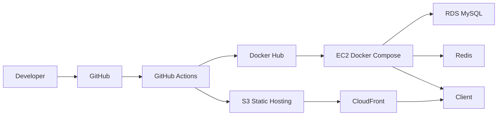

# Deployment & Infrastructure Design

## 1. 배포 개요

- 목표는 Frontend와 Backend를 역할에 맞게 분리 배포하는 것이다.
- Frontend는 `S3 + CloudFront`, Backend는 `EC2 + Docker Compose`, 영속 데이터는 `RDS`를 기준으로 둔다.
- Local, Test, Production을 같은 구조로 복제하지 않고, 목적에 맞는 격리 수준으로 나눈다.

## 2. 인프라 구성

| 영역 | 구성 | 목적 |
| --- | --- | --- |
| Frontend | AWS S3, AWS CloudFront | 정적 자산 호스팅 및 CDN 배포 |
| Backend | AWS EC2, Docker Compose, Nginx, Spring Boot, Redis | API 실행, HTTPS reverse proxy, 토큰/캐시 처리 |
| Data | AWS RDS (MySQL 8) | 영속 데이터 저장 |
| Delivery | GitHub Actions, Docker Hub | CI/CD 자동화 |

## 3. 서버 구성

### Local

- `docker-compose.yml`
  - `mysql` (`mysql:8.0`)
  - `redis`
  - `prometheus`
  - `grafana`
- Spring Boot와 Vite는 로컬 프로세스로 실행한다.
- `k6`는 로컬 Spring Boot를 대상으로 실행하고, `experimental-prometheus-rw` 출력으로 Prometheus에 메트릭을 적재한다.
- Grafana는 provisioning된 `Rankings Baseline` 대시보드로 `k6`와 Spring Boot 메트릭을 같은 축에서 시각화한다.
- local profile은 `monitoring.prometheus.permit-all=true`로 `/actuator/prometheus` scrape를 허용한다.
- 목적
  - 기능 개발
  - API 연동 확인
  - 모니터링 환경 로컬 재현
  - Redis 리팩토링 전/후 성능 기준선 재현
- 제약
  - 랭킹 `nickname` 검색 fallback 구현은 MySQL 8 window function을 사용하므로 Local/Test/Production DB 기준은 MySQL 8을 유지한다.

### Test

- GitHub Actions workflow는 변경 경로 기준으로 backend/frontend를 분리해 실행한다.
- Backend CI
  - Testcontainers 기반 MySQL / Redis
  - `./gradlew test jacocoTestReport --no-daemon`
  - REST Docs 검증을 위한 `./gradlew build -x test`
  - 성공 시 `backend/build/docs/asciidoc/`를 `restdocs-site` artifact로 업로드
  - 실패 시 `backend/build/reports/tests/`를 `test-report` artifact로 업로드
  - 항상 `backend/build/reports/jacoco/test/`를 `jacoco-report` artifact로 업로드
- Frontend CI
  - `npm ci`
  - `npm run lint`
  - `npm test -- --run`
  - `npm run build`
  - 실패 시 `frontend/.ci-reports/`를 `frontend-failure-reports` artifact로 업로드
- Performance Benchmark
  - `workflow_dispatch` 기반 수동 실행
  - MySQL / Redis service container 준비
  - schema reset 후 baseline seed SQL 적재
  - `k6` summary JSON과 Markdown 비교 리포트 artifact 업로드
- 목적
  - 실제 DB/Redis와 가까운 통합 테스트
  - 문서화 자동화 검증
  - 프런트 정적 검증과 실패 분석 산출물 회수
  - 성능 기준선 재현과 전/후 비교용 artifact 보관

### Production (목표)

- Frontend
  - S3 정적 호스팅
  - CloudFront CDN
- Backend
  - EC2 내부 Docker Compose
  - Nginx reverse proxy
  - Spring Boot API
  - Redis
- Data
  - RDS MySQL

### Production (현재 운영 기준)

- 저장소 기준 파일
  - `backend/Dockerfile`
  - `infra/docker/docker-compose.prod.yml`
  - `infra/nginx/nginx.conf`
- 실행 기준
  - `infra/docker/.env`에 운영 값을 두고 `cd infra/docker && docker compose -f docker-compose.prod.yml ...` 기준으로 실행한다.
- 배포 범위
  - `api.cubing-hub.com` Nginx + Spring Boot + Redis
  - `www.cubing-hub.com` CloudFront + S3
- 실제 반영 상태
  - `api.cubing-hub.com` HTTPS 응답과 `/actuator/health` 확인을 완료했다.
  - 프런트는 `VITE_API_BASE_URL=https://api.cubing-hub.com`로 다시 빌드해 배포했다.
- 제외 범위
  - Prometheus / Grafana 운영 배포
- 초기 운영 정책
  - `GET /actuator/health`만 공개
  - `Spring Boot`는 `prod` profile로 동작
  - Redis 랭킹 초기화는 env로 제어한다.
  - `/actuator/prometheus`는 기본값으로 공개하지 않는다.

## 4. 환경 변수 / 비밀값 관리

### Local

- root `.env.example`를 복사해 root `.env`를 만든 뒤 local 실행에 필요한 값을 채운다.
- local 실행에서 직접 사용하는 값:
  - `LOCAL_DB_PASSWORD`
  - `LOCAL_JWT_SECRET`
  - `LOCAL_GRAFANA_ADMIN_PASSWORD`
  - `LOCAL_FEEDBACK_DISCORD_WEBHOOK_URL`
  - `SMTP_HOST`
  - `SMTP_PORT`
  - `SMTP_USERNAME`
  - `SMTP_PASSWORD`
  - `SMTP_AUTH`
  - `SMTP_STARTTLS_ENABLE`
  - `SMTP_FROM_ADDRESS`
  - 위 SMTP 설정은 회원가입 이메일 인증과 비밀번호 재설정 메일 발송에 공통으로 사용한다.
- `docker compose up -d`
  - `LOCAL_DB_PASSWORD`, `LOCAL_GRAFANA_ADMIN_PASSWORD`를 사용한다.
- `cd backend && ./gradlew bootRun`
  - `application-local.yaml`이 root `.env`의 property 형식 값을 읽어 `LOCAL_DB_PASSWORD`, `LOCAL_JWT_SECRET`를 사용한다.
- 실제 값 파일은 Git 추적 대상에 포함하지 않는다.

### Backend Production

`application-prod.yaml` 기준:

- `DB_HOST`
- `DB_PORT`
- `DB_NAME`
- `DB_USERNAME`
- `DB_PASSWORD`
- `REDIS_HOST`
- `REDIS_PORT`
- `JWT_SECRET`
- `CORS_ALLOWED_ORIGINS`
  - 기본값 `https://cubing-hub.com,https://www.cubing-hub.com`
- `JWT_EXPIRATION`
  - 프로덕션 Access Token 만료 시간, 기본 30분
- `JWT_REFRESH_EXPIRATION`
  - 프로덕션 Refresh Token 만료 시간, 기본 7일
- `SPRING_JPA_HIBERNATE_DDL_AUTO`
  - 기본값 `validate`, first deploy 1회만 `update` 권장
- `AUTH_REFRESH_COOKIE_SECURE`
  - 기본값 `true`
- `AUTH_EMAIL_VERIFICATION_CODE_EXPIRATION_MS`
  - 회원가입 이메일 인증과 비밀번호 재설정 인증번호 만료 시간, 기본 `600000`
- `AUTH_EMAIL_VERIFICATION_RESEND_COOLDOWN_MS`
  - 회원가입 이메일 인증과 비밀번호 재설정 인증번호 재요청 cooldown, 기본 `60000`
- `AUTH_EMAIL_VERIFICATION_VERIFIED_EXPIRATION_MS`
  - 이메일 인증 완료 marker 유지 시간, 기본 `1800000`
- `AUTH_EMAIL_VERIFICATION_SUBJECT`
  - 회원가입 인증 메일 제목
- `SMTP_HOST`
- `SMTP_PORT`
  - 기본값 `587`
- `SMTP_USERNAME`
- `SMTP_PASSWORD`
- `SMTP_AUTH`
  - 기본값 `true`
- `SMTP_STARTTLS_ENABLE`
  - 기본값 `true`
- `SMTP_FROM_ADDRESS`
- SMTP 설정은 회원가입 인증 메일과 비밀번호 재설정 인증 메일에 공통으로 사용한다.
- `FEEDBACK_DISCORD_WEBHOOK_URL`
  - Discord incoming webhook URL
- `MONITORING_PROMETHEUS_PERMIT_ALL`
  - 기본값 `false`, local scraping 재현이 필요할 때만 제한적으로 사용
- `RANKING_REDIS_REBUILD_ON_STARTUP`
  - 기본값 `false`, first deploy 1회만 `true` 사용 가능
- `BACKEND_IMAGE`
  - Docker Hub backend image 경로
- `BACKEND_IMAGE_TAG`
  - Docker Hub image tag
- `LETSENCRYPT_DIR`
  - host 인증서 디렉터리, 기본 `/etc/letsencrypt`
- `CERTBOT_WEBROOT`
  - ACME challenge webroot, 기본 `/var/www/certbot`

### Frontend

- `VITE_API_BASE_URL`
  - 미설정 시 `http://localhost:8080`

### 보안 원칙

- 비밀값은 코드에 하드코딩하지 않는다.
- 프로덕션용 민감 정보는 환경 변수나 승인된 배포 설정에서 주입한다.
- local 개발용 값도 추적 파일에 직접 넣지 않고 `.env` 같은 비추적 파일로 분리한다.
- 로컬 개발 편의 설정은 프로덕션 보안 정책으로 그대로 승격하지 않는다.
- Discord webhook URL도 비밀값으로 취급하고 로그나 문서 본문에 직접 노출하지 않는다.

### 피드백 Discord 알림 반영 절차

- production은 `infra/docker/.env`에 `FEEDBACK_DISCORD_WEBHOOK_URL`을 추가한 뒤 backend container를 재기동한다.
- 이번 기능처럼 `feedbacks` 테이블에 새 컬럼이 추가되는 변경은 production에서 schema 반영 절차가 먼저 필요하다.
- 현재 production 기본값이 `SPRING_JPA_HIBERNATE_DDL_AUTO=validate`이므로, 새 컬럼 반영 시에는 아래 둘 중 하나를 선택한다.
  - 운영 DB에 `ALTER TABLE feedbacks ...`를 수동 적용
  - 또는 1회 배포 동안만 `SPRING_JPA_HIBERNATE_DDL_AUTO=update`로 올린 뒤 반영 확인 후 다시 `validate`로 원복

## 5. CI/CD 파이프라인

### 구현 상태

1. GitHub Push
2. 변경 경로에 따라 `Backend CI` 또는 `Frontend CI` 실행
3. Backend 변경 시 `./gradlew test jacocoTestReport --no-daemon` 수행
4. Backend 변경 시 `./gradlew build -x test --no-daemon` 수행
5. Backend 성공 시 `backend/build/docs/asciidoc/`를 `restdocs-site` artifact로 업로드
6. Backend 실패 시 `test-report`, 항상 `jacoco-report` 업로드
7. Frontend 변경 시 `npm ci`, `npm run lint`, `npm test -- --run`, `npm run build` 수행
8. Frontend 실패 시 `frontend/.ci-reports/`를 `frontend-failure-reports` artifact로 업로드
9. 필요 시 `Performance Benchmark`를 수동 실행
10. benchmark workflow에서 schema reset, seed 적재, `k6` baseline 실행
11. benchmark workflow에서 `summary.json`, `comparison.md`, backend 로그 artifact 업로드
12. 실제 운영 배포는 현재 수동으로 수행한다.
13. frontend는 `VITE_API_BASE_URL`을 주입해 build 후 S3/CloudFront에 반영한다.
14. backend는 Docker Hub image push 후 EC2에서 `docker compose pull && up -d`로 반영한다.
15. `deploy-backend.yml`은 `Backend CI` 성공 후 Docker Hub push와 EC2 deploy를 자동화한다.
16. `deploy-frontend.yml`은 `Frontend CI` 성공 후 S3 sync와 CloudFront invalidation을 자동화한다.

### 목표 흐름

1. GitHub Push
2. GitHub Actions 테스트 통과
3. Docker 이미지 빌드 및 Docker Hub 푸시
4. EC2에서 최신 이미지 Pull
5. 컨테이너 재시작으로 CD 수행
6. Nginx + Let's Encrypt(Certbot) 인증서를 마운트해 HTTPS 적용

### GitHub Actions 배포용 값

#### Secrets

- `DOCKERHUB_TOKEN`
- `EC2_SSH_PRIVATE_KEY`
- `AWS_ACCESS_KEY_ID`
- `AWS_SECRET_ACCESS_KEY`

#### Variables

- `DOCKERHUB_USERNAME`
- `BACKEND_IMAGE`
- `EC2_HOST`
- `EC2_USER`
- `AWS_REGION`
- `S3_BUCKET`
- `CLOUDFRONT_DISTRIBUTION_ID`
- `VITE_API_BASE_URL`

## 6. 도메인 / 네트워크

- Frontend
  - CloudFront가 공개 진입점을 담당한다.
  - OAC를 사용해 S3 직접 접근을 차단하는 구성을 목표로 한다.
- Backend
  - `api.cubing-hub.com`이 외부 진입점이다.
  - Nginx가 `80 -> 443` 리다이렉트와 `/api`, `/actuator/health` reverse proxy를 담당한다.
  - EC2와 RDS는 보안 그룹으로 접근 범위를 제한한다.
- 데이터 저장소
  - RDS는 외부 직접 접근을 허용하지 않고 애플리케이션 계층에서만 접근한다.

## 7. 운영 고려사항

- 1차 배포는 `GET /actuator/health`만 공개한다.
- `prometheus`, `grafana`는 local 관찰 기준선으로 유지하고 production 범위에서는 제외한다.
- RDS는 first deploy 시점에만 `SPRING_JPA_HIBERNATE_DDL_AUTO=update`를 사용하고 이후 `validate`로 되돌린다.
- Redis ready marker가 필요하므로 first deploy 시점에만 `RANKING_REDIS_REBUILD_ON_STARTUP=true`를 사용할 수 있다.
- 운영 Redis read model이 비어 복구가 필요하면 `RANKING_REDIS_REBUILD_ON_STARTUP=true`로 1회 재시작 후 완료 확인 뒤 다시 `false`로 원복한다.
- startup rebuild는 데이터가 크면 deploy workflow health check 대기 시간보다 오래 걸릴 수 있으므로 복구용 one-shot 절차로만 사용한다.
- AWS Billing Alarm 설정으로 과도한 비용 사용을 방지한다.
- 실제 first deploy / redeploy 절차와 운영 후처리 체크리스트는 [aws-first-deploy-and-redeploy-checklist](./Trouble%20Shooting/aws-first-deploy-and-redeploy-checklist.md)에 정리한다.

## 8. 장애 대응 초안

| 상황 | 1차 대응 | 후속 대응 |
| --- | --- | --- |
| Spring Boot 컨테이너 장애 | 컨테이너 재시작 및 로그 확인 | 이미지/설정 롤백 검토 |
| Redis 장애 | 토큰/캐시 영향 범위 확인 | Redis 배치 전략 또는 영속화 옵션 재검토 |
| RDS 연결 실패 | DB 접속 정보와 네트워크 설정 점검 | 보안 그룹 / 애플리케이션 설정 재검토 |
| CloudFront / S3 정적 배포 문제 | 캐시 무효화 및 배포 산출물 재확인 | 배포 파이프라인 검토 |
| HTTPS 인증서 문제 | `certbot` 발급/만료 상태 확인 | 인증서 갱신 방식 재검토 |
| CI 실패 | backend는 `test-report`, `jacoco-report`, frontend는 `frontend-failure-reports` 확인 | backend는 테스트/문서 단계, frontend는 lint/test/build 단계로 원인 분리 |

## 9. 배포 다이어그램

### 배포 구조도

## 10. 미확정 사항

- HTTPS 인증서 발급/갱신 자동화 방식
- Docker Hub 기반 CD 스크립트의 최종 자동화 방식
- Route 53, OAC 세부 운영 절차
- GitHub Actions deploy workflow의 최종 trigger 정책과 secret/variable 구조
