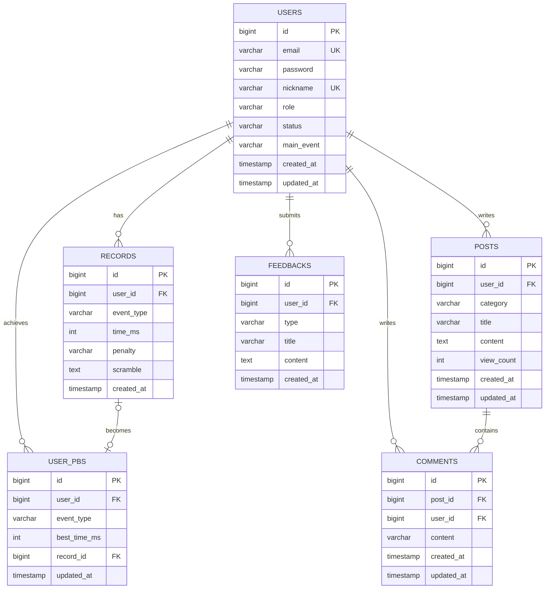

# Database ERD



## Users

| Field | Type | Description |
|------|------|-------------|
| id | bigint | 사용자 ID (PK, Auto Increment) |
| email | varchar(255) | 로그인 이메일 (Unique) |
| password | varchar(255) | 암호화된 비밀번호 |
| nickname | varchar(50) | 사용자 닉네임 (Unique) |
| role | varchar(20) | 시스템 권한 (ROLE_USER, ROLE_ADMIN) |
| status | varchar(20) | 계정 상태 (ACTIVE, DELETED 등) |
| main_event | varchar(50) | 프로필 주력 종목 (예: 3x3x3 등) |
| created_at | timestamp | 생성일 |
| updated_at | timestamp | 수정일 |

---

## Records

| Field | Type | Description |
|------|------|-------------|
| id | bigint | 기록 ID (PK, Auto Increment) |
| user_id | bigint | 측정자 ID (FK -> Users.id) |
| event_type | varchar(50) | 종목 (예: 3x3x3, 2x2x2) |
| time_ms | int | 해결 시간(밀리초, ms) |
| penalty | varchar(10) | 페널티 여부 (NONE, +2, DNF) |
| scramble | text | 사용된 WCA 규격 스크램블 문자열 |
| created_at | timestamp | 측정 일시 |

* Index: `idx_user_id` (개인 기록 페이징 참조)
* Index: `idx_event_type_time` (종목별 글로벌 랭킹 조회 최소화용 옵션)
* Note: `records`는 모든 solve 원본 기록을 저장한다.
* Note: 홈/마이페이지의 총 횟수, 일간/월간 횟수, 평균 같은 값은 `records` 기반 집계값이며 별도 컬럼으로 저장하지 않는다.

---

## User_PBs

| Field | Type | Description |
|------|------|-------------|
| id | bigint | 최고 기록 ID (PK, Auto Increment) |
| user_id | bigint | 측정자 ID (FK -> Users.id) |
| event_type | varchar(50) | 종목 (예: 3x3x3) |
| best_time_ms | int | 최고 기록 (밀리초) |
| record_id | bigint | 원본 측정 기록 ID (FK -> Records.id) |
| updated_at | timestamp | 최고 기록 달성(갱신) 일시 |

* Unique: `uk_user_event` (유저 1명당 종목별 1개의 기록만 보관)
* Index: `idx_event_best_time` (실시간 글로벌 랭킹 산정 최적화)
* Note: `user_pbs`는 유저별·종목별 대표 PB row다.
* Note: 사용자 랭킹 보드는 `records` 전체가 아니라 `user_pbs` 또는 그와 동등한 사용자 대표 기록 기준으로 해석한다.

---

## Posts

| Field | Type | Description |
|------|------|-------------|
| id | bigint | 게시글 ID (PK, Auto Increment) |
| user_id | bigint | 작성자 ID (FK -> Users.id) |
| category | varchar(50) | 게시판 분류 (NOTICE, FREE) |
| title | varchar(100) | 게시글 제목 |
| content | text | 게시글 본문 |
| view_count | int | 조회수 (기본값: 0) |
| created_at | timestamp | 작성일 |
| updated_at | timestamp | 수정일 |

* Index: `idx_category` (게시판 분류별 데이터 조회용)
* Note: 커뮤니티 카테고리는 `NOTICE`, `FREE` 운영을 기준으로 한다.

---

## Comments

| Field | Type | Description |
|------|------|-------------|
| id | bigint | 댓글 ID (PK, Auto Increment) |
| post_id | bigint | 게시글 ID (FK -> Posts.id) |
| user_id | bigint | 작성자 ID (FK -> Users.id) |
| content | varchar(500) | 댓글 본문 |
| created_at | timestamp | 작성일 |
| updated_at | timestamp | 수정일 |

* Note: `comments`는 커뮤니티 상세 화면의 댓글 작성/삭제 상호작용을 담당한다.

---

## Feedbacks

| Field | Type | Description |
|------|------|-------------|
| id | bigint | 피드백 ID (PK, Auto Increment) |
| user_id | bigint | 제보자 ID (FK -> Users.id, 익명시 null 가능) |
| type | varchar(20) | 피드백 종류 (BUG, FEATURE, UX, OTHER) |
| title | varchar(100) | 피드백 요약 제목 |
| content | text | 피드백 상세 내용 |
| created_at | timestamp | 제출일 |

* Note: 제품 기준 피드백 전달 경로는 관리자 메일이다.
* Note: `feedbacks`는 필요 시 아카이브/관리 용도로 선택적으로 저장하는 모델이며, 메일 전달만 사용할 경우 필수 테이블은 아니다.
* Note: 회신 이메일, 메일 발송 상태, 처리 이력까지 관리하려면 현재 스키마 보강이 필요할 수 있다.

---

## 관계

```text
Users 1:N Records
Users 1:N User_PBs
Users 1:N Posts
Users 1:N Comments
Users 1:N Feedbacks
Posts 1:N Comments
Records 1:1 (또는 1:0) User_PBs
```
