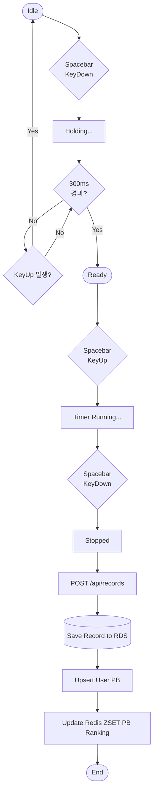

# Project Overview

## 1. 기본 정보

- 프로젝트 이름: 큐빙허브 (Cubing Hub)
- 개발 기간: 1개월
- 개발 목적: 기존 큐빙 유저들의 데이터 파편화 문제를 해결하는 통합 플랫폼을 구축하고, Docker 기반 배포/운용, 테스트 자동화, 모니터링, 성능 최적화 과정을 실제 프로젝트 안에서 학습한다.

## 2. 문제 정의

기존 큐빙 유저들의 기록, 학습 자료, 커뮤니티 활동은 여러 서비스와 개인 도구에 흩어져 있다. 
큐빙허브는 이 데이터를 하나의 플랫폼으로 통합하되, 서비스 운영 과정에서 발생할 수 있는 대규모 읽기 요청 부하와 테스트 신뢰성 부족 문제까지 시스템적으로 함께 다루는 것을 목표로 한다.

## 3. 목표

- 기록, 학습, 랭킹, 커뮤니티를 한 서비스 흐름으로 연결한다.
- 단순 CRUD에 그치지 않고 인증, 문서화, 테스트, 모니터링, 배포까지 하나의 서비스 기준으로 정리한다.
- 랭킹 구조를 `records` 기반 기준선(V1)과 Redis ZSET 기반 목표 구조(V2)로 분리해 성능 개선 과정을 설명 가능하게 만든다.

## 4. 주요 사용자 그룹

| 구분 | 내용 |
| --- | --- |
| 타겟 사용자 | 스피드큐빙 코어 유저 |
| 사용 환경 | PC 및 모바일 웹 브라우저 |
| 핵심 니즈 | 기록 관리, PB 확인, 랭킹 비교, 학습 자료 탐색, 커뮤니티 활동 |

## 5. 핵심 기능

### 사용자 기능

- 회원가입 / 로그인
  - 이메일, 비밀번호, 닉네임, 주 종목 입력
- 홈 대시보드
  - 오늘의 스크램블, 프로필, PB, 평균, 최근 기록 요약
- 타이머
  - 홀드 300ms → 준비 → 시작의 3단계 상태 머신
  - 스크램블 조회 및 기록 자동 저장
- 개인 기록 대시보드 / 마이페이지
  - 전체 기록, PB, 평균, 최근 기록, 프로필 정보
- 글로벌 랭킹 보드
  - 종목 필터, 닉네임 검색, 25개 단위 페이지네이션
- 큐브 학습
  - `CFOP` 기준 `F2L 41 + OLL 57 + PLL 21 = 119` 케이스 제공
- 자유 게시판
  - 목록/상세/작성/수정/삭제
  - 제목·닉네임 검색, 카테고리 필터링
- 피드백
  - 버그 제보, 기능 제안 등 관리자에게 전달

### 시스템 기능

- 인증/인가
  - JWT Access Token + Redis Refresh Token Rotation
  - Access Token Blacklist
- 동적 쿼리
  - QueryDSL 기반 게시판 검색 및 랭킹 조회 기준선 구현
- 신뢰성 검증
  - Testcontainers 기반 통합 테스트
- 문서화 자동화
  - Spring REST Docs 기반 API 문서 생성
- 모니터링
  - Prometheus / Grafana 기반 메트릭 수집과 시각화
- 성능 비교 실험
  - V1: `records` 기반 랭킹 조회
  - V2: Redis ZSET 기반 실시간 랭킹 목표 구조

## 6. 범위

### MVP에 포함

- JWT 기반 인증
  - 최종 목표: Redis Refresh Token 연동 및 토큰 생명주기 관리
- 홈 공용 오늘의 스크램블 카드
- 타이머 측정 및 기록 저장
- 개인 기록 대시보드 및 마이페이지
- 사용자 대표 기록(PB) 기준 랭킹 구조
  - 현재 V1은 `records` 기반 조회
  - 최종 목표는 Redis ZSET 기반 실시간 랭킹
- QueryDSL 기반 게시판 CRUD 및 검색
- 댓글 상호작용
- 사용자 피드백 전달
- EC2 내부 Docker Compose 기반 백엔드 운영
- GitHub Actions 기반 CI/CD

### 지원 종목

- 현재 우선 지원: `3x3x3`
- 향후 확장 예정
  - `2x2x2`, `4x4x4`, `5x5x5`, `6x6x6`, `7x7x7`, 블라인드, 원핸드 등 WCA 공식 종목

### 이번 버전에서 제외

- 소셜 로그인
- 실시간 1:1 대결 기능

### 후속 확장 아이디어

- Redis ZSET 기반 랭킹 V2 완성
- 마이페이지/대시보드 API 고도화
- 댓글 및 피드백 처리 백오피스성 관리 기능
- 부하 테스트 결과 기반 운영 개선 문서화

## 7. 핵심 사용자 흐름

## 8. 기술 스택

| 구분 | 스택 | 사용 이유 |
| --- | --- | --- |
| Frontend | React, Vite, React Router DOM, Axios | 단일 페이지 앱 구조와 빠른 개발 반복 |
| Backend | Java 17, Spring Boot 3.5.12, Spring Security, JWT, Spring Data JPA, QueryDSL, Spring REST Docs | 인증/인가, 영속성, 동적 쿼리, 문서화 자동화 |
| Database & Cache | MySQL 8.0, Redis 7.x | 영속 데이터 저장과 토큰/랭킹 캐시 분리 |
| Infra | AWS EC2, RDS, S3, CloudFront | 정적 리소스와 API/DB 역할 분리 |
| Testing & Ops | Docker, Docker Compose, GitHub Actions, JUnit 5, Testcontainers, Prometheus, Grafana, k6 | 로컬 개발, 테스트 격리, CI, 운영 관찰, 부하 검증 |

## 9. 핵심 설계 선택

### 설계 선택 1

- 선택한 방식:
  - 기록, 학습, 랭킹, 커뮤니티를 각각 따로 만들지 않고 하나의 통합 플랫폼으로 설계했다.
- 선택 이유:
  - 큐빙 사용자 문제는 기록 저장만이 아니라 학습과 비교, 커뮤니티 활동이 분리되어 있다는 점에 있다.
  - 따라서 단일 기능 앱보다 여러 사용자 흐름이 이어지는 서비스 형태가 문제 정의와 더 맞다.
- 검토한 대안:
  - 타이머 + 기록 저장만 제공하는 소규모 앱
  - 랭킹이나 커뮤니티 없이 개인 기록 관리만 제공하는 구조
- 대안을 배제한 이유:
  - 포트폴리오 관점에서 데이터 저장, 인증, 검색, 캐시, 배포, 운영까지 함께 설명하기 어렵다.
  - 사용자 문제를 부분적으로만 해결하게 된다.
- 트레이드오프:
  - 범위가 넓어져 구현 난도가 올라간다.
  - 문서와 코드 모두에서 현재 상태와 목표 상태를 분리해 설명해야 한다.
- 기대 효과:
  - 기능 자체보다 서비스 단위 설계 판단과 운영 관점을 함께 설명할 수 있다.

### 설계 선택 2

- 선택한 방식:
  - 랭킹을 현재 구현 기준선(V1)과 최종 목표 구조(V2)로 분리했다.
- 선택 이유:
  - 현재 구조의 병목을 설명하려면 비교 대상이 필요하다.
  - `records` 기반 조회는 구현이 단순하고 현재 상태를 보여주기 좋으며, Redis ZSET은 최종 최적화 방향을 설명하기 좋다.
- 검토한 대안:
  - 처음부터 Redis ZSET만 구현해 단일 구조로 설명
  - 반대로 RDB 조회만 유지하고 캐시 구조를 문서에서 제외
- 대안을 배제한 이유:
  - 전자는 개선 전 한계를 설명하기 어렵다.
  - 후자는 읽기 부하 개선 설계의 목적이 약해진다.
- 트레이드오프:
  - 문서에서 V1과 V2를 명확히 구분하지 않으면 오히려 혼란이 생긴다.
  - 코드와 문서의 현재 상태가 어긋나 보일 수 있다.
- 기대 효과:
  - 개발 완료 후 `k6` 전후 비교 문서와 자연스럽게 연결된다.

### 설계 선택 3

- 선택한 방식:
  - 기능 구현과 함께 테스트, 문서화, 모니터링, 배포 구조까지 MVP 안에 포함했다.
- 선택 이유:
  - 서비스는 기능만으로 끝나지 않고, 검증과 운영 가능성이 함께 있어야 한다.
  - 면접에서도 "어떻게 만들었는가"보다 "어떻게 검증하고 운영할 것인가"를 설명할 수 있어야 한다.
- 검토한 대안:
  - 기능 구현 완료 후 인프라와 운영 문서를 나중에 추가
- 대안을 배제한 이유:
  - 문서와 구현이 분리되면 현재 상태와 목표 상태가 뒤섞이기 쉽다.
  - 테스트와 문서화가 후순위로 밀릴 위험이 크다.
- 트레이드오프:
  - 초기 구현 속도는 느려질 수 있다.
  - 완성 전 단계에서는 예정 항목이 많이 남아 보일 수 있다.
- 기대 효과:
  - 프로젝트를 기능 데모가 아니라 운영 가능한 서비스 설계로 설명할 수 있다.

## 10. 현재 구현 단계 메모

- 인증
  - 백엔드 인증 API는 구현되어 있다.
  - 프런트 로그인/회원가입 화면의 실제 API 연동은 구현 예정이다.
- 랭킹
  - 현재 V1은 `records` 테이블 기반 QueryDSL 조회다.
  - 최종 목표는 Redis ZSET 기반 실시간 랭킹이다.
- 커뮤니티
  - 게시글 CRUD API는 구현되어 있다.
  - 댓글 API는 구현 예정이다.
- 마이페이지 / 피드백
  - 화면 범위는 정의되어 있으나 일부 프런트/백엔드 연동은 구현 예정이다.
- 운영
  - 로컬 Docker Compose, CI, REST Docs는 준비되어 있다.
  - 프로덕션 배포 스크립트, 도메인, HTTPS, 부하 테스트 결과는 구현 예정이다.

## 11. 성공 기준

| 구분 | 기준 |
| --- | --- |
| 기능 | 인증, 기록 저장, 랭킹, 게시판, 학습, 피드백 흐름이 MVP 범위에서 동작한다. |
| 품질 | Testcontainers 기반 통합 테스트와 REST Docs 생성 흐름이 유지된다. |
| 배포 | CloudFront, S3, EC2, RDS 기준 프로덕션 배포 구조를 설명하고 실행 가능하게 만든다. |
| 문서화 | 현재 구현 상태와 목표 상태, 설계 선택 이유를 7종 문서에서 일관되게 설명한다. |
| 성능 | 개발 완료 후 `k6` 부하 테스트를 수행하고 개선 전/후 비교 문서를 남긴다. |

## 12. 면접 / 포트폴리오 포인트

- 현재 구현 상태와 목표 구조를 분리해 문서화했다는 점
- 랭킹을 V1(`records` 조회)과 V2(Redis ZSET)로 나눠 개선 경로를 설명한다는 점
- 인증, 테스트, 문서화, 모니터링, 배포까지 서비스 관점으로 설계했다는 점
- 아직 미완성인 프런트 인증 연동, 랭킹 V2, 프로덕션 배포, `k6` 결과는 숨기지 않고 예정 범위로 분리했다는 점

## 13. 미확정 사항

- 프로덕션 도메인, Route 53, HTTPS 최종 구성
- `k6` 부하 테스트의 실제 기준 시나리오와 결과 수치
- 랭킹 V2의 Redis 동기화 및 장애 대응 세부 전략
