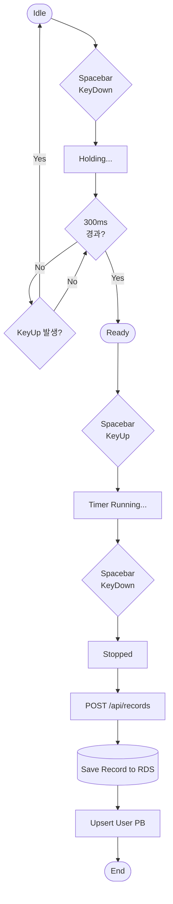

# Project Overview

## 1. 기본 정보

- 프로젝트 이름: 큐빙허브 (Cubing Hub)
- 개발 기간: 1개월
- 개발 목적: 기존 큐빙 유저들의 데이터 파편화 문제를 해결하는 통합 플랫폼을 구축하고, Docker 기반 배포/운용, 테스트 자동화, 모니터링, 성능 최적화 과정을 실제 프로젝트 안에서 학습한다.

## 2. 문제 정의

기존 큐빙 유저들의 기록, 학습 자료, 커뮤니티 활동은 여러 서비스와 개인 도구에 흩어져 있다. 
큐빙허브는 이 데이터를 하나의 플랫폼으로 통합하되, 서비스 운영 과정에서 발생할 수 있는 대규모 읽기 요청 부하와 테스트 신뢰성 부족 문제까지 시스템적으로 함께 다루는 것을 목표로 한다.

## 3. 목표

- 기록, 학습, 랭킹, 커뮤니티를 한 서비스 흐름으로 연결한다.
- 단순 CRUD에 그치지 않고 인증, 문서화, 테스트, 모니터링, 배포까지 하나의 서비스 기준으로 정리한다.
- 랭킹 구조를 `user_pbs` 기반 PB 기준선(V1)과 Redis ZSET 기반 목표 구조(V2)로 분리해 성능 개선 과정을 설명 가능하게 만든다.

## 4. 주요 사용자 그룹

| 구분 | 내용 |
| --- | --- |
| 타겟 사용자 | 스피드큐빙 코어 유저 |
| 사용 환경 | PC 및 모바일 웹 브라우저 |
| 핵심 니즈 | 기록 관리, PB 확인, 랭킹 비교, 학습 자료 탐색, 커뮤니티 활동 |

## 5. 핵심 기능

### 사용자 기능

- 회원가입 / 로그인
  - 이메일, 비밀번호, 닉네임, 주 종목 입력
- 홈 대시보드
  - 오늘의 스크램블, 프로필, PB, 평균, 최근 기록 요약
- 타이머
  - 홀드 300ms → 준비 → 시작의 3단계 상태 머신
  - 스크램블 조회 및 기록 자동 저장
  - 최근 기록 `PLUS_TWO`, `DNF`, 삭제 액션
- 개인 기록 대시보드 / 마이페이지
  - 전체 기록 페이지 조회, PB, 평균, 프로필 정보
  - 기록 penalty 수정 및 삭제
- 글로벌 랭킹 보드
  - 종목 필터, 닉네임 검색, 25개 단위 페이지네이션
- 큐브 학습
  - `CFOP` 기준 `F2L 41 + OLL 57 + PLL 21 = 119` 케이스 제공
- 자유 게시판
  - 목록/상세/작성/수정/삭제
  - 제목·닉네임 검색, 카테고리 필터링
- 피드백
  - 버그 제보, 기능 제안 등 관리자에게 전달

### 시스템 기능

- 인증/인가
  - 구현 상태: JWT Access Token + Redis Refresh Token Rotation + Refresh Token `HttpOnly` cookie
  - 구현 상태: React는 메모리 access token과 `401 -> refresh -> retry`, 앱 초기 `refresh -> /api/me` 세션 복구를 사용한다.
  - Access Token Blacklist
- 동적 쿼리
  - QueryDSL 기반 게시판 검색 및 랭킹 조회 기준선 구현
- 신뢰성 검증
  - Testcontainers 기반 통합 테스트와 JaCoCo 리포트 기준선 관리
- 문서화 자동화
  - Spring REST Docs 기반 API 문서 생성
- 모니터링
  - Prometheus / Grafana 기반 메트릭 수집과 시각화
- 성능 비교 실험
  - V1: `user_pbs` 기반 PB 랭킹 조회
  - V2: Redis ZSET 기반 실시간 랭킹 목표 구조

## 6. 범위

### MVP에 포함

- JWT 기반 인증
  - 최종 목표: Redis Refresh Token 연동 및 토큰 생명주기 관리
- 홈 공용 오늘의 스크램블 카드
- 타이머 측정 및 기록 저장
- 개인 기록 대시보드 및 마이페이지
- 사용자 대표 기록(PB) 기준 랭킹 구조
  - V1 상태는 MySQL `user_pbs` 기반 PB 조회
  - 최종 목표는 Redis ZSET 기반 실시간 랭킹
- QueryDSL 기반 게시판 CRUD 및 검색
- 댓글 상호작용
- 사용자 피드백 전달
- EC2 내부 Docker Compose 기반 백엔드 운영
- GitHub Actions 기반 CI/CD

### 지원 종목

- 지원 범위: `3x3x3`
- 확장 대상
  - `2x2x2`, `4x4x4`, `5x5x5`, `6x6x6`, `7x7x7`, 블라인드, 원핸드 등 WCA 공식 종목

### 이번 버전에서 제외

- 소셜 로그인
- 실시간 1:1 대결 기능

### 후속 확장 아이디어

- Redis ZSET 기반 랭킹 V2 완성
- 홈 대시보드 API 고도화
- 마이페이지 기록 정렬/표시 고도화
- 댓글 및 피드백 처리 백오피스성 관리 기능
- 부하 테스트 결과 기반 운영 개선 문서화

## 7. 핵심 사용자 흐름

### 현재 흐름 (V1)

- 랭킹 V1 조회는 `user_pbs`를 기준으로 사용자당 종목별 PB 1건만 반환한다.

### 목표 흐름 (V2)

## 8. 기술 스택

| 구분 | 스택 | 사용 이유 |
| --- | --- | --- |
| Frontend | React, Vite, React Router DOM, Axios | 단일 페이지 앱 구조와 빠른 개발 반복 |
| Backend | Java 17, Spring Boot 3.5.12, Spring Security, JWT, Spring Data JPA, QueryDSL, Spring REST Docs | 인증/인가, 영속성, 동적 쿼리, 문서화 자동화 |
| Database & Cache | MySQL 8.0, Redis 7.x | 영속 데이터 저장과 토큰/랭킹 캐시 분리 |
| Infra | AWS EC2, RDS, S3, CloudFront | 정적 리소스와 API/DB 역할 분리 |
| Testing & Ops | Docker, Docker Compose, GitHub Actions, JUnit 5, Testcontainers, Prometheus, Grafana, k6 | 로컬 개발, 테스트 격리, CI, 운영 관찰, 부하 검증 |

## 9. 구현 상태

- 인증
  - 백엔드 인증 API와 `GET /api/me`가 구현되어 있다.
  - React 로그인/회원가입/로그아웃, 보호 라우트, guest-only 라우트, `401 -> refresh -> retry`가 구현되어 있다.
  - React access token 저장은 메모리 기반이고, 앱 초기 `refresh -> /api/me`로 사용자 컨텍스트를 복구한다.
- 랭킹
  - V1 상태는 `user_pbs`와 원본 `records`를 기준으로 PB 랭킹을 조회한다.
  - 최종 목표는 Redis ZSET 기반 실시간 랭킹이다.
- 커뮤니티
  - 게시글 CRUD API는 구현되어 있다.
  - 댓글 API는 미구현 상태다.
- 마이페이지 / 피드백
  - 마이페이지는 프로필/요약, 전체 기록 페이지 조회, 기록 penalty 수정/삭제가 연동되어 있다.
  - 홈 대시보드는 아직 mock 기반이다.
  - 피드백은 화면만 있고 백엔드 연동은 미구현 상태다.
- 운영
  - 로컬 Docker Compose, CI, REST Docs는 준비되어 있다.
  - 프로덕션 배포 스크립트, 도메인, HTTPS, 부하 테스트 결과는 미구현 상태다.

## 10. 성공 기준

| 구분 | 기준 |
| --- | --- |
| 기능 | 인증, 기록 저장, 랭킹, 게시판, 학습, 피드백 흐름이 MVP 범위에서 동작한다. |
| 품질 | Testcontainers 기반 통합 테스트와 REST Docs 생성 흐름이 유지된다. |
| 배포 | CloudFront, S3, EC2, RDS 기준 프로덕션 배포 구조를 설명하고 실행 가능하게 만든다. |
| 문서화 | 구현 상태, 목표 상태, 공개 계약을 관련 문서에서 일관되게 유지한다. |
| 성능 | 개발 완료 후 `k6` 부하 테스트를 수행하고 개선 전/후 비교 문서를 남긴다. |

## 11. 미확정 사항

- 프로덕션 도메인, Route 53, HTTPS 최종 구성
- `k6` 부하 테스트의 실제 기준 시나리오와 결과 수치
- 랭킹 V2의 Redis 동기화 및 장애 대응 세부 전략
