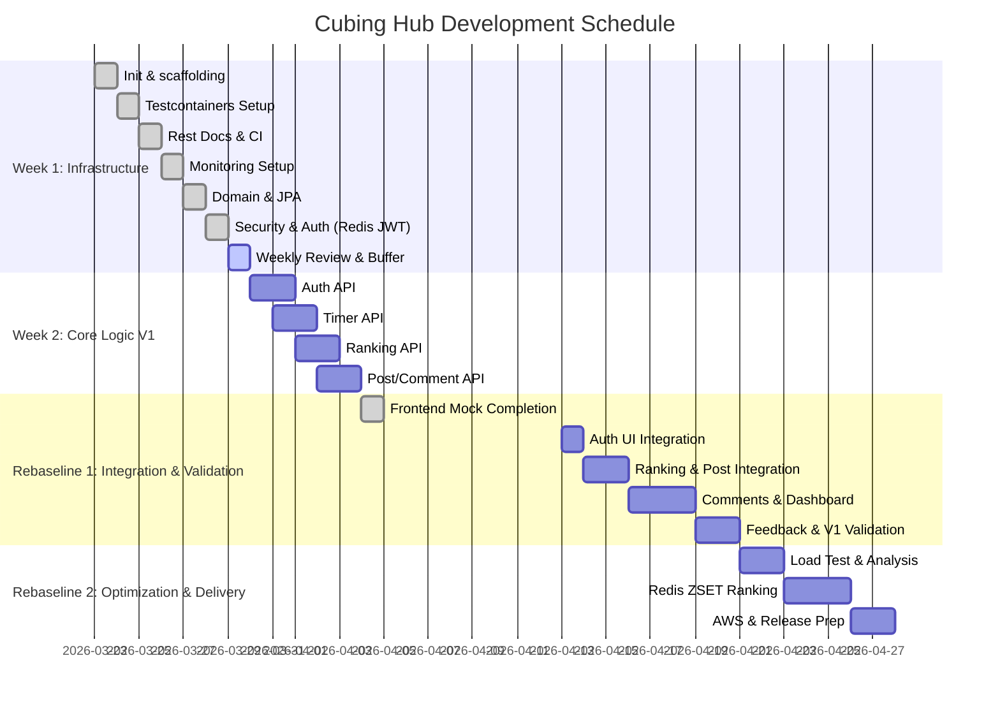

# Cubing Hub: 고성능 백엔드 아키텍처 구축 및 단계별 최적화 로드맵

> 이 문서는 일정/로드맵 보조 문서입니다.
> 정식 설계 문서는 [README](../README.md), [Project Overview](./Project%20Overview.md), [System Architecture](./System%20Architecture.md), [Deployment & Infrastructure Design](./Deployment%20%26%20Infrastructure%20Design.md)를 참고하세요.

---

## Week 1: 인프라 격리 및 모니터링 기반 구축 (ROI 최적화 주간)
> 기능 개발 전, 테스트와 지표 수집을 위한 환경을 완벽히 통제한다.

**Day 1 (월): 프로젝트 초기화 및 Git 전략 수립**
- [X] Java 17, Spring Boot 3.5.12, React 프로젝트 스캐폴딩 및 `main` 브랜치 푸시
- [X] `application.yml` 프로필 분리 (local, test, prod)
- [X] 프론트/백엔드 기본 통신(CORS) 확인

**Day 2 (화): Testcontainers 및 통합 테스트 환경 구축**
- [X] `BaseIntegrationTest` 클래스 작성
- [X] MySQL, Redis 도커 컨테이너 연동 및 테스트 컨텍스트 로드 확인
- [X] 더미 테스트 코드로 컨테이너 Up/Down 정상 동작 검증

**Day 3 (수): 자동 문서화 및 CI 파이프라인 초안**
- [X] Spring Rest Docs 설정 및 기본 템플릿(`.adoc`) 작성
- [X] 테스트 코드 통과 시 문서가 HTML로 빌드되는지 검증
- [X] GitHub Actions CI 워크플로우 생성 (Push 시 Testcontainers 기반 테스트 실행)

**Day 4 (목): Prometheus & Grafana 로컬 세팅**
- [X] `docker-compose.yml` 작성 (Prometheus, Grafana 컨테이너)
- [X] Spring Boot Actuator 의존성 추가 및 엔드포인트 개방
- [X] Grafana 'Spring Boot 3.5.12 System' 대시보드 연동 및 지표 수집 확인

**Day 5 (금 - 반일 작업): 도메인 설계 및 영속성 설정**
- [X] User, Record, Post 엔티티(JPA) 클래스 작성 및 연관관계 매핑
- [x] QueryDSL Q-Class 생성 및 설정 확인
- [X] DDL 자동 생성 쿼리 검토

**Day 6 (토 - 반일 작업): 보안 및 인증 뼈대 구축 (+Redis)**
- [x] Spring Security 필터 체인 구성 (Stateless 세션 설정)
- [X] JWT 유틸리티 클래스 작성 (Access/Refresh 토큰 생성, 파싱)
- [X] Redis 기반 Refresh Token 로직 연동 (TTL 관리 및 갱신 API 준비)

**Day 7 (일 - 반일 작업): 주간 마일스톤 점검 및 버퍼**
- [X] 1주 차 환경 세팅 중 지연된 작업 보완
- [X] 로컬 환경 전체 컨테이너(DB, 모니터링) 구동 테스트

---

## Week 2: 코어 비즈니스 로직 및 V1(RDBMS) 베이스라인 구축
> RDBMS 기반의 표준 아키텍처를 구현하고, 시스템의 성능 베이스라인 및 데이터 정합성을 검증합니다.

**Day 8 (월): 인증/인가 API 구현**
- [X] 로그인/회원가입 API 구현 및 통합 테스트 작성
- [X] Access Token만 발급하는 V1 인증 로직 완성
- [X] Spring Rest Docs에 로그인 API 명세 추가

**Day 9 (화): 타이머 기록 API 구현 (V1)**
- [X] WCA 스크램블 생성 유틸리티 구현
- [X] `POST /api/records` 구현 (MySQL에 단일 저장)
- [X] 기록 생성 통합 테스트 작성

**Day 10 (수): 글로벌 랭킹 API 및 성능 베이스라인 구축**
- [X] `GET /api/rankings` 구현
- [X] QueryDSL을 활용한 `ORDER BY time_ms ASC LIMIT 100` 풀스캔 쿼리 작성
- [X] 랭킹 조회 통합 테스트 작성

**Day 11 (목): 게시판 CRUD 및 동적 쿼리 구현**
- [X] `POST, GET /api/posts` 구현
- [X] QueryDSL을 이용한 게시글 다중 조건 검색(키워드, 작성자) 구현
- [X] 게시판 API 통합 테스트 작성 및 문서화

**Day 12 (금 - 반일 작업): 클라이언트 연동 (인증/타이머)**
- [X] React 로그인, 회원가입 폼 구현 및 토큰 로컬스토리지 저장
- [X] 스페이스바 이벤트 기반 타이머 측정 로직 및 API 연동
- [X] API 응답 정책 및 도메인 레이어 리팩토링
- [X] 통합 테스트, 서비스 단위 테스트, 보안 실패 경로 보강
- [X] 공개 스크램블 조회 API 추가 및 문서화
- [X] `react-router-dom`, `axios` 기반 프런트 공통 연동 기반 구성

**Day 13 (토, 2026-04-04): 프런트 목업 완성 (서비스형 UI)**
- [X] React 앱 셸과 주요 라우트 구조 정비
- [X] 홈, 랭킹, 학습, 커뮤니티, 피드백, 로그인/회원가입, 마이페이지 목업 화면 구현
- [X] 타이머 집중형 UI 재구성과 스페이스바 스크롤 이슈 기록
- [X] 프런트 목업 기준 PRD/ERD 동기화

---

## Rebaseline 1: 프런트 실연동 및 V1 안정화
> Day 14부터 진행 기준인 `2026-04-13` 이후로 재설정한다. 화면 명세를 유지하기 위해 필요한 백엔드 계약을 먼저 보강하고, 그 다음 프런트 실연동과 통합 검증을 닫는다.

**Day 14 (월, 2026-04-13): 인증 실연동**
- [ ] 로그인/회원가입 화면을 실제 인증 API와 연결
- [ ] 로그아웃 흐름 및 인증 실패 처리 정리
- [ ] 인증 관련 프런트-백엔드 수동 검증

**Day 15 (화, 2026-04-14): 랭킹 계약 확장 및 실연동**
- [ ] `/api/rankings`에 닉네임 검색, 25개 페이지네이션 계약 추가
- [ ] 랭킹 화면을 실제 API와 연결하고 loading/empty 상태 정리
- [ ] 확장된 랭킹 계약을 문서와 테스트에 반영

**Day 16 (수, 2026-04-15): 게시판 목록/본문 계약 확장 및 실연동**
- [ ] `/api/posts`에 카테고리 필터, 8개 페이지네이션 계약 추가
- [ ] 커뮤니티 목록/상세/작성/삭제 화면 실연동
- [ ] 게시글 인증/권한 실패 UX 점검

**Day 17 (목, 2026-04-16): 댓글 기능 완성**
- [ ] 댓글 API 구현 및 문서화
- [ ] 커뮤니티 상세 댓글 작성/삭제 실연동
- [ ] 커뮤니티 통합 흐름 결함 정리

**Day 18 (금, 2026-04-17): 홈/마이페이지 백엔드 준비**
- [ ] 홈/마이페이지에 필요한 프로필, 요약 통계, 최근 기록, 전체 기록 조회 API 추가
- [ ] 집계 쿼리와 응답 DTO 정리
- [ ] 인증 정책과 문서 반영

**Day 19 (토, 2026-04-18): 홈/마이페이지 실연동**
- [ ] 홈/마이페이지 mock 데이터 제거
- [ ] loading, empty, auth failure 상태 처리
- [ ] 대시보드 수동 검증

**Day 20 (일, 2026-04-19): 피드백 기능 완성**
- [ ] 피드백 제출 백엔드 경로 추가
- [ ] 피드백 화면 실연동 및 제출 결과 처리
- [ ] 메일/저장 전략과 문서 정리

**Day 21 (월, 2026-04-20): V1 통합 검증 및 핫픽스**
- [ ] 인증, 타이머, 랭킹, 커뮤니티, 마이페이지, 피드백 수동 통합 테스트
- [ ] 계약 불일치 및 UX 결함 핫픽스
- [ ] 필요 문서와 개발 로그 보강

---

## Rebaseline 2: 성능 최적화와 배포 준비
> V1 실연동과 통합 검증을 우선 닫은 뒤 성능 실험과 배포를 뒤로 미룬다.

**Day 22 (화, 2026-04-21): V1 로컬 부하 테스트**
- [ ] k6 스크립트 작성 및 V1 랭킹 부하 주입
- [ ] 쿼리 지연 시간과 TPS 측정
- [ ] 부하 조건과 측정 기준 문서화

**Day 23 (수, 2026-04-22): 병목 지표 캡처 및 원인 분석**
- [ ] Grafana 대시보드와 핵심 지표 캡처
- [ ] HikariCP, CPU, DB 병목 원인 정리
- [ ] MySQL Slow Query 로그 확인

**Day 24 (목, 2026-04-23): V2 리팩토링 준비**
- [ ] Redis ZSET 기반 랭킹 구조 설계 확정
- [ ] 기존 V1 랭킹/기록 저장 흐름과 동기화 전략 정리
- [ ] 선행 리팩토링과 테스트 보강 범위 확정

**Day 25 (금, 2026-04-24): V2 랭킹 최적화 구현**
- [ ] 기록 저장 시 Redis ZSET 반영 로직 추가
- [ ] 랭킹 조회를 Redis ZSET 기반으로 전환
- [ ] 데이터 정합성 검증 로직과 테스트 추가

**Day 26 (토, 2026-04-25): V2 검증과 비교**
- [ ] 동일한 k6 시나리오로 V2 부하 테스트
- [ ] V1 대비 latency, TPS, 안정성 비교
- [ ] 개선 지표와 리스크 정리

**Day 27 (일, 2026-04-26): 배포 준비**
- [ ] AWS RDS, EC2, Docker Compose, Redis, Nginx 준비
- [ ] Docker Hub 및 CD 스크립트 정리
- [ ] 정적 호스팅과 도메인 연결 준비

**Day 28 (월, 2026-04-27): 배포 마감**
- [ ] S3/CloudFront 정적 호스팅, HTTPS, CD 적용
- [ ] 프로덕션 스모크 테스트와 더미 데이터 검증
- [ ] 남은 운영 리스크와 후속 작업 정리
