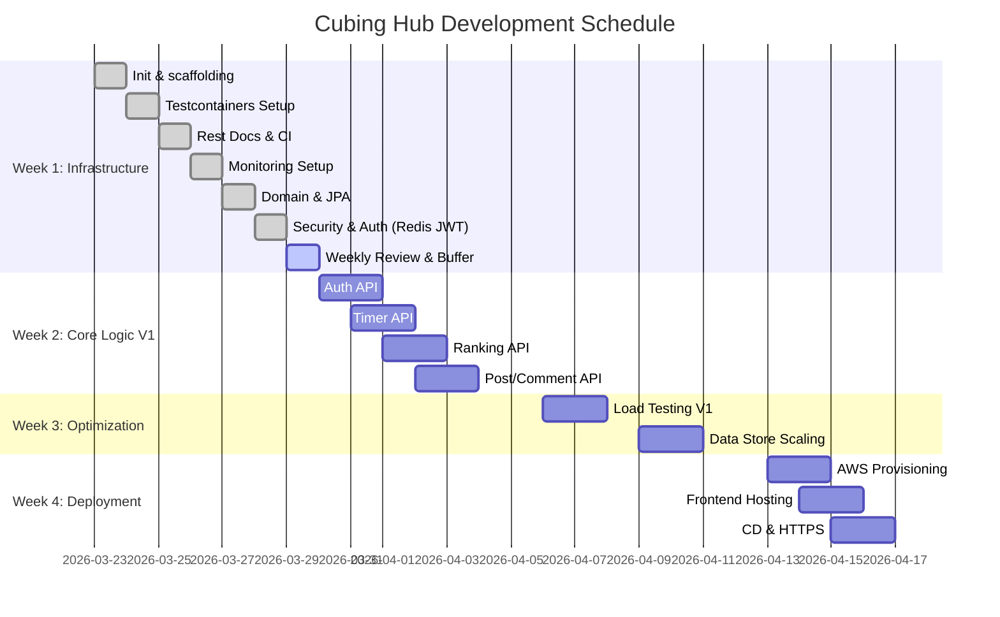

# Cubing Hub: 고성능 백엔드 아키텍처 구축 및 단계별 최적화 로드맵

---

## Week 1: 인프라 격리 및 모니터링 기반 구축 (ROI 최적화 주간)
> 기능 개발 전, 테스트와 지표 수집을 위한 환경을 완벽히 통제한다.

**Day 1 (월): 프로젝트 초기화 및 Git 전략 수립**
- [X] Java 17, Spring Boot 3.5.12, React 프로젝트 스캐폴딩 및 `main` 브랜치 푸시
- [X] `application.yml` 프로필 분리 (local, test, prod)
- [X] 프론트/백엔드 기본 통신(CORS) 확인

**Day 2 (화): Testcontainers 및 통합 테스트 환경 구축**
- [X] `BaseIntegrationTest` 클래스 작성
- [X] MySQL, Redis 도커 컨테이너 연동 및 테스트 컨텍스트 로드 확인
- [X] 더미 테스트 코드로 컨테이너 Up/Down 정상 동작 검증

**Day 3 (수): 자동 문서화 및 CI 파이프라인 초안**
- [X] Spring Rest Docs 설정 및 기본 템플릿(`.adoc`) 작성
- [X] 테스트 코드 통과 시 문서가 HTML로 빌드되는지 검증
- [X] GitHub Actions CI 워크플로우 생성 (Push 시 Testcontainers 기반 테스트 실행)

**Day 4 (목): Prometheus & Grafana 로컬 세팅**
- [X] `docker-compose.yml` 작성 (Prometheus, Grafana 컨테이너)
- [X] Spring Boot Actuator 의존성 추가 및 엔드포인트 개방
- [X] Grafana 'Spring Boot 3.5.12 System' 대시보드 연동 및 지표 수집 확인

**Day 5 (금 - 반일 작업): 도메인 설계 및 영속성 설정**
- [X] User, Record, Post 엔티티(JPA) 클래스 작성 및 연관관계 매핑
- [x] QueryDSL Q-Class 생성 및 설정 확인
- [X] DDL 자동 생성 쿼리 검토

**Day 6 (토 - 반일 작업): 보안 및 인증 뼈대 구축 (+Redis)**
- [x] Spring Security 필터 체인 구성 (Stateless 세션 설정)
- [X] JWT 유틸리티 클래스 작성 (Access/Refresh 토큰 생성, 파싱)
- [X] Redis 기반 Refresh Token 로직 연동 (TTL 관리 및 갱신 API 준비)

**Day 7 (일 - 반일 작업): 주간 마일스톤 점검 및 버퍼**
- [X] 1주 차 환경 세팅 중 지연된 작업 보완
- [X] 로컬 환경 전체 컨테이너(DB, 모니터링) 구동 테스트

---

## Week 2: 코어 비즈니스 로직 및 V1(RDBMS) 베이스라인 구축
> RDBMS 기반의 표준 아키텍처를 구현하고, 시스템의 성능 베이스라인 및 데이터 정합성을 검증합니다.

**Day 8 (월): 인증/인가 API 구현**
- [X] 로그인/회원가입 API 구현 및 통합 테스트 작성
- [X] Access Token만 발급하는 V1 인증 로직 완성
- [X] Spring Rest Docs에 로그인 API 명세 추가

**Day 9 (화): 타이머 기록 API 구현 (V1)**
- [X] WCA 스크램블 생성 유틸리티 구현
- [X] `POST /api/records` 구현 (MySQL에 단일 저장)
- [X] 기록 생성 통합 테스트 작성

**Day 10 (수): 글로벌 랭킹 API 및 성능 베이스라인 구축**
- [X] `GET /api/rankings` 구현
- [X] QueryDSL을 활용한 `ORDER BY time_ms ASC LIMIT 100` 풀스캔 쿼리 작성
- [X] 랭킹 조회 통합 테스트 작성

**Day 11 (목): 게시판 CRUD 및 동적 쿼리 구현**
- [X] `POST, GET /api/posts` 구현
- [X] QueryDSL을 이용한 게시글 다중 조건 검색(키워드, 작성자) 구현
- [X] 게시판 API 통합 테스트 작성 및 문서화

**Day 12 (금 - 반일 작업): 클라이언트 연동 (인증/타이머)**
- [X] React 로그인, 회원가입 폼 구현 및 토큰 로컬스토리지 저장
- [X] 스페이스바 이벤트 기반 타이머 측정 로직 및 API 연동
- [X] API 응답 정책 및 도메인 레이어 리팩토링
- [X] 통합 테스트, 서비스 단위 테스트, 보안 실패 경로 보강
- [X] 공개 스크램블 조회 API 추가 및 문서화
- [X] `react-router-dom`, `axios` 기반 프런트 공통 연동 기반 구성

**Day 13 (토 - 반일 작업): 클라이언트 연동 (랭킹/게시판)**
- [ ] V1 랭킹 조회 API 연동 및 테이블 UI 렌더링
- [ ] 자유 게시판 목록 및 작성 페이지 연동

**Day 14 (일 - 반일 작업): V1 기능 결함 검증**
- [ ] 프론트엔드 - 백엔드 통합 기능 테스트 (수동)
- [ ] 발견된 버그 즉각 핫픽스 및 `main` 푸시

---

## Week 3: 부하 테스트 및 데이터 아키텍처 스케일링 (핵심 최적화 주간)
> 실제 트래픽 시나리오 기반의 임계치를 측정하고, 측정 지표에 최적화된 데이터 저장소 확장 전략을 수립합니다.

**Day 15 (월): V1 로컬 부하 테스트 및 임계치 측정**
- [ ] k6 스크립트 작성 (가상 유저 1,000명 단위 VUs 세팅)
- [ ] V1 글로벌 랭킹 API(`GET /api/rankings`) 타겟으로 k6 부하 주입
- [ ] 쿼리 지연 시간 확인 및 TPS 측정

**Day 16 (화): 병목 지표 캡처 및 원인 분석**
- [ ] 부하 주입 중 Grafana 대시보드 스크린샷 캡처
- [ ] HikariCP 커넥션 풀 고갈 및 CPU 스파이크 지표 문서화
- [ ] MySQL Slow Query 로그 확인

**Day 17 (수): V2 리팩토링 - 성능 지표 기반 최적화 준비**
- [ ] (기존 Redis Refresh Token 로직 고도화 및 블랙리스트 전략 점검)
- [ ] 기존 로그인 통합 테스트 수정 및 통과 확인

**Day 18 (목): V2 리팩토링 - 실시간 랭킹 데이터 구조 최적화**
- [ ] 병목 해소를 위한 고속 데이터 구조(예: In-Memory) 도입 및 로직 구현
- [ ] RDBMS 기반 조회 로직을 최적화된 아키텍처로 전면 교체
- [ ] 데이터 정합성 유지 및 동기화 전략 수립 및 검증

**Day 19 (금 - 반일 작업): V2 최적화 부하 테스트**
- [ ] 동일한 k6 스크립트로 V2 랭킹 API 타겟 부하 주입
- [ ] Redis 적용 후의 Latency(지연 시간) 단축 확인

**Day 20 (토 - 반일 작업): 개선 지표 캡처 및 비교**
- [ ] V2 트래픽 방어 성공 시 Grafana 대시보드 안정화 지표 캡처
- [ ] V1 vs V2 TPS 개선율(%), 응답 속도 단축(ms) 수치 연산

**Day 21 (일 - 반일 작업): 성능 최적화 리포트 및 기술 블로그 작성**
- [ ] 도출된 데이터를 바탕으로 Markdown 포트폴리오 트러블슈팅 세션 초안 작성
- [ ] "RDBMS 풀스캔 한계 -> Redis ZSET 도입 -> TPS 000% 개선" 논리 구조화

---

## Week 4: AWS 클라우드 배포 및 최종 마감
> 로컬 환경에서 검증된 시스템을 프로덕션으로 이관하고 프로젝트를 종결한다.

**Day 22 (월): AWS 인프라 프로비저닝**
- [ ] AWS RDS(MySQL) 프리티어 생성 및 외부 접속 차단(보안 그룹 설정)
- [ ] AWS EC2 인스턴스 생성 및 Docker/Docker-compose 설치
- [ ] EC2 내부에 Redis 및 Nginx 컨테이너 띄우기

**Day 23 (화): 프론트엔드 정적 호스팅 및 도메인 연동**
- [ ] S3 버킷 생성 및 React 정적 파일(build) 업로드
- [ ] CloudFront 연동 및 OAC 설정으로 S3 직접 접근 차단
- [ ] 구매한 도메인 Route 53 연결

**Day 24 (수): CD 파이프라인 및 HTTPS 적용**
- [ ] GitHub Actions -> Docker Hub 이미지 푸시 스크립트 작성
- [ ] EC2에서 이미지 Pull 및 컨테이너 재시작 스크립트 작성(CD 완성)
- [ ] Nginx에 Let's Encrypt(Certbot) SSL 인증서 발급 및 HTTPS 적용

**Day 25 (목): 프로덕션 환경 최종 검증**
- [ ] 상용 도메인에서 타이머 동작, 기록 저장, 랭킹 조회 정상 확인
- [ ] 프로덕션 DB 더미 데이터 삽입 및 Redis 동기화 상태 점검

**Day 26 (금 - 반일 작업): 프로덕션 부하 테스트 (과금 통제)**
- [ ] 과금을 방지하기 위해 최대 3분 이내로 k6 프로덕션 부하 테스트 1회 실시
- [ ] AWS CloudWatch 또는 프로덕션 Grafana 지표 캡처

**Day 27 (토 - 반일 작업): 포트폴리오 문서 최종화**
- [ ] 로컬 및 프로덕션 부하 테스트 결과를 포함한 최종 포트폴리오 PRD 업데이트
- [ ] 시스템 아키텍처 다이어그램(AWS 구조 포함) 확정

**Day 28 (일 - 반일 작업): 인프라 폐기 및 프로젝트 동결**
- [ ] AWS Billing(결제) 대시보드 점검 및 예상 요금 확인
- [ ] 포트폴리오 캡처 완료 즉시 RDS 삭제 (또는 중지) 및 불필요한 인프라 정리
- [ ] 큐빙허브 개발 완전 종료
