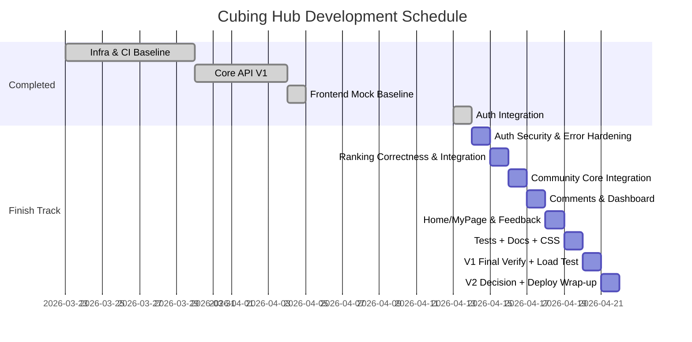

# Cubing Hub 개발 일정 및 마감 로드맵

> 이 문서는 공개 일정/로드맵 보조 문서입니다.
> 정식 설계 문서는 [README](../README.md), [Project Overview](./Project%20Overview.md), [System Architecture](./System%20Architecture.md), [Deployment & Infrastructure Design](./Deployment%20%26%20Infrastructure%20Design.md)를 참고하세요.

## 일정 원칙

- 내부 일정과 같은 날짜/단계 구조를 따른다.
- 차이는 체크리스트 밀도뿐이다.
- 일정 압축은 항목 삭제가 아니라 여러 작업을 더 적은 날짜에 배치하는 방식으로 진행한다.
- 검증 단계는 생략하지 않는다.
- 랭킹 V2가 일정 지연 요인이 되면 V1 마감이 우선이다.

---

## Week 1: 인프라 기반 구축

**Day 1 (월, 2026-03-23): 프로젝트 초기화 및 기본 구조 설정**
- [X] 프로젝트 스캐폴딩과 브랜치 기준선 정리
- [X] 프로필 분리와 프런트/백 기본 통신 확인

**Day 2 (화, 2026-03-24): Testcontainers 기반 통합 테스트 환경**
- [X] MySQL, Redis 컨테이너 테스트 기반 구축
- [X] 통합 테스트 컨텍스트 정상 구동 확인

**Day 3 (수, 2026-03-25): REST Docs 및 CI 초안**
- [X] 문서 자동화 설정
- [X] GitHub Actions 기반 테스트 검증 흐름 구성

**Day 4 (목, 2026-03-26): 모니터링 로컬 환경**
- [X] Prometheus, Grafana 로컬 구성
- [X] Actuator 지표 수집 확인

**Day 5 (금, 2026-03-27): 도메인 및 영속성 기준선**
- [X] 핵심 엔티티와 연관관계 매핑
- [X] QueryDSL 및 DDL 기준선 확인

**Day 6 (토, 2026-03-28): 보안 및 인증 뼈대**
- [X] Stateless Security 필터 체인 구성
- [X] JWT 및 Redis 기반 토큰 관리 기반 구축

**Day 7 (일, 2026-03-29): 1주 차 점검**
- [X] 지연 작업 보완
- [X] 로컬 전체 컨테이너 구동 확인

---

## Week 2: 코어 API V1 구축

**Day 8 (월, 2026-03-30): 인증 API 구현**
- [X] 회원가입/로그인 API와 테스트 작성
- [X] 인증 문서화 기준선 확보

**Day 9 (화, 2026-03-31): 기록 저장 API 구현**
- [X] 스크램블 생성과 기록 저장 API 구현
- [X] 기록 생성 테스트 작성

**Day 10 (수, 2026-04-01): 랭킹 V1 API 구현**
- [X] `GET /api/rankings` 구현
- [X] V1 기준 쿼리와 테스트 확보

**Day 11 (목, 2026-04-02): 게시글 CRUD 및 검색**
- [X] 게시글 CRUD와 검색 API 구현
- [X] 게시판 테스트 및 문서화

**Day 12 (금, 2026-04-03): 프런트 인증/타이머 연동 기반**
- [X] 인증 폼과 타이머 API 연동 기반 구축
- [X] 공통 API 클라이언트 및 인증 저장소 정리

**Day 13 (토, 2026-04-04): 프런트 목업 완성**
- [X] 주요 화면 목업 완료
- [X] 화면 기준 문서 동기화

---

## Rebaseline: 실연동 마감

**Day 14 (월, 2026-04-13): 인증 실연동 + Auth UX Hardening**
- [X] `GET /api/me`, 로그인/회원가입/로그아웃 실연동
- [X] 보호/guest-only 라우트, 로그인 후 복귀, `401 -> refresh -> retry` 정리
- [X] 인증 관련 수동 검증과 문서 동기화

**Day 15 (화, 2026-04-14): 보안 기본기 + Auth 계약/테스트 정리**
- [X] secret/basic password 정리와 env 분리
- [X] `메모리 Access Token + HttpOnly Refresh Cookie` 반영
- [X] React auth 회귀 테스트 추가
- [X] JaCoCo 기반 테스트 커버리지 기준선 도입과 generated class 왜곡 보정
- [X] auth 예외 계약 일부 정리와 백엔드 인증 테스트 구조 보강
- [X] `refresh_token` 누락/재사용 감지 `401`을 포함한 auth 실패 응답과 generated REST Docs 정렬
- [X] 인증 관련 수동 검증과 문서 동기화

**Day 16 (수, 2026-04-15): 랭킹 정합성 수정 + 랭킹 실연동**
- [ ] `PLUS_TWO` 보정과 랭킹 기준 확정
- [ ] 랭킹 검색/페이지네이션 계약 확장
- [ ] `RankingsPage` 실연동과 검증

**Day 17 (목, 2026-04-16): 커뮤니티 본체 실연동**
- [ ] 게시글 목록 계약 확장
- [ ] 커뮤니티 목록/상세/작성/삭제 실연동
- [ ] 권한 실패 UX 점검

**Day 18 (금, 2026-04-17): 댓글 + 대시보드 API/실연동**
- [ ] 댓글 API와 댓글 UI 실연동
- [ ] 홈/마이페이지용 API 범위와 응답 정리

**Day 19 (토, 2026-04-18): 홈/마이페이지 + 피드백 실연동**
- [ ] 홈/마이페이지 실연동과 mock 제거
- [ ] 피드백 API 및 화면 실연동
- [ ] 사용자 상태별 UX 점검

**Day 20 (일, 2026-04-19): 테스트 + 문서 + CSS 정리**
- [ ] 핵심 테스트 보강
- [ ] 문서 동기화
- [ ] CSS 구조 분리와 후순위 정리

**Day 21 (월, 2026-04-20): V1 최종 검증 + 부하 테스트 기준선**
- [ ] 전체 기능 수동 검증
- [ ] `k6` 기반 V1 성능 기준선 확보

**Day 22 (화, 2026-04-21): 랭킹 V2 적용 여부 결정 + 배포 마감**
- [ ] Redis ZSET 랭킹 V2 적용 여부 판단
- [ ] 최종 배포/스모크 테스트
- [ ] 최종 문서와 남은 리스크 정리

## 공개 일정 해석 가이드

- 내부 일정 문서와 같은 날짜 구조를 사용한다.
- 공개 문서는 각 Day의 핵심 목표만 요약한다.
- 상세 작업 순서, 세부 검증 항목, 선행 조건은 내부 일정 문서에서 관리한다.
