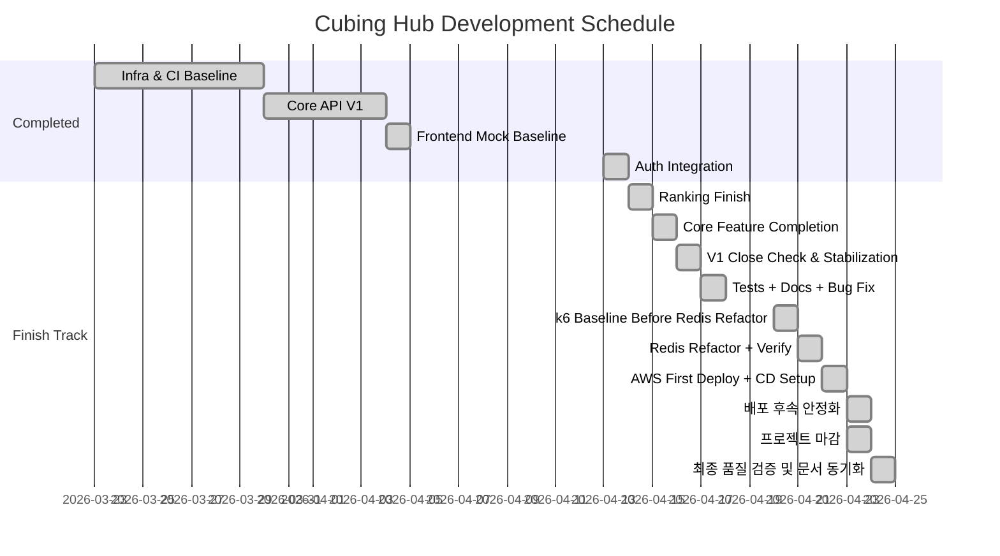

# Cubing Hub 개발 일정 및 마감 로드맵

> 이 문서는 공개 일정/로드맵 보조 문서입니다.
> 정식 설계 문서는 [README](../README.md), [Project Overview](./Project%20Overview.md), [System Architecture](./System%20Architecture.md), [Deployment & Infrastructure Design](./Deployment%20%26%20Infrastructure%20Design.md)를 참고하세요.
> 이 문서의 날짜 라벨은 계획 타임라인이고, `docs/Development Log/Day *.md`의 커밋 시각 기준 번호와는 별개입니다.

> `2026-04-24` 기준 기능 구현, CI/CD 운영 반영, 배포 환경 수동 검증, backend/frontend 최종 커버리지 검증, 공식·내부 문서 마감을 완료했다.

## Week 1: 인프라 기반 구축

**2026-03-23 (월): 프로젝트 초기화 및 기본 구조 설정**
- [X] 프로젝트 스캐폴딩과 브랜치 기준선 정리
- [X] 프로필 분리와 프런트/백 기본 통신 확인

**2026-03-24 (화): Testcontainers 기반 통합 테스트 환경**
- [X] MySQL, Redis 컨테이너 테스트 기반 구축
- [X] 통합 테스트 컨텍스트 정상 구동 확인

**2026-03-25 (수): REST Docs 및 CI 초안**
- [X] 문서 자동화 설정
- [X] GitHub Actions 기반 테스트 검증 흐름 구성

**2026-03-26 (목): 모니터링 로컬 환경**
- [X] Prometheus, Grafana 로컬 구성
- [X] Actuator 지표 수집 확인

**2026-03-27 (금): 도메인 및 영속성 기준선**
- [X] 핵심 엔티티와 연관관계 매핑
- [X] QueryDSL 및 DDL 기준선 확인

**2026-03-28 (토): 보안 및 인증 뼈대**
- [X] Stateless Security 필터 체인 구성
- [X] JWT 및 Redis 기반 토큰 관리 기반 구축

**2026-03-29 (일): 1주 차 점검**
- [X] 지연 작업 보완
- [X] 로컬 전체 컨테이너 구동 확인

---

## Week 2: 코어 API V1 구축

**2026-03-30 (월): 인증 API 구현**
- [X] 회원가입/로그인 API와 테스트 작성
- [X] 인증 문서화 기준선 확보

**2026-03-31 (화): 기록 저장 API 구현**
- [X] 스크램블 생성과 기록 저장 API 구현
- [X] 기록 생성 테스트 작성

**2026-04-01 (수): 랭킹 V1 API 구현**
- [X] `GET /api/rankings` 구현
- [X] V1 기준 쿼리와 테스트 확보

**2026-04-02 (목): 게시글 CRUD 및 검색**
- [X] 게시글 CRUD와 검색 API 구현
- [X] 게시판 테스트 및 문서화

**2026-04-03 (금): 프런트 인증/타이머 연동 기반**
- [X] 인증 폼과 타이머 API 연동 기반 구축
- [X] 공통 API 클라이언트 및 인증 저장소 정리

**2026-04-04 (토): 프런트 목업 완성**
- [X] 주요 화면 목업 완료
- [X] 화면 기준 문서 동기화

---

## 재기준화: 실연동 마감

**2026-04-13 (월): 인증 실연동 + Auth UX Hardening**
- [X] `GET /api/me`, 로그인/회원가입/로그아웃 실연동
- [X] 보호/비로그인 전용 라우트, 로그인 후 복귀, `401 -> refresh -> retry` 정리
- [X] 인증 관련 수동 검증과 문서 동기화

**2026-04-14 (화): 보안 기본기/Auth 계약 정리 + 랭킹 종료**
- [X] secret/basic password 정리와 env 분리
- [X] `메모리 Access Token + HttpOnly Refresh Cookie` 반영
- [X] React auth 회귀 테스트 추가
- [X] JaCoCo 기반 테스트 커버리지 기준선 도입과 generated class 왜곡 보정
- [X] auth 예외 계약 일부 정리와 백엔드 인증 테스트 구조 보강
- [X] `refresh_token` 누락/재사용 감지 `401`을 포함한 auth 실패 응답과 generated REST Docs 정렬
- [X] 인증 관련 수동 검증과 문서 동기화
- [X] 랭킹 기준을 PB 기준과 서버 페이지네이션 계약으로 정리
- [X] 기록 penalty 수정/삭제와 마이페이지 기록 조회 API 추가
- [X] `RankingsPage`, `TimerPage`, `MyPage` 실연동과 프런트 테스트 보강
- [X] 랭킹/마이페이지 설계 문서와 일정 문서 동기화
- [X] 랭킹/기록 관리 수동 검증

**2026-04-15 (수): 핵심 기능 구현 완료**
- [X] 커뮤니티 목록/상세/작성/삭제 실연동
- [X] 댓글 API와 댓글 UI 실연동
- [X] 홈 대시보드, 피드백 실연동
- [X] 관련 문서 동기화와 자동 회귀 검증
- [X] 브라우저 수동 검증 완료

**2026-04-16 (목): V1 마감 점검 및 안정화**
- [X] 커뮤니티/댓글/마이페이지 권한과 validation 경계 보완
- [X] 홈 선택적 인증 대체 처리와 피드백 상태 처리 안정화
- [X] V1 범위 자동 회귀 재확인과 마감 판단 근거 정리

**2026-04-17 (금): 테스트 + 문서 + CSS + 잔버그 정리**
- [X] 안정화 범위 테스트와 문서 동기화
- [X] CSS 구조 정리와 피드백/커뮤니티 화면 잔버그 수정
- [X] `frontend` lint/build/test 재실행

**2026-04-20 (월): Redis 리팩토링 전 `k6` 기준선 측정**
- [X] 브라우저 핵심 흐름 수동 재점검
- [X] Redis 리팩토링 전 V1 기준 `k6` 기준선 측정
- [X] 측정 조건과 결과 기록 정리

**2026-04-21 (화): Redis 리팩토링 + 재측정 + 문서 마감**
- [X] Redis ZSET 랭킹 V2 리팩토링
- [X] 동일 `k6` 시나리오 재실행과 전/후 비교 정리
- [X] 실제 배포와 대상 환경 스모크 테스트
- [X] 큐빙허브 최종 문서와 남은 리스크 정리

**2026-04-22 (수): AWS 1차 배포 완료와 CD 준비**
- [X] `www.cubing-hub.com`, `api.cubing-hub.com` 기준 1차 수동 배포 완료
- [X] HTTPS health check와 브라우저 스모크 테스트 확인
- [X] 운영 체크리스트와 공식 문서 최신화
- [X] backend/frontend 자동 배포 workflow 추가

**2026-04-23 (목): 배포 후속 안정화**
- [X] 회원가입 이메일 인증 흐름, SMTP/Redis TTL, 관련 설계 문서 정리
- [X] 모바일 반응형 레이아웃과 타이머 `touch`/`pen` 입력 보강
- [X] 랭킹 검색 전체 순위 보존, 타이머 게스트 캐시/자동 초기화, 입력 길이 제한, backlog 및 화면/API 문서 동기화
- [X] 비밀번호 재설정과 마이페이지 계정 정보/비밀번호 변경 흐름 추가
- [X] 커뮤니티 게시글 수정 프런트 연동과 학습 화면 회전기호 가이드 추가

**2026-04-23 (목): 프로젝트 마감**

- [X] backend/frontend CI와 deploy workflow 운영 반영 확인
- [X] 배포환경 기준 핵심 사용자 기능과 관리자 기능 수동 검증 완료
- [X] README, 설계 문서, 일정 문서, 허브 로그, `portfolio.internal.md` 마감 동기화

**2026-04-24 (금): 최종 품질 검증 및 문서 동기화**

- [X] SMTP 이메일 발송 어댑터/설정과 S3 게시글 이미지 저장소/설정 운영 경로 테스트 보강
- [X] backend `./gradlew test jacocoTestReport --no-daemon` 기준 JaCoCo instruction/branch 100% 확인
- [X] 공개 Q&A와 관리자 화면 라우트/페이지 테스트 보강
- [X] frontend `npx vitest run --coverage` 기준 statements/branches/functions/lines 100% 확인
- [X] 사용자 수동 확인 기준 실제 SMTP 송수신, 실제 S3 업로드/삭제, 최종 브라우저 QA 통과
- [X] 오늘 개발일지, 일정 문서, 허브 로그, `portfolio.internal.md` 최종 동기화
