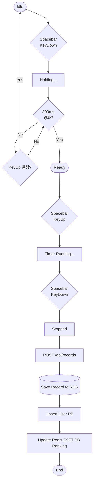

# Project Specification (PRD)

## 1. 프로젝트 개요
- 프로젝트 이름: 큐빙허브 (Cubing Hub)
- 개발 기간: 1개월
- 개발 목적: 기존 큐빙 유저들의 데이터 파편화 문제를 해결하는 통합 플랫폼을 구축과 도커를 활용한 배포 및 운용, 테스트 자동화 학습

---

## 2. 문제 정의
기존 큐빙 유저들의 데이터 파편화 문제를 해결하는 통합 플랫폼을 구축하되, 서비스 운영 과정에서 발생할 수 있는 대규모 읽기 요청 부하와 테스트 신뢰성 부족 문제를 시스템적으로 해결해야 함.

---

## 3. 목표 사용자
- 타겟 사용자: 스피드큐빙 코어 유저
- 사용 환경: PC 및 모바일 웹 브라우저

---

## 4. 핵심 기능

### 사용자 기능
- 회원가입 / 로그인 (주 종목 선택 포함)
- 홈 공용 오늘의 스크램블 카드 제공 및 WCA 규격 무작위 스크램블 조회
- 타이머 측정 및 개인 기록 저장 (홀드 300ms → 준비 → 시작 3단계 상태 머신)
- 개인 기록 대시보드 및 마이페이지 (공용 오늘의 스크램블, 프로필, 솔빙 통계, PB, 최근 기록, 전체 기록 조회)
- 글로벌 누적 랭킹 보드 조회 (사용자당 1개의 PB row 기준, 닉네임 검색, 종목 필터링, 25개 단위 페이지네이션)
- 큐브 공식 학습 (CFOP: F2L 41 + OLL 57 + PLL 21 = 119케이스)
- 자유 게시판 (게시글 목록/상세, 댓글 작성·삭제, 제목·닉네임 검색, 카테고리 필터링, 8개 단위 페이지네이션)
- 관리자 메일로 피드백(버그 제보, 기능 제안 등) 전달

### 시스템 기능
- **인증/인가:** JWT Access Token 발급 및 Redis 기반 Refresh Token 생명주기 관리
- **동적 쿼리:** QueryDSL을 활용한 게시판 다중 조건 검색 및 PB 기준 랭킹 필터링
- **신뢰성 검증:** Testcontainers를 이용한 통합 테스트 환경 구축
- **문서화 자동화:** 테스트 통과 시 Spring Rest Docs 기반 API 문서 자동 생성
- **모니터링:** Prometheus/Grafana를 통한 EC2 컨테이너 및 API 지표 모니터링

---

## 5. MVP 범위
반드시 구현

- JWT 기반 인증 (Redis Refresh Token 연동)
- 홈 공용 오늘의 스크램블 카드 제공
- 타이머 측정 및 기록 보관 (AWS RDS)
- 개인 기록 대시보드 및 마이페이지
- 사용자당 1개의 PB를 기준으로 한 Redis ZSET 기반 실시간 랭킹 조회 (25개 단위 페이지네이션)
- QueryDSL 기반 게시판 CRUD 및 상세 조회/댓글 상호작용 (검색 포함, 8개 단위 페이지네이션)
- 사용자 피드백 메일 전달
- EC2 내부 Docker Compose 구축 (Spring Boot, Redis, Prometheus, Grafana)
- GitHub Actions를 통한 CI/CD (Docker Hub 이미지 푸시 및 EC2 자동 배포)

지원 종목

- 현재 지원: 3x3x3
- 향후 순차 지원 예정: 2x2x2, 4x4x4, 5x5x5, 6x6x6, 7x7x7, 블라인드, 원핸드 등 WCA 공식 17개 종목

제외 기능

- 소셜 로그인 
- 실시간 1:1 대결 기능

---

## 6. 성공 기준
- 1개월 내 분산 인프라(EC2, RDS, CloudFront, S3) 상용 배포 완료
- Testcontainers 기반 통합 테스트 커버리지 70% 이상 달성
- k6 부하 테스트(가상 유저 1,000명 동시 접속) 시 RDS I/O 부하와 EC2 메모리 상태를 Grafana로 분석하고, 문서화
