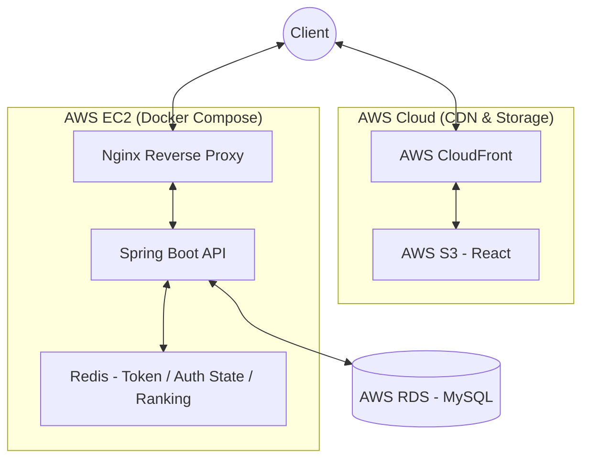

# System Architecture

## 1. 아키텍처 개요



### 목표 아키텍처

**Frontend**

```text
Client ↔ AWS CloudFront ↔ AWS S3
```

**Backend & Storage**

```text
Client ↔ AWS Nginx
           ↓
      AWS EC2 (Docker Compose)
           ├─ Spring Boot API
           ├─ Redis
           └─ Nginx Reverse Proxy
           ↓
      AWS RDS (MySQL)
```

## 2. 주요 구성요소

| 컴포넌트 | 역할 |
| --- | --- |
| Client | 웹 브라우저에서 서비스 사용 |
| CloudFront | 정적 리소스 CDN |
| S3 | React 정적 파일 호스팅 |
| Nginx | Reverse Proxy 및 외부 진입점 |
| Spring Boot API | 인증, 기록, 랭킹, 게시판 등 비즈니스 로직 처리 |
| Redis | Refresh Token, Blacklist, 이메일 인증 / 비밀번호 재설정 임시 상태, 랭킹 읽기 모델 |
| RDS MySQL | 영속 데이터 저장 |
| SMTP Server | 회원가입 / 비밀번호 재설정 인증번호 발송 |

## 3. 요청 흐름

### 정적 리소스 요청

1. 사용자는 브라우저에서 프런트 페이지에 접근한다.
2. CloudFront가 정적 파일을 캐싱해 응답한다.
3. 원본 정적 자산은 S3에서 제공한다.

### API 요청

1. 프런트는 `VITE_API_BASE_URL=https://api.cubing-hub.com` 기준으로 백엔드 API를 호출한다.
2. 외부 요청은 `api.cubing-hub.com`의 Nginx를 통해 EC2 내부 Spring Boot 컨테이너로 전달된다.
3. Spring Boot는 필요 시 Redis와 RDS를 함께 사용해 응답을 구성한다.

## 4. 인증 흐름

### 구현 인증 흐름

1. 로그인 시 Spring Boot가 Access Token과 Refresh Token을 발급한다.
2. Access Token은 응답 body로 전달되고, 클라이언트는 이를 메모리에만 유지한다.
3. Refresh Token은 Redis에 저장되고, 브라우저에는 `HttpOnly` cookie로 전달된다.
4. 앱 초기 진입/새로고침 시 클라이언트는 refresh cookie로 Access Token을 재발급받은 뒤 `/api/me`로 세션을 복구하고, 보호 API `401`에는 `refresh -> retry`를 1회 수행한다.
5. 보호 API 요청 시 Access Token이 JWT 필터를 통과하면 비즈니스 로직으로 진입한다.
6. 로그아웃 시 Refresh Token은 Redis에서 제거되고 Access Token은 blacklist에 등록된다.

### 목표 인증 흐름

1. 로그인 시 Spring Boot가 Access Token과 Refresh Token을 발급한다.
2. Access Token은 응답 body로 전달되고, 클라이언트는 이를 메모리에만 유지한다.
3. Refresh Token은 Redis에 저장되고, 브라우저에는 `HttpOnly` cookie로 전달된다.
4. 앱 초기 진입/새로고침 시 클라이언트는 refresh cookie로 Access Token을 재발급받은 뒤 `/api/me`로 세션을 복구한다.
5. 보호 API 요청 시 Access Token이 JWT 필터를 통과하면 비즈니스 로직으로 진입한다.
6. 로그아웃 시 Refresh Token은 Redis에서 제거되고 Access Token은 blacklist에 등록된다.

## 5. 데이터 흐름

### 조회

- 홈 대시보드/마이페이지
  - 홈 대시보드는 `GET /api/home` 기준으로 구현되어 있고, 비로그인/로그인 상태에 따라 조합 데이터를 반환한다.
  - 마이페이지는 RDS 기반 프로필/요약 조회와 전체 기록 페이지 조회를 제공한다.
- 랭킹 V2
  - `nickname` 미입력 기본 조회는 Redis ZSET 읽기 모델을 사용한다.
  - `nickname` 검색 요청 또는 Redis 준비 상태 키가 없는 경우는 MySQL `user_pbs` 대체 경로를 사용한다.
  - MySQL `records` / `user_pbs`는 기준 데이터이고 Redis는 읽기 최적화를 위한 보조 모델이다.
- 게시판
  - RDS의 `posts`, `users`, `post_attachments`, `post_views`를 조합해 목록/상세를 조회한다.
  - 공개 Q&A는 `feedbacks`에서 `PUBLIC + answered` 조건만 읽어 `/qna`로 노출한다.

### 생성 / 수정 / 삭제

- 회원가입
  - SMTP로 인증번호를 발송하고 Redis에 인증 상태를 임시 저장한 뒤, 확인 완료 후 `users`에 새 계정을 저장한다.
- 비밀번호 재설정
  - SMTP로 비밀번호 재설정 인증번호를 발송하고 Redis에 인증번호/재요청 제한 상태를 임시 저장한 뒤, 확인 완료 후 비밀번호를 갱신하고 기존 refresh token을 모두 정리한다.
- 기록 저장
  - `records`에 solve를 저장하고 `user_pbs`를 갱신하며, PB가 바뀌면 Redis 랭킹 읽기 모델도 함께 동기화한다.
- 기록 수정/삭제
  - `records`의 penalty 수정과 삭제를 허용하고, 변경 후 `user_pbs`를 다시 계산하며 Redis 랭킹 읽기 모델을 갱신하거나 제거한다.
- 로그인 사용자 계정 관리
  - 마이페이지에서 프로필을 수정하면 `/api/me`와 화면 데이터를 다시 동기화하고, 비밀번호 변경이 성공하면 기존 refresh token을 모두 정리해 재로그인을 강제한다.
- 게시글 CRUD
  - `posts`를 생성/수정/삭제하고, 첨부 이미지는 S3에 저장한 뒤 `post_attachments` 메타데이터로 연결한다.
  - 상세 조회 시 로그인 사용자 기준 고유 조회 이력을 `post_views`에 기록하고 `view_count`를 증가시킨다.
- 피드백 운영
  - `feedbacks`에 관리자 답변과 공개 여부를 함께 저장하고, 관리자 전용 `/api/admin/**`에서 운영한다.
  - 내부 개발 메모는 `admin_memos`를 별도 도메인으로 둔다.

### 외부 연동 / 운영 데이터

- 로컬 기준선은 Prometheus와 Grafana로 유지한다.
- 1차 운영 배포 범위는 `Nginx + Spring Boot + Redis + RDS`이며, 운영 메트릭 스택은 배포 범위에서 제외한다.
- GitHub Actions는 변경 경로 기준으로 `Backend CI`, `Frontend CI`를 분리 실행한다.
- `Backend CI`는 Testcontainers 통합 테스트, JaCoCo 리포트, REST Docs 빌드와 artifact 회수를 담당한다.
- `Frontend CI`는 `npm ci`, lint, vitest, build 검증과 실패 산출물 회수를 담당한다.
- `Performance Benchmark` workflow는 `workflow_dispatch`로 수동 실행하며, 기준선 seed와 `k6` 결과 artifact를 재현한다.

## 6. 성능 / 확장 고려

- 랭킹 V2는 MySQL 기준 데이터 + Redis 읽기 모델 구조다.
  - 기본 조회는 Redis ZSET, `nickname` 검색은 MySQL 대체 경로로 분리해 읽기 병목을 줄인다.
  - 로컬 프로필은 애플리케이션 시작 시 재구축을 사용하고, 운영 재구축 정책은 별도로 남아 있다.
- 정적 리소스는 S3 + CloudFront로 분리한다.
  - EC2가 정적 파일 트래픽까지 직접 처리하지 않도록 해 API 서버 부하를 줄인다.
- 영속성과 휘발성 저장소를 분리한다.
  - 영속 기준 데이터는 RDS
  - 토큰/캐시/랭킹 보조 구조는 Redis
- 정량 수치
  - 최종 `MySQL-v1` 재측정 (`300,000` PB, `GET /api/rankings?eventType=WCA_333&page=1&size=25`)은 `avg 7,245.23 ms`, `p95 12,429.58 ms`, `4.21 req/s`다.
  - 최종 `redis-v2` 재측정은 같은 조건에서 `avg 21.10 ms`, `p95 36.94 ms`, `1,502.77 req/s`를 기록했다.
  - 산출물은 `docs/performance/rankings-v1-summary.json`, `docs/performance/rankings-v2-summary.json`, `docs/performance/rankings-v1-v2-comparison.md`와 대응 HTML 리포트에 남긴다.
  - 로컬 `300,000` PB 기준 시작 시 재구축 시간은 약 9분이었다.

## 7. 외부 연동

| 외부 요소 | 역할 |
| --- | --- |
| AWS S3 | React 정적 파일 저장 |
| AWS CloudFront | CDN 배포 |
| AWS RDS | MySQL 관리형 DB |
| SMTP Server | 회원가입 / 비밀번호 재설정 인증번호 발송 |
| GitHub Actions | CI 실행 및 수동 벤치마크 workflow |
| Docker Hub | 컨테이너 이미지 배포 저장소 |

## 8. 준비 상태

- 로컬 저장소에는 `docker-compose.yml` 기반 MySQL, Redis, Prometheus, Grafana 구성이 존재한다.
- 프로덕션 배포용 기준 파일로 `backend/Dockerfile`, `infra/docker/docker-compose.prod.yml`, `infra/nginx/nginx.conf`를 사용한다.
- GitHub Actions에는 backend/frontend 분리 CI가 반영되어 있다.
- Backend CI에는 Testcontainers 기반 테스트와 REST Docs 빌드 검증이 반영되어 있다.
- Frontend CI에는 lint, vitest, build 검증과 실패 산출물 회수가 반영되어 있다.
- `Performance Benchmark` workflow에는 기준선 seed, `k6`, Markdown artifact 회수 흐름이 반영되어 있다.
- Redis V2 비교 산출물은 확보했고, 1차 운영 배포는 `www.cubing-hub.com`과 `api.cubing-hub.com` 분리 도메인으로 반영됐다.
- `api.cubing-hub.com`은 EC2의 Nginx와 Let's Encrypt 인증서로 HTTPS 응답을 제공한다.
- `deploy-backend.yml`, `deploy-frontend.yml`는 `main` 기준 CI success `workflow_run`과 수동 `workflow_dispatch`를 지원하고, 운영 반영까지 확인했다.
- 배포환경에서는 인증, 타이머/기록, 랭킹, 커뮤니티, 피드백, 관리자 흐름 수동 검증을 완료했다.
- 운영 runbook 고도화와 인증서 갱신 자동화는 아직 남아 있다.

## 9. 미확정 사항

- Nginx 인증서 발급/갱신 자동화 방식
- 운영 환경에서의 Redis 재구축 시점과 장애 복구 수준
- 랭킹 `nickname` 검색을 Redis secondary index로 확장할지 여부
