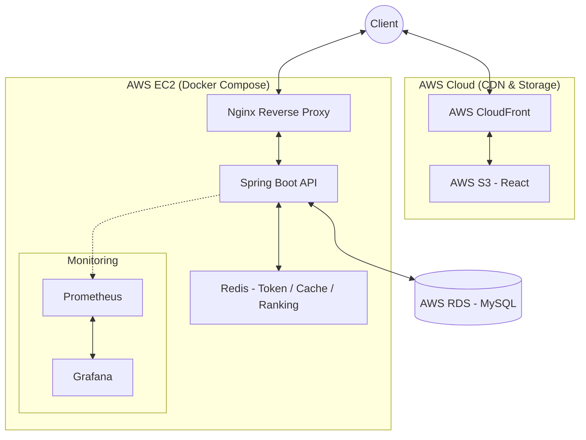

# System Architecture

## 1. 아키텍처 개요



### 목표 아키텍처

**Frontend**

```text
Client ↔ AWS CloudFront ↔ AWS S3
```

**Backend & Storage**

```text
Client ↔ AWS Nginx
           ↓
      AWS EC2 (Docker Compose)
           ├─ Spring Boot API
           ├─ Redis
           ├─ Prometheus
           └─ Grafana
           ↓
      AWS RDS (MySQL)
```

## 2. 주요 구성요소

| 컴포넌트 | 역할 |
| --- | --- |
| Client | 웹 브라우저에서 서비스 사용 |
| CloudFront | 정적 리소스 CDN |
| S3 | React 정적 파일 호스팅 |
| Nginx | Reverse Proxy 및 외부 진입점 |
| Spring Boot API | 인증, 기록, 랭킹, 게시판 등 비즈니스 로직 처리 |
| Redis | Refresh Token, Blacklist, 랭킹 캐시 대상 |
| RDS MySQL | 영속 데이터 저장 |
| Prometheus | Actuator 메트릭 수집 |
| Grafana | 대시보드 시각화 |

## 3. 요청 흐름

### 정적 리소스 요청

1. 사용자는 브라우저에서 프런트 페이지에 접근한다.
2. CloudFront가 정적 파일을 캐싱해 응답한다.
3. 원본 정적 자산은 S3에서 제공한다.

### API 요청

1. 프런트는 `VITE_API_BASE_URL` 기준으로 백엔드 API를 호출한다.
2. 외부 요청은 Nginx를 통해 EC2 내부 Spring Boot 컨테이너로 전달된다.
3. Spring Boot는 필요 시 Redis와 RDS를 함께 사용해 응답을 구성한다.

## 4. 인증 흐름

1. 로그인 시 Spring Boot가 Access Token과 Refresh Token을 발급한다.
2. Refresh Token은 Redis에 저장되고, 브라우저에는 `HttpOnly` cookie로 전달된다.
3. 보호 API 요청 시 Access Token이 JWT 필터를 통과하면 비즈니스 로직으로 진입한다.
4. 로그아웃 시 Refresh Token은 Redis에서 제거되고 Access Token은 blacklist에 등록된다.

## 5. 데이터 흐름

### 조회

- 홈/마이페이지
  - 최종적으로는 RDS 기반 기록/통계 조회가 필요하다.
- 랭킹 V1
  - `records` 테이블을 직접 조회해 Top 100을 계산한다.
- 랭킹 V2 목표
  - 사용자 대표 기록을 Redis ZSET에 반영해 읽기 비용을 줄인다.
- 게시판
  - RDS의 `posts`, `users`를 조합해 목록/상세를 조회한다.

### 생성 / 수정 / 삭제

- 회원가입
  - `users`에 새 계정을 저장한다.
- 기록 저장
  - `records`에 solve를 저장하고 `user_pbs`를 갱신한다.
- 게시글 CRUD
  - `posts`를 생성/수정/삭제하고, 상세 조회 시 `view_count`를 증가시킨다.

### 외부 연동 / 운영 데이터

- Prometheus는 Spring Boot Actuator 메트릭을 수집한다.
- Grafana는 Prometheus 데이터를 시각화한다.
- GitHub Actions는 테스트 및 문서화 검증 후 배포 파이프라인으로 연결된다.

## 6. 성능 / 확장 고려

- 현재 랭킹 V1은 `records` 기반 조회다.
  - 원본 로그를 직접 조회하므로 읽기 부하가 커질수록 DB 정렬 비용이 증가할 수 있다.
- 최종 랭킹 V2는 Redis ZSET을 목표로 한다.
  - 사용자 대표 기록 기준으로 정렬된 구조를 별도로 유지해 읽기 성능을 개선하려는 목적이다.
- 정적 리소스는 S3 + CloudFront로 분리한다.
  - EC2가 정적 파일 트래픽까지 직접 처리하지 않도록 해 API 서버 부하를 줄인다.
- 영속성과 휘발성 저장소를 분리한다.
  - 영속 기준 데이터는 RDS
  - 토큰/캐시/랭킹 보조 구조는 Redis
- 정량 수치
  - 현재는 `k6` 실측 결과가 없으므로 구조적 병목 설명까지만 문서화한다.
  - 개발 완료 후 전/후 비교 문서를 추가로 연결한다.

## 7. 외부 연동

| 외부 요소 | 역할 |
| --- | --- |
| AWS S3 | React 정적 파일 저장 |
| AWS CloudFront | CDN 배포 |
| AWS RDS | MySQL 관리형 DB |
| GitHub Actions | CI 실행 |
| Docker Hub | 컨테이너 이미지 배포 저장소 |
| Prometheus / Grafana | 운영 메트릭 관찰 |

## 8. 핵심 아키텍처 판단

### 설계 선택 1

- 선택한 구조:
  - 정적 리소스를 S3 + CloudFront로 분리한다.
- 선택 이유:
  - 프런트 정적 파일은 API 서버와 분리하는 것이 역할상 명확하다.
  - EC2가 정적 자산 트래픽까지 직접 처리할 필요가 없다.
- 검토한 대안:
  - EC2에서 프런트와 백엔드를 함께 서빙
- 대안을 배제한 이유:
  - 서버 역할이 섞이고 CDN 이점을 활용하기 어렵다.
- 트레이드오프:
  - 배포 경로가 두 갈래가 되어 인프라 구성이 조금 복잡해진다.
- 기대 효과:
  - 정적 자산 배포와 API 서버 부하를 분리해 설명할 수 있다.

### 설계 선택 2

- 선택한 구조:
  - 영속 데이터는 RDS로 분리하고, Redis는 EC2 내부 컨테이너로 둔다.
- 선택 이유:
  - MySQL은 사용자/기록/게시글 같은 영속 데이터를 장기 보관해야 하므로 관리형 DB가 맞다.
  - Redis는 RDBMS처럼 계속 저장해야 하는 주 저장소가 아니라 토큰/캐시/랭킹 보조 저장소 성격이 강하다.
  - 이 프로젝트 규모에서는 RDS처럼 별도 관리형 저장소로 분리할 필요가 낮고, 내부 컨테이너로도 역할을 수행할 수 있다.
- 검토한 대안:
  - Redis까지 별도 관리형 서비스로 분리
  - 반대로 MySQL까지 EC2 내부 컨테이너에 함께 두기
- 대안을 배제한 이유:
  - 전자는 현재 규모 대비 운영 구성이 과해질 수 있다.
  - 후자는 영속 데이터의 안정성과 운영성을 해친다.
- 트레이드오프:
  - 단일 EC2 내부 Redis는 다중화와 장애 복구 측면에서 약하다.
  - 운영 요구가 커지면 Redis 배치 전략 재검토가 필요하다.
- 기대 효과:
  - 영속성과 휘발성 저장소를 역할에 맞게 분리하면서도 MVP 범위의 운영 복잡도를 통제할 수 있다.

### 설계 선택 3

- 선택한 구조:
  - 랭킹을 V1(`records` 조회)과 V2(Redis ZSET 목표)로 분리한다.
- 선택 이유:
  - 개선 전 기준선과 개선 후 목표를 함께 설명해야 성능 개선 설계가 설득력 있다.
- 검토한 대안:
  - 단일 랭킹 구조만 사용
- 대안을 배제한 이유:
  - 현재 구현의 한계와 이후 최적화 필요성을 설명하기 어렵다.
- 트레이드오프:
  - 문서에서 현재 상태와 목표 상태를 강하게 분리해야 한다.
- 기대 효과:
  - 추후 `k6` 전/후 비교 결과와 자연스럽게 연결된다.

## 9. 현재 준비 상태

- 로컬 저장소에는 `docker-compose.yml` 기반 MySQL, Redis, Prometheus, Grafana 구성이 존재한다.
- GitHub Actions에는 Testcontainers 기반 테스트와 REST Docs 빌드 검증이 반영되어 있다.
- 프로덕션 배포 스크립트, 도메인 연결, HTTPS 적용은 구현 예정이다.

## 10. 면접 / 포트폴리오 포인트

- 정적 자산, API, 영속 DB, 캐시/토큰 저장소를 역할 기준으로 분리했다는 점
- 현재 V1 구조와 목표 V2 구조를 같이 두고 성능 개선 경로를 설명한다는 점
- 모니터링과 테스트까지 포함해 운영 가능한 시스템으로 접근했다는 점

## 11. 미확정 사항

- Nginx 리버스 프록시 설정과 HTTPS 리다이렉트 세부 정책
- Redis 장애 복구/영속화 전략의 최종 수준
- `k6` 부하 테스트 시나리오와 결과 수치
