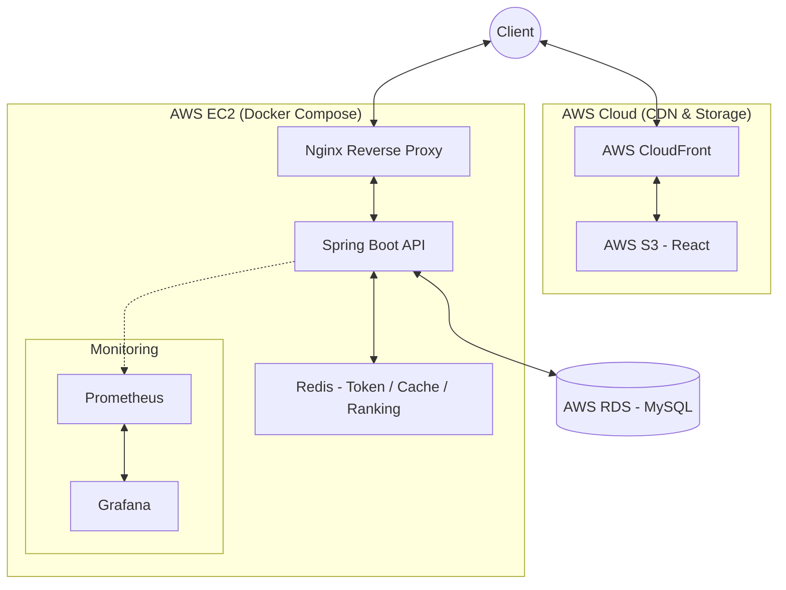

# System Architecture

## 1. 아키텍처 개요



### 목표 아키텍처

**Frontend**

```text
Client ↔ AWS CloudFront ↔ AWS S3
```

**Backend & Storage**

```text
Client ↔ AWS Nginx
           ↓
      AWS EC2 (Docker Compose)
           ├─ Spring Boot API
           ├─ Redis
           ├─ Prometheus
           └─ Grafana
           ↓
      AWS RDS (MySQL)
```

## 2. 주요 구성요소

| 컴포넌트 | 역할 |
| --- | --- |
| Client | 웹 브라우저에서 서비스 사용 |
| CloudFront | 정적 리소스 CDN |
| S3 | React 정적 파일 호스팅 |
| Nginx | Reverse Proxy 및 외부 진입점 |
| Spring Boot API | 인증, 기록, 랭킹, 게시판 등 비즈니스 로직 처리 |
| Redis | Refresh Token, Blacklist, 랭킹 캐시 대상 |
| RDS MySQL | 영속 데이터 저장 |
| Prometheus | Actuator 메트릭 수집 |
| Grafana | 대시보드 시각화 |

## 3. 요청 흐름

### 정적 리소스 요청

1. 사용자는 브라우저에서 프런트 페이지에 접근한다.
2. CloudFront가 정적 파일을 캐싱해 응답한다.
3. 원본 정적 자산은 S3에서 제공한다.

### API 요청

1. 프런트는 `VITE_API_BASE_URL` 기준으로 백엔드 API를 호출한다.
2. 외부 요청은 Nginx를 통해 EC2 내부 Spring Boot 컨테이너로 전달된다.
3. Spring Boot는 필요 시 Redis와 RDS를 함께 사용해 응답을 구성한다.

## 4. 인증 흐름

### 구현 인증 흐름

1. 로그인 시 Spring Boot가 Access Token과 Refresh Token을 발급한다.
2. Access Token은 응답 body로 전달되고, 클라이언트는 이를 메모리에만 유지한다.
3. Refresh Token은 Redis에 저장되고, 브라우저에는 `HttpOnly` cookie로 전달된다.
4. 앱 초기 진입/새로고침 시 클라이언트는 refresh cookie로 Access Token을 재발급받은 뒤 `/api/me`로 세션을 복구하고, 보호 API `401`에는 `refresh -> retry`를 1회 수행한다.
5. 보호 API 요청 시 Access Token이 JWT 필터를 통과하면 비즈니스 로직으로 진입한다.
6. 로그아웃 시 Refresh Token은 Redis에서 제거되고 Access Token은 blacklist에 등록된다.

### 목표 인증 흐름

1. 로그인 시 Spring Boot가 Access Token과 Refresh Token을 발급한다.
2. Access Token은 응답 body로 전달되고, 클라이언트는 이를 메모리에만 유지한다.
3. Refresh Token은 Redis에 저장되고, 브라우저에는 `HttpOnly` cookie로 전달된다.
4. 앱 초기 진입/새로고침 시 클라이언트는 refresh cookie로 Access Token을 재발급받은 뒤 `/api/me`로 세션을 복구한다.
5. 보호 API 요청 시 Access Token이 JWT 필터를 통과하면 비즈니스 로직으로 진입한다.
6. 로그아웃 시 Refresh Token은 Redis에서 제거되고 Access Token은 blacklist에 등록된다.

## 5. 데이터 흐름

### 조회

- 홈 대시보드/마이페이지
  - 홈 대시보드는 미구현 상태다.
  - 마이페이지는 RDS 기반 프로필/요약 조회와 전체 기록 페이지 조회가 구현되어 있다.
- 랭킹 V1
  - `user_pbs`와 원본 `records`를 기준으로 사용자별 PB 1건을 조회한다.
- 랭킹 V2 목표
  - 사용자 대표 기록을 Redis ZSET에 반영해 읽기 비용을 줄인다.
- 게시판
  - RDS의 `posts`, `users`를 조합해 목록/상세를 조회한다.

### 생성 / 수정 / 삭제

- 회원가입
  - `users`에 새 계정을 저장한다.
- 기록 저장
  - `records`에 solve를 저장하고 `user_pbs`를 갱신한다.
- 기록 수정/삭제
  - `records`의 penalty 수정과 삭제를 허용하고, 변경 후 `user_pbs`를 다시 계산한다.
- 게시글 CRUD
  - `posts`를 생성/수정/삭제하고, 상세 조회 시 `view_count`를 증가시킨다.

### 외부 연동 / 운영 데이터

- Prometheus는 Spring Boot Actuator 메트릭을 수집한다.
- Grafana는 Prometheus 데이터를 시각화한다.
- GitHub Actions는 테스트 및 문서화 검증 후 배포 파이프라인으로 연결된다.

## 6. 성능 / 확장 고려

- 랭킹 V1 상태는 `user_pbs` 기반 PB 조회다.
  - 같은 사용자가 종목별로 한 번만 노출되도록 중복을 줄였지만, 읽기 hot path는 여전히 MySQL에 남아 있다.
- 최종 랭킹 V2는 Redis ZSET을 목표로 한다.
  - 사용자 대표 기록 기준으로 정렬된 구조를 별도로 유지해 읽기 성능을 개선하려는 목적이다.
- 정적 리소스는 S3 + CloudFront로 분리한다.
  - EC2가 정적 파일 트래픽까지 직접 처리하지 않도록 해 API 서버 부하를 줄인다.
- 영속성과 휘발성 저장소를 분리한다.
  - 영속 기준 데이터는 RDS
  - 토큰/캐시/랭킹 보조 구조는 Redis
- 정량 수치
  - `k6` 실측 결과는 아직 없으므로 구조적 병목 설명까지만 문서화한다.
  - 개발 완료 후 전/후 비교 문서를 추가로 연결한다.

## 7. 외부 연동

| 외부 요소 | 역할 |
| --- | --- |
| AWS S3 | React 정적 파일 저장 |
| AWS CloudFront | CDN 배포 |
| AWS RDS | MySQL 관리형 DB |
| GitHub Actions | CI 실행 |
| Docker Hub | 컨테이너 이미지 배포 저장소 |
| Prometheus / Grafana | 운영 메트릭 관찰 |

## 8. 준비 상태

- 로컬 저장소에는 `docker-compose.yml` 기반 MySQL, Redis, Prometheus, Grafana 구성이 존재한다.
- GitHub Actions에는 Testcontainers 기반 테스트와 REST Docs 빌드 검증이 반영되어 있다.
- 프로덕션 배포 스크립트, 도메인 연결, HTTPS 적용은 미구현 상태다.

## 9. 미확정 사항

- Nginx 리버스 프록시 설정과 HTTPS 리다이렉트 세부 정책
- Redis 장애 복구/영속화 전략의 최종 수준
- `k6` 부하 테스트 시나리오와 결과 수치
