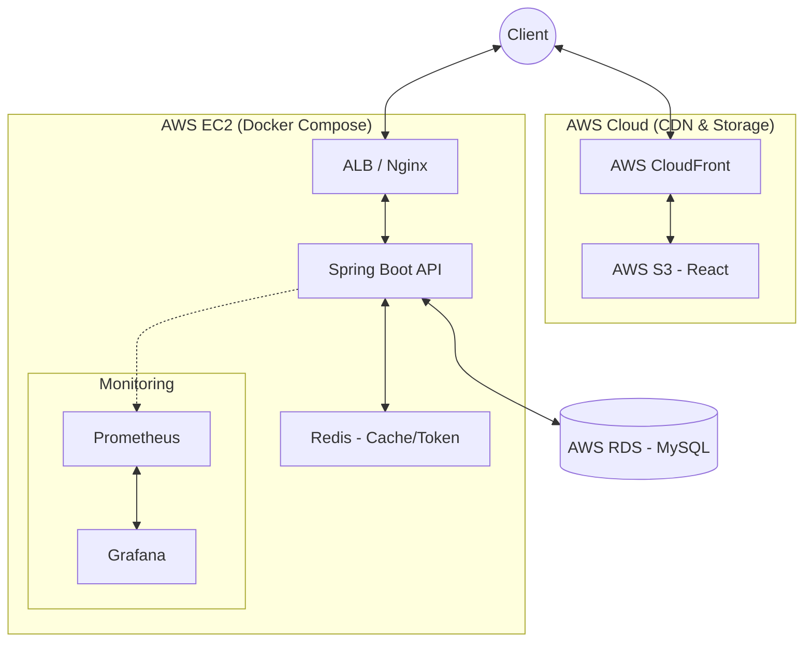

# System Architecture

## 1. 전체 구조

**[Frontend]**
Client ↔ AWS CloudFront (CDN) ↔ AWS S3 (React Static Files Hosting)

**[Backend & Infrastructure]**
Client ↔ AWS ALB / Nginx (Reverse Proxy) 
           ↓
      **AWS EC2 (Docker Compose Environment)**
           ├─ Spring Boot API Container
           └─ Redis Container (Refresh Token, 랭킹 캐시)
           ↓
      **AWS RDS (MySQL)** ← (EC2와 분리된 매니지드 서비스로 영구 데이터 저장)

**[Monitoring & Testing]**
EC2 내부 (Prometheus Container ↔ Grafana Container) ← Spring Boot Actuator 지표 수집
GitHub Actions ↔ Testcontainers (CI 단계 격리 테스트) ↔ Spring Rest Docs ↔ Docker Hub

---

## 2. 사용 기술

Frontend
- React

Backend
- Java 17
- Spring Boot 3.5.12
- Spring Security, JWT
- Spring Data JPA, QueryDSL

Database & Cache
- MySQL 8.0 (AWS RDS)
- Redis 7.x (EC2 내 Docker Container)

Infra & Testing
- AWS (EC2, RDS, S3, CloudFront)
- Docker, Docker Compose
- GitHub Actions
- JUnit5, Testcontainers, Spring Rest Docs, k6
- Prometheus, Grafana

---

## 3. 아키텍처 설명

1. **정적 리소스 분리:** React 리소스는 S3와 CloudFront를 통해 제공되어 EC2의 불필요한 트래픽 부하를 원천 차단한다.
2. **상태 및 무상태 인프라 분리:** 데이터 유실을 방지하고 부하 테스트 시 I/O 경합을 막기 위해 MySQL은 AWS RDS로 분리한다. 반면, 애플리케이션 서버와 세션/캐시를 담당하는 Redis는 비용 효율을 위해 단일 EC2 인스턴스 내에서 Docker Compose로 묶어 오케스트레이션한다.
3. **가시성 확보:** Spring Boot Actuator 메트릭을 EC2 내의 Prometheus가 수집하고, Grafana 대시보드가 이를 시각화하여 k6 부하 주입 시 서버의 병목 지점을 추적한다.
4. **CI/CD 파이프라인:** GitHub에 코드가 푸시되면 Actions가 Testcontainers로 실제 DB 환경에서 테스트를 수행한다. 통과된 빌드만 Docker Hub로 푸시되며, EC2 서버가 해당 이미지를 Pull 받아 컨테이너를 무중단 재시작한다.

---

## 4. 보안 및 운영

- AWS 인프라 간(EC2 ↔ RDS) 통신은 프라이빗 서브넷 및 보안 그룹(Security Group)을 통해 외부 접근을 철저히 차단
- JWT Access Token의 탈취 리스크를 줄이기 위해 짧은 만료 시간을 부여하고, Redis를 활용한 Refresh Token Blacklisting 전략 적용
- 과도한 프리티어 요금 발생 방지를 위한 AWS Billing Alarm 설정 필수