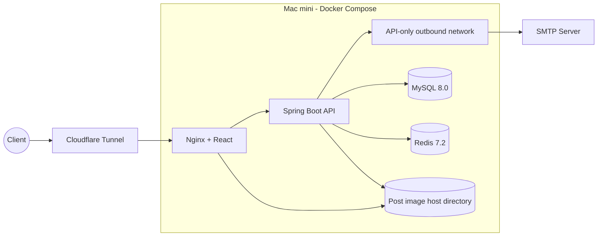
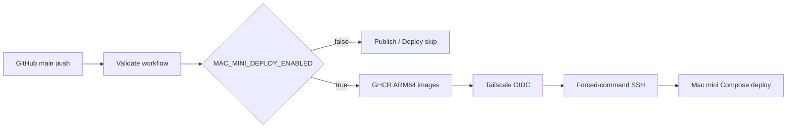

# System Architecture

## 1. 아키텍처 개요

```mermaid
flowchart LR
    Client((Client))
    CF[Cloudflare Tunnel]
    SMTP[SMTP Server]

    subgraph MacMini["Mac mini - Docker Compose"]
        Web[Nginx + React]
        API[Spring Boot API]
        Outbound[API-only outbound network]
        MySQL[(MySQL 8.0)]
        Redis[(Redis 7.2)]
        Images[(Post image host directory)]
    end

    Client --> CF
    CF --> Web
    Web --> API
    Web --> Images
    API --> MySQL
    API --> Redis
    API --> Images
    API --> Outbound
    Outbound --> SMTP
```

- 저장소에는 Mac mini용 `db`, `redis`, `api`, `web` Compose 구성이 반영되어 있다.
- 외부 요청은 공유 Cloudflare Tunnel과 `edge` network의 `cubing-hub-web` alias를 거쳐 web 컨테이너로 전달한다.
- web 컨테이너는 React 정적 파일, SPA fallback, API reverse proxy, 게시글 이미지 응답을 담당한다.
- API, MySQL, Redis는 외부에 port를 공개하지 않는 내부 `application`
  network를 사용한다.
- API만 별도 `outbound` bridge network에도 연결해 SMTP와 Discord 같은
  외부 연동에 필요한 outbound traffic을 허용한다.
- Mac mini runtime과 Cloudflare route는 운영 중이며, `outbound` 추가
  구성은 아직 재배포 전이다.

## 2. 주요 구성요소

| 컴포넌트 | 역할 |
| --- | --- |
| Client | 웹 브라우저에서 서비스 사용 |
| Cloudflare Tunnel | `www`, `api`, apex 공개 route와 Mac mini origin 연결 |
| Nginx + React | 정적 파일, SPA fallback, API reverse proxy, 이미지 응답 |
| Spring Boot API | 인증, 기록, 랭킹, 게시판 등 비즈니스 로직 처리 |
| MySQL 8.0 | Flyway schema와 영속 기준 데이터 저장 |
| Redis 7.2 | Refresh Token, blacklist, 인증 임시 상태, 랭킹 읽기 모델 |
| Post image host directory | 게시글 이미지 바이너리 저장 |
| SMTP Server | 회원가입과 비밀번호 재설정 인증번호 발송 |
| GHCR | API/web `linux/arm64` full commit SHA 이미지 보관 |
| GitHub Actions | 검증, 이미지 발행, 제한 SSH 배포 |
| Tailscale | GitHub-hosted runner와 Mac mini 사이의 배포 전용 사설 연결 |

## 3. 네트워크와 요청 흐름

### 공개 요청

1. 사용자는 `www.cubing-hub.com` 또는 `api.cubing-hub.com`에 접근한다.
2. Cloudflare Tunnel이 요청을 공유 `edge` network의 `cubing-hub-web`로 전달한다.
3. Nginx는 Host와 path에 따라 React 정적 파일 또는 Spring Boot API로 요청을 보낸다.
4. `/uploads/**` 요청은 API와 같은 host image directory를 read-only로 마운트한 Nginx가 응답한다.

### 내부 요청

- API는 `application` network에서 `db:3306`, `redis:6379`를 사용한다.
- `application` network는 `internal: true`로 구성한다.
- API는 project 전용 `outbound` bridge network를 통해서만 외부 DNS와
  SMTP·Discord endpoint에 접근한다.
- MySQL과 Redis는 `outbound`와 `edge`에 참여하지 않는다.
- MySQL과 Redis는 host port를 공개하지 않는다.
- web만 외부 `edge` network에 참여한다.

## 4. 인증 흐름

1. 로그인 시 Spring Boot가 Access Token과 Refresh Token을 발급한다.
2. Access Token은 response body로 전달하고 React memory에만 유지한다.
3. Refresh Token은 Redis에 저장하고 브라우저에는 `HttpOnly` cookie로 전달한다.
4. 앱 초기 진입과 새로고침은 `refresh -> /api/me`로 session을 복구한다.
5. 보호 API가 `401`을 반환하면 `refresh -> retry`를 한 번 수행한다.
6. 로그아웃 시 Refresh Token을 Redis에서 제거하고 Access Token을 blacklist에 등록한다.

## 5. 데이터 흐름

### 영속 데이터와 랭킹

- MySQL의 `records`와 `user_pbs`가 기록과 PB의 기준 데이터다.
- 기본 랭킹 조회는 Redis ZSET 읽기 모델을 사용한다.
- `nickname` 검색 또는 Redis 미준비 상태에서는 MySQL 대체 경로를 사용한다.
- 기록 생성·수정·삭제로 PB가 바뀌면 Redis 읽기 모델을 함께 동기화한다.

### 게시글 이미지

- API는 `POST_IMAGES_LOCAL_ROOT_PATH=/data/post-images`에 이미지 파일을 저장한다.
- Mac mini는 `POST_IMAGES_HOST_DIR`을 API에 read-write, web에 read-only로 마운트한다.
- `post_attachments.object_key`는 host image root 기준 상대 경로다.
- DB backup과 이미지 snapshot은 한 backup 단위로 함께 검증한다.

### 초기 schema

- 신규 MySQL volume에서 Flyway가 `V1__init_schema.sql`, `V2__add_query_support_indexes.sql` 순서로 schema를 만든다.
- 운영 API는 `SPRING_JPA_HIBERNATE_DDL_AUTO=validate`로 schema 일치 여부를 확인한다.
- 삭제된 기존 원격 DB 데이터는 이관하지 않고 신규 빈 데이터로 시작한다.

## 6. 배포 흐름

```mermaid
flowchart LR
    Push[GitHub main push] --> Validate[Validate workflow]
    Validate --> Gate{MAC_MINI_DEPLOY_ENABLED}
    Gate -- false --> Skip[Publish / Deploy skip]
    Gate -- true --> GHCR[GHCR ARM64 images]
    GHCR --> TS[Tailscale OIDC]
    TS --> SSH[Forced-command SSH]
    SSH --> Deploy[Mac mini Compose deploy]
```

- `validate.yml`은 backend/frontend 검증과 API/web ARM64 image build를 실행한다.
- `deploy.yml`은 같은 commit SHA의 API/web 이미지만 GHCR에 발행한다.
- 배포 runner는 Tailscale OIDC로 Mac mini에 연결한다.
- SSH key는 `deploy-cubing-hub <commit-sha> <registry-user>` 명령만 허용한다.
- 배포 script는 기존 운영 상태가 있으면 먼저 backup을 만들고 두 이미지를 함께 교체한다.
- health 실패 시 이전 full SHA 이미지로 rollback한다.
- repository variable gate가 꺼져 있으면 Validate만 실행한다.

## 7. 성능과 운영 고려

- 랭킹 V2는 MySQL 기준 데이터와 Redis 읽기 모델을 분리한다.
- `nickname` 미입력 조회는 Redis, 검색은 MySQL 대체 경로를 사용한다.
- 로컬 `300,000` PB 기준 비교 결과는 `docs/performance/` 산출물에 보관한다.
- MySQL과 Redis는 named volume을 사용하고 게시글 이미지는 repository 밖 host directory에 둔다.
- container log는 `json-file` 최대 `10m`, 파일 `3개`로 제한한다.
- 성공한 backup은 최신 `3개`를 유지한다.

## 8. 구현 및 검증 상태

- 구현 완료
  - Mac mini production Compose와 고정 runtime 경로
  - GHCR full SHA ARM64 image workflow
  - Tailscale OIDC와 forced-command SSH 배포 경계
  - backup, health check, rollback script
  - Cloudflare origin용 Nginx Host/path routing
- 검증 완료
  - GitHub-hosted backend/frontend 검증
  - API/web `linux/arm64` image build
  - Compose render, Nginx config, shell syntax, 운영 설정 테스트
- 미검증
  - GHCR 실제 image 발행
  - Mac mini 신규 MySQL/Redis volume과 API 기동
  - Flyway 적용, 빈 business data, runtime health
  - Cloudflare route와 공개 TLS/SPA/API/image 요청
  - SMTP, 게시글 이미지, backup/restore rehearsal

## 9. 미확정 사항

- 운영 환경 Redis 재구축 trigger와 장애 복구 수준
- 랭킹 `nickname` 검색 Redis secondary index 확장 여부
- Mac mini 공개 전환 뒤 Uptime Kuma monitor와 alert 기준
